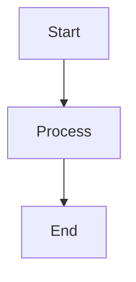

# Documentation Request: [Topic/Area]

**Requester**: @[github-username]
**Type**: New Documentation / Update / Fix
**Priority**: [P0 / P1 / P2 / P3]
**Status**: Needs Review

---

## 📚 Documentation Need

### Summary

[Brief description of the documentation need]

### What's Missing or Incorrect?

**Current State**:
- [ ] Documentation doesn't exist
- [ ] Documentation is outdated
- [ ] Documentation is incorrect
- [ ] Documentation is unclear/confusing
- [ ] Documentation is incomplete

**Specific Issues**:
1. [Issue 1]
2. [Issue 2]
3. [Issue 3]

---

## 🎯 Target Documentation

### Documentation Type

- [ ] User documentation (for site builders/administrators)
- [ ] Developer documentation (for module developers)
- [ ] API documentation
- [ ] Configuration guide
- [ ] Installation/setup guide
- [ ] Troubleshooting guide
- [ ] Migration/upgrade guide
- [ ] Best practices guide
- [ ] Change record
- [ ] README update

### Location

**Current Location** (if exists): [Path or URL]

**Proposed Location**: [Where this documentation should live]
- `/docs/` directory
- README.md
- Code comments/docblocks
- Drupal.org documentation
- Other: _____

---

## ✍️ Proposed Content

<details>
<summary><strong>📝 Draft Documentation (Click to expand)</strong></summary>

[If you have draft content, paste it here in markdown format]

```markdown
# Example Documentation

## Overview
[Content here]

## Usage
[Content here]

## Examples
[Content here]
```

</details>

---

## 👥 Target Audience

**Primary Audience**:
- [ ] Site administrators
- [ ] Content editors
- [ ] Module developers
- [ ] Theme developers
- [ ] DevOps/system administrators
- [ ] End users
- [ ] Community contributors

**Knowledge Level**:
- [ ] Beginner
- [ ] Intermediate
- [ ] Advanced

**Prerequisites**:
[What knowledge users should have before reading this documentation]

---

## 📸 Supporting Materials

<details>
<summary><strong>🖼️ Screenshots/Diagrams (Click to expand)</strong></summary>

### Screenshots

[Add relevant screenshots showing what needs documenting]

### Diagrams

[Add architecture diagrams, flowcharts, or other visual aids]



### Code Examples

```php
// Example code to be documented
function example_function() {
  // ...
}
```

</details>

---

## 🔗 Related Documentation

### Existing Documentation

- [Link to related doc 1]
- [Link to related doc 2]

### External References

- [Drupal.org documentation]
- [API documentation]
- [Community resources]

---

## ✅ Acceptance Criteria

### Documentation Quality Checklist

- [ ] Content is accurate and up-to-date
- [ ] Examples are clear and working
- [ ] Code snippets are tested
- [ ] Screenshots are current
- [ ] Links are valid
- [ ] Formatting is consistent
- [ ] Grammar and spelling checked
- [ ] Accessible language used
- [ ] Technical terms explained

### Coverage Requirements

- [ ] Overview/introduction provided
- [ ] Prerequisites listed
- [ ] Step-by-step instructions included
- [ ] Examples provided
- [ ] Common issues/troubleshooting addressed
- [ ] Related topics linked

---

## 🔄 Update Frequency

**How often should this be reviewed?**:
- [ ] Every release
- [ ] Quarterly
- [ ] Annually
- [ ] As needed
- [ ] One-time update

---

## 📊 Success Metrics

**How will we know this documentation is effective?**:
- Reduces support questions about [topic]
- Helps [X%] of users complete [task]
- Decreases onboarding time by [X hours]
- Other: _____

---

## 🎯 Related Issues

### Related Items

- Related to: #[issue-number]
- Depends on: #[issue-number]
- Blocks: #[issue-number]

### External References

- [Drupal.org issue]
- [Community discussion]
- [Documentation request]

---

## 💬 Additional Context

[Any additional information, context, or notes]

---

## ✅ Triage Checklist (for maintainers)

- [ ] Documentation scope is clear
- [ ] Priority assigned
- [ ] Target audience identified
- [ ] Location determined
- [ ] Writer assigned
- [ ] Added to documentation roadmap
- [ ] Technical review needed: [Yes/No]

---

**Template Version**: 1.0
**Source**: ITCare GitHub Templates
**Last Updated**: 2025-10-21
