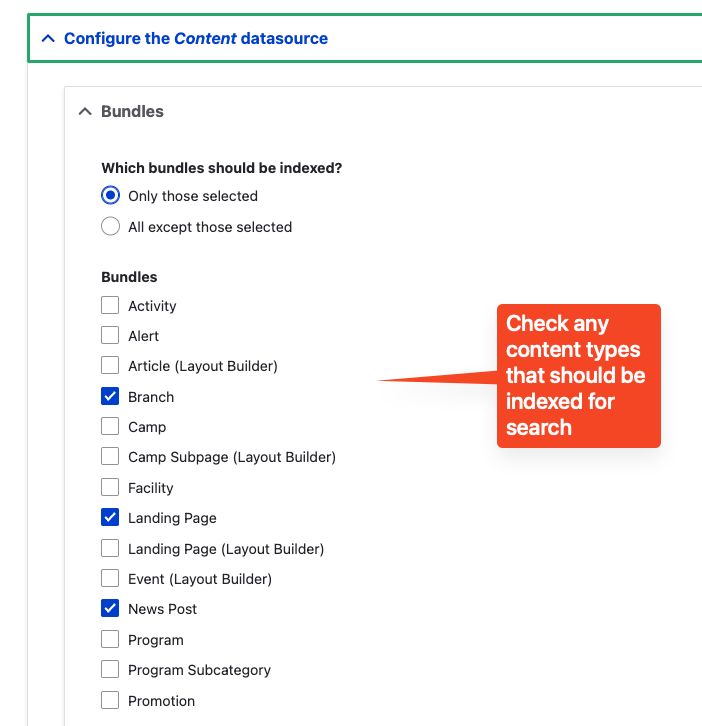
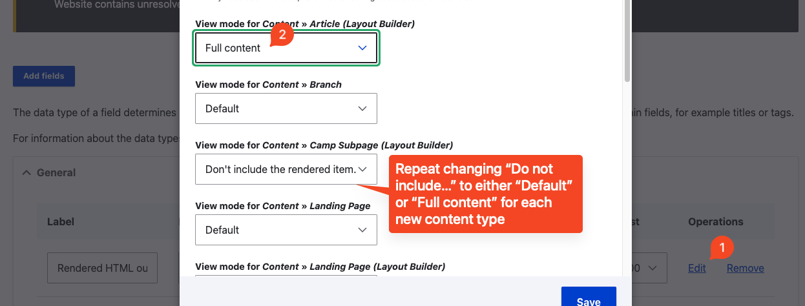

YMCA Website Services leverages [Apache Solr](https://solr.apache.org/) for a few features:

- [Activity Finder](https://github.com/YCloudYUSA/yusaopeny_activity_finder/wiki) requires Solr
- Site search can _optionally_ use Solr as per [this Pull Request](https://github.com/ymcatwincities/openy/pull/1967)

## Prerequisites

Before you begin, ensure that you have:

-   A running Apache Solr server, version 6.4 or higher is recommended (refer to [Apache Solr](https://solr.apache.org/) for installation instructions).
-   The YMCA Website Services Search API module installed and enabled.
-   Administrative access to your Drupal site.

## Quick Start / Upgrade path

1.  Log in as admin.
2.  Go to `admin/modules` and enable the YMCA Website Services Search API module.

    

3.  Approve the next step for enabling Database Search.

    

4.  Go to the Search API configuration page `admin/config/search/search-api`.
5.  Verify that the "OpenY Database Search" server is enabled.
6.  Visit "Search content" index.

    

    > TIP: Admins can enable the Solr search and switch the index between servers.

7.  Index content by clicking "Index now".

    

8.  Go to the homepage and search for any keyword.

    

9.  Verify search results are displayed correctly.

## Starting from the YMCA Website Services installer

-   Find the `Select search service` step displayed during the YMCA Website Services installation.
-   Choose from one of these options during installation:
    -   **None**
        -   Nothing happens if the user chooses this option; search modules are displayed after installation.
    -   **YMCA Website Services Google Custom Search**
        -   Google Custom Search configuration form is displayed if the user chooses this option.
        -   The YMCA Website Services Google Search module is enabled after installation and ready to use.
    -   **YMCA Website Services Search API**
        -   Search API backend options are displayed in this case with the following options:
            -   _Database_
                -   The YMCA Website Services Search API module is enabled after installation. The database search API server is enabled. The search is ready to use after content indexation.
            -   _Solr_
                -   Additional installation step with Solr configuration form is displayed in this case and user can specify all params for Solr connection. The YMCA Website Services Search API module is enabled after installation, Solr search API server is enabled. The search is ready to use after content indexing (if the correct Solr settings were used).

## Switch from database search backend to Solr backend

Watch a [video tutorial](https://youtu.be/-Sq3uZb5K_U) on how to switch an existing site from the database backend to a Solr server. This requires a Solr server to be configured in your environment.

-   Edit the "Solr search" server from the Search API configuration `admin/config/search/search-api`.
-   Add the configuration information for your Solr server. Refer to Drupal's [Search API Solr project](https://www.drupal.org/project/search_api_solr) for troubleshooting connection information.
-   Save the server and observe that Search API has successfully connected to your server.
-   Edit the "Search content" index and change the "Server" field to the newly configured "Solr Search" index.
-   Visit the "Search content" index and click "Index now" to re-index the content.

## Layout Builder and Solr search

Solr search can be used with [Layout Builder](../../user-documentation/layout-builder), and requires a few extra steps.

### Configure Solr to index the new content types

In order for Solr to index the new content types, they need to be added to the index.

1.  Enable the YMCA Website Services Search API (`openy_search_api`) module if not already enabled.
2.  Go to **Admin** > **Configuration** > **Search and metadata** > **Search API**, then **Edit** the **Search content** index. (`/admin/config/search/search-api/index/search_content/edit`)
3.  Configure Solr to index the Layout Builder content types:

    -   Scroll down, expand **Configure the _Content_ datasource**, and check the content types that should be indexed for search.
        
    -   Save the form.
4.  Configure how Solr indexes the Layout Builder content types:

    -   From the **Search API** configuration, open the dropdown for the **Search content** index and choose **Fields**.
        
    -   To the right of the **Rendered HTML output** field options, choose **Edit**.
    -   For each newly added content type, switch "Don't include the rendered item" to the right view mode.
        
        -   In general, new Layout Builder specific content types will use the "Default" view mode, while older Layout Builder-compatible content types should use the "Full content" view mode.

            | Content type        | View mode |
            | --------------------- | --------- |
            | Article (LB)        | Default   |
            | Branch              | Full      |
            | Event (LB)          | Default   |
            | Camp                | Full      |
            | Camp Subpage        | Full      |
            | Facility            | Full      |
            | Landing Page (LB)   | Default   |
            | Program             | Full      |
            | Program Subcategory | Full      |

    -   Save the page.
5.  Once your changes have been saved, re-index the content to see the changes reflected in search results.

### Set up a Layout Builder search page

1.  If you have an existing site, disable the old search page:

    -   Go to `/search`.
    -   Remove the URL alias by unchecking **Generate automatic URL alias** in the sidebar then deleting `/search`.
    -   Uncheck **Published** and **Save** to un-publish the page.
2.  Create a new **Landing Page (Layout Builder)** (`node/add/landing_page_lb`):

    -   Set the **Title** to "Search".
    -   Ensure **Generate automatic URL alias** is unchecked in the sidebar and set the alias to `/search`.

        -   If that alias results in an error, you can remove the old one at **Admin** > **Configuration** > **Search and metadata** > **URL aliases**
    -   Check **Published** then **Save and edit layout**.
3.  Add a [Small Banner](../../user-documentation/layout-builder/banner) to the header with a title for the page, like "Search".
4.  Add the search results block to the page:

    -   In the **Body** section, **Add block**, then expand **All system block** and choose **Content search block** from the Paragraph Blocks section.
    -   Optionally, choose to hide the title or change the number of items to display.
    -   **Save layout** and check your page.
5.  Change the Search API config to use your new page:

    -   Go to **Admin** > **YMCA Website Services** > **Settings** > **Search API settings** (`/admin/openy/settings/search-api`) and set the **Search page id** to the node id of your new page.
    -   Or, change the config with drush:

        ```
        drush cset openy_search_api.settings search_page_id <nid>
        ```

6.  Test the search box in the Layout Builder page header to ensure the new configuration works as expected.

## Legacy Solr Support

The contrib [Search API Solr](https://www.drupal.org/project/search_api_solr) module supports a broad swath of Solr versions, but occasionally old versions are dropped from support in the main module. If, when enabling YMCA Website Services Search API, you encounter errors that your version of Solr is out of date, you may need to enable the [Search API Solr Legacy module](https://git.drupalcode.org/project/search_api_solr/-/blob/4.x/modules/search_api_solr_legacy/README.md). As of January 2022, Search API Solr Legacy supports Solr 3.6 through 6.4.

The error message when using an old version of Solr may look something like this:

> Notice: Undefined index: 4.x in Drupal\search_api_solr\Controller\SolrConfigSetController->getConfigFiles()
