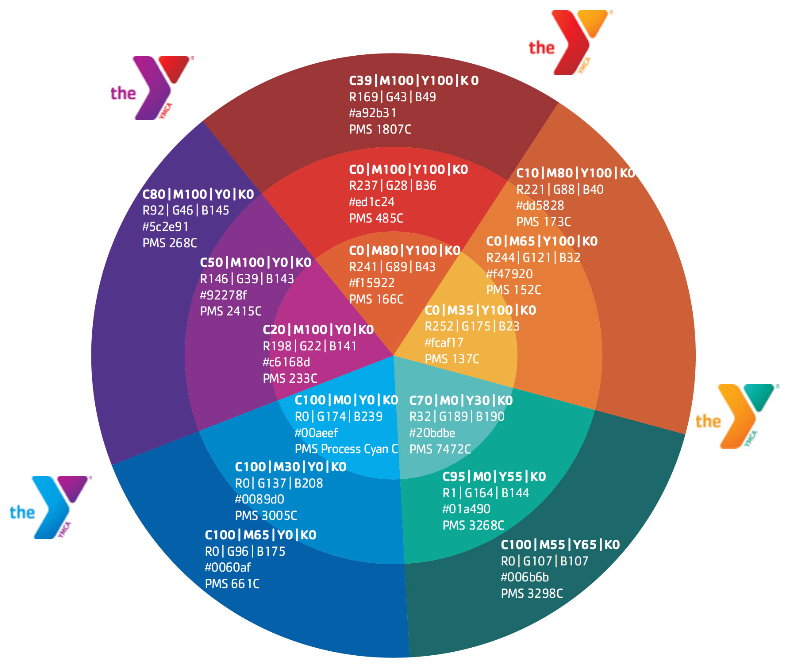
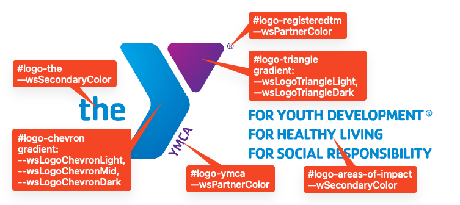

## CSS Variables

### Base Variables

We start by defining a base set of colors based on the "Y Color Wheel and Neighbored Color Zones" from the "Websites & Platforms Style Guide", available in the [YMCA Brand Resource Center](https://theybrand.org/). These colors are used to create the color palettes available in the Layout Builder.



> **Note:** RGB variable values are not complete color definitions and must be wrapped in `rgb{a}()`, like `background-color: rgb(var(--ylb-color-rgb-red-dark), 0.5);`. This allows you to control the opacity of the color.

```scss
:root {
    --ylb-color-red-dark: ;
    --ylb-color-rgb-red-dark: ;
    --ylb-color-red: ;
    --ylb-color-rgb-red: ;
    --ylb-color-red-light: ;
    --ylb-color-rgb-red-light: ;
    --ylb-color-orange-dark: ;
    --ylb-color-rgb-orange-dark: ;
    --ylb-color-orange: ;
    --ylb-color-rgb-orange: ;
    --ylb-color-orange-light: ;
    --ylb-color-rgb-orange-light: ;
    --ylb-color-green-dark: ;
    --ylb-color-rgb-green-dark: ;
    --ylb-color-green: ;
    --ylb-color-rgb-green: ;
    --ylb-color-green-light: ;
    --ylb-color-rgb-green-light: ;
    --ylb-color-blue-dark: ;
    --ylb-color-rgb-blue-dark: ;
    --ylb-color-blue: ;
    --ylb-color-rgb-blue: ;
    --ylb-color-blue-light: ;
    --ylb-color-rgb-blue-light: ;
    --ylb-color-purple-dark: ;
    --ylb-color-rgb-purple-dark: ;
    --ylb-color-purple: ;
    --ylb-color-rgb-purple: ;
    --ylb-color-purple-light: ;
    --ylb-color-rgb-purple-light: ;
    --ylb-color-white: ;
    --ylb-color-rgb-white: ;
    --ylb-color-light-grey-1: ;
    --ylb-color-rgb-light-grey-1: ;
    --ylb-color-light-grey-2: ;
    --ylb-color-rgb-light-grey-2: ;
    --ylb-color-light-grey-3: ;
    --ylb-color-rgb-light-grey-3: ;
    --ylb-color-grey-1: ;
    --ylb-color-rgb-grey-1: ;
    --ylb-color-grey-2: ;
    --ylb-color-rgb-grey-2: ;
    --ylb-color-grey-3: ;
    --ylb-color-rgb-grey-3: ;
    --ylb-color-dark-grey-1: ;
    --ylb-color-rgb-dark-grey-1: ;
    --ylb-color-dark-grey-2: ;
    --ylb-color-rgb-dark-grey-2: ;
    --ylb-color-black: ;
    --ylb-color-rgb-black: ;
}
```

### Colorway Variables

Each colorway is built upon four core colors derived from the base color palette:

- `PrimaryColor`: The main color for the colorway.
- `SecondaryColor`: A complementary color to the primary.
- `TertiaryColor`: Another complementary color, providing additional visual interest.
- `PartnerColor`:  A contrasting color, often used for buttons and calls to action.

These four colors are used to style the majority of page elements. Each variable is prefixed with `ws` to denote "Website Services". RGB versions of these colors are also provided for use with `rgba()` styles.

In addition to the main colors, five more variables are used to define the YMCA logo gradients:

- `LogoChevronDark`
- `LogoChevronMid`
- `LogoChevronLight`
- `LogoTriangleDark`
- `LogoTriangleLight`

> **Important:** These `Logo` variables should **only** be used for styling the YMCA logo.  They are not intended for use in other page components. The Canadian Y logo does not change colors, and therefore these extra colors are not needed for Canadian colorways.

Here's a complete list of the colorway variables:

```css
--wsPrimaryColor
--wsPrimaryColorRGB
--wsSecondaryColor
--wsSecondaryColorRGB
--wsTertiaryColor
--wsTertiaryColorRGB
--wsPartnerColor
--wsPartnerColorRGB
--wsLogoChevronDark
--wsLogoChevronMid
--wsLogoChevronLight
--wsLogoTriangleDark
--wsLogoTriangleLight
```

These variables are typically defined by referencing the base color variables.  Here's an example of a complete colorway definition:

```scss
:root {
  --wsPrimaryColor: var(--ylb-color-blue-dark);
  --wsPrimaryColorRGB: var(--ylb-color-rgb-blue-dark);
  --wsSecondaryColor: var(--ylb-color-blue);
  --wsSecondaryColorRGB: var(--ylb-color-rgb-blue);
  --wsTertiaryColor: var(--ylb-color-blue-light);
  --wsTertiaryColorRGB: var(--ylb-color-rgb-blue-light);
  --wsPartnerColor: var(--ylb-color-purple-dark);
  --wsPartnerColorRGB: var(--ylb-color-rgb-purple-dark);
  --wsLogoChevronDark: var(--ylb-color-blue-dark);
  --wsLogoChevronMid: var(--ylb-color-blue);
  --wsLogoChevronLight: var(--ylb-color-blue-light);
  --wsLogoTriangleDark: var(--ylb-color-purple-dark);
  --wsLogoTriangleLight: var(--ylb-color-purple-light);
}
```

## Logo Colors

To ensure consistency and minimize code duplication, the YMCA logo is divided into six distinct sections, each styled individually:

- `the`
- `chevron`
- `ymca`
- `triangle`
- `registeredtm`
- `areas-of-impact`

The `chevron` and `triangle` sections use `radialGradient` elements, taking advantage of the `wsLogo` variables mentioned above. The other sections are styled using the standard colorway variables. Each section is a `path` element with a unique `id` and a color defined using the `fill` property.



- `#logo-the` uses `--wsSecondaryColor`
- `#logo-chevron` uses a gradient composed of (from top to bottom) `--wsLogoChevronLight`, `--wsLogoChevronMid`, and `--wsLogoChevronDark`
- `#logo-ymca` uses `--wsPartnerColor`
- `#logo-triangle` uses a gradient composed of (from left to right) `--wsLogoTriangleLight` and `--wsLogoTriangleDark`
- `#logo-registeredtm` uses `--wsPartnerColor`
- `#logo-areas-of-interest` uses `--wsSecondaryColor`

## Y Styles

Each "Y Styles" option activates a specific CSS library, as defined in [`y_lb.ws_style_option.yml`](https://github.com/YCloudYUSA/y_lb/blob/main/y_lb.ws_style_option.yml). These libraries can be overridden by a custom theme, allowing for further customization (see the [Drupal documentation on Overriding Theme Functions](https://www.drupal.org/node/2497313) for details).
