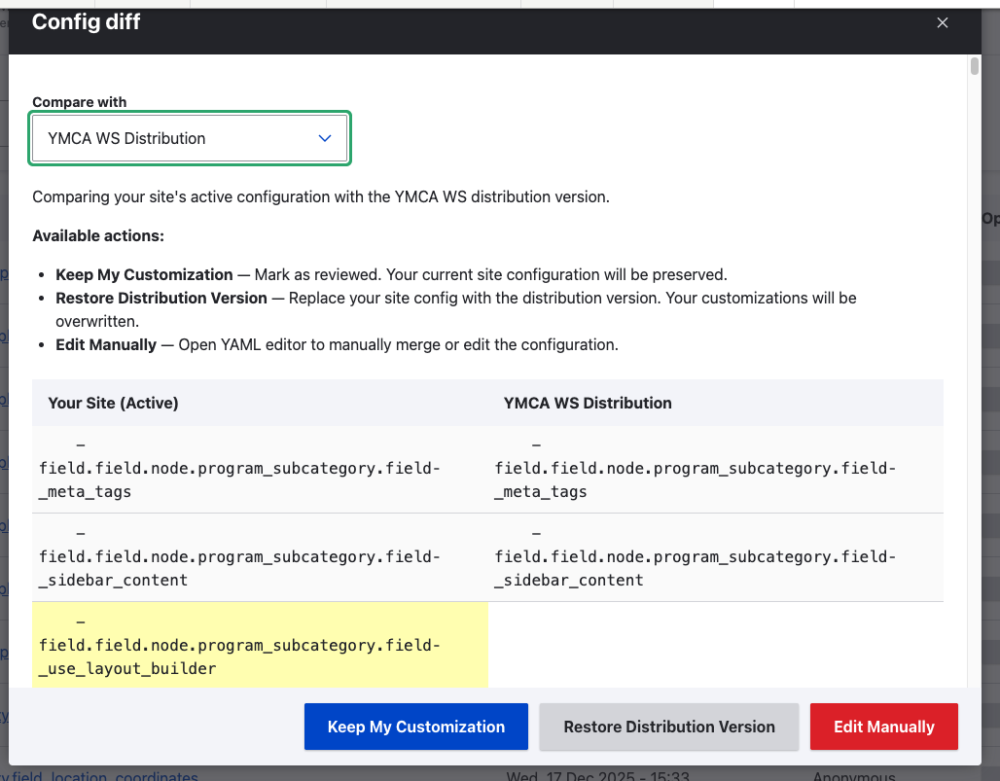
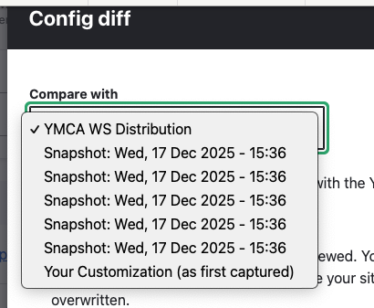
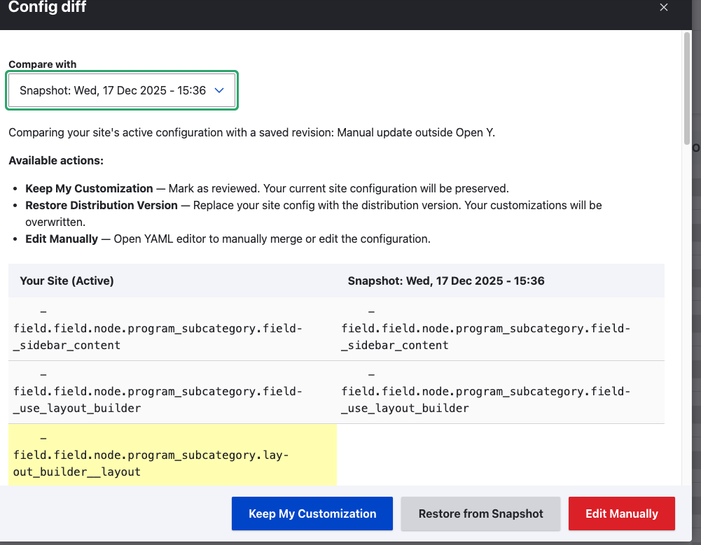

The **Upgrade Tool** helps site administrators track configuration differences between their site and the YMCA Website Services (formerly Open Y) distribution. When you customize configurations, the tool detects these changes and provides options to review, keep, or restore them during upgrades.

## Installation

The Upgrade Tool is included in YMCA Website Services. Install it via Composer:

```bash
composer require drupal/upgrade_tool
drush en openy_upgrade_tool -y
```

**Requirements:**
- Drupal 11+
- YMCA Website Services distribution

## Dashboard Overview

Access the dashboard at **Administration > YMCA Website Services > Development > Upgrade Tool Dashboard** or navigate to `/admin/openy/development/upgrade-log/dashboard`.


### Understanding the Dashboard

The dashboard displays two sections:

| Section | Description |
|---------|-------------|
| **Manual Changes (Pending Review)** | Configuration customizations detected on your site that haven't been reviewed yet. These appear when your active config differs from the distribution. |
| **Reviewed Changes** | Customizations you've already acknowledged. These won't trigger warnings but are tracked for reference. |

Expand each section to view the list of configuration changes:


### Status Page Warning

When you have pending configuration changes, a warning appears on the Drupal **Status report** (`/admin/reports/status`). This helps administrators notice when customizations need attention after an upgrade.

## Working with Configuration Changes

### Viewing Differences

Click **Diff** on any configuration to open a comparison modal showing:

- **Your Site (Active)** - Your current site configuration
- **Compare with** dropdown to select what to compare against:
  - **YMCA WS Distribution** - The original distribution version
  - **Your Customization (as first captured)** - Your config when first detected
  - **Snapshot: [date]** - Previously saved snapshots



Use the **Compare with** dropdown to select different versions for comparison:



When comparing against a snapshot, the button changes to **Restore from Snapshot**:



### Available Actions

| Action | What it does |
|--------|--------------|
| **Keep My Customization** | Marks the change as reviewed. Your site's current configuration is preserved. Use this when you intentionally customized the config and want to keep it. |
| **Restore Distribution Version** | Replaces your site config with the distribution version. Your customizations will be overwritten. Use this to reset to the standard YMCA WS configuration. When comparing against a snapshot, this button shows as **Restore from Snapshot**. |
| **Edit Manually** | Opens a YAML editor where you can manually merge or modify the configuration. Use this for fine-grained control over the final configuration. |

### Bulk Operations

Select multiple configurations and use bulk actions:
- **Keep My Customization (Mark as Reviewed)** - Mark all selected as reviewed
- **Restore Distribution Version** - Reset all selected to distribution defaults

## How It Works

### Configuration Detection

The Upgrade Tool monitors configurations from YMCA Website Services modules. When a config in your active storage differs from the distribution's `config/install` or `config/optional` directories, it creates a tracking entry.

### Revisions and Snapshots

Each time a tracked configuration changes, a new revision (snapshot) is created. This allows you to:
- Compare current config against historical versions
- Restore to a previous snapshot if needed
- Track the evolution of customizations over time

## Best Practices

1. **Review after every upgrade** - After running `drush updb`, visit the dashboard to review any new configuration changes.

2. **Understand before acting** - Use **View Diff** to understand what changed before choosing an action.

3. **Keep intentional customizations** - If you customized a config for your YMCA's specific needs, use **Keep My Customization** to preserve it.

4. **Reset problematic configs** - If an upgrade introduced issues with a specific config, **Restore Distribution Version** can help reset it.

5. **Use Edit Manually sparingly** - Manual YAML editing is powerful but error-prone. Only use it when you need to merge specific parts of both versions.

## Troubleshooting

### "Edit Manually" shows an error

Ensure you're running Drupal 11+ with the latest version of the Upgrade Tool module. Earlier versions had compatibility issues with Drupal 11.

### Configurations keep reappearing

If a configuration keeps appearing as "pending review" after you've addressed it, check if:
- A module update is resetting the config
- You have configuration overrides in `settings.php`
- Another process is modifying the config

### Dashboard is empty but warning shows

Clear Drupal caches (`drush cr`) and refresh. If the issue persists, check the database table `openy_upgrade_log` for orphaned entries.

## Related Documentation

- [Upgrading to a new version]()
- [Upgrade path (for developers)]()
- [Important versions for upgrade path]()

## External Resources

- [Upgrade Tool on Drupal.org](https://www.drupal.org/project/upgrade_tool)
- [Latest Release Notes](https://www.drupal.org/project/upgrade_tool/releases)
