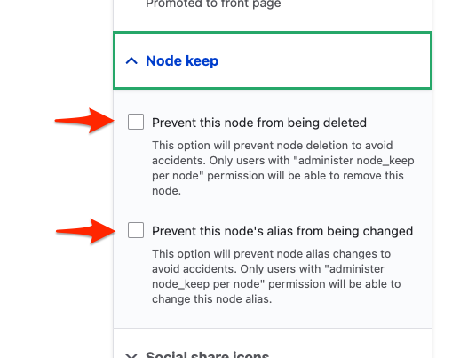

```markdown
---
title: Virtual Y Configuration
aliases:
  - /docs/wiki/virtual-y-configuration/
---

## Virtual Y Predefined Pages

Once Virtual Y is installed, the system creates a set of required landing pages with predefined URLs. These pages are:

*   Virtual Y Landing page - `/virtual-ymca`
*   Virtual Y Login Landing page - `/virtual-y-login`

The URLs to the pages above are then set as configuration values at `/admin/openy/virtual-ymca`.

It is the administrator's responsibility to keep these pages in the system or to properly update the configuration with new values to ensure Virtual Y functionality continues to work correctly. These pages are built using the "Landing Page (Layout Builder)" content type.

## Protecting Virtual Y Pages

If content editors modify the alias or remove the Virtual Y pages above, the Virtual Y site may break. Site administrators may want to add additional protections to the site to prevent editors from making those changes. We recommend [Node Keep](https://www.drupal.org/project/node_keep) for this purpose:

*   Add `node_keep` to your repo with `composer require 'drupal/node_keep'`
*   Enable the module in Drupal
*   Edit each of the pages above and set the Node Keep options as you wish to protect the pages



## Virtual Y Log Module

The Virtual Y Log module can be configured via configuration files. Available settings:

*   `activity_granularity_interval`: Default value `600` - sets the interval in seconds to track user activity on the site.
*   `archiver_enabled`: Default value `true` - enables/disables the activity logs archiver cron execution.
*   `archiver_store_period`: Default value `1 year` - sets the period for which activity logs will be collected and placed in the same archive. This value should be set as a Relative Date/Time PHP string, e.g., `1 week`, `2 months`, `1 year`, etc.
```
