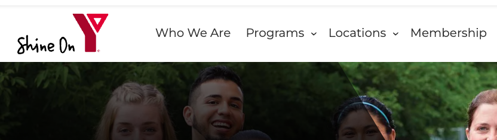
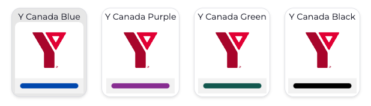
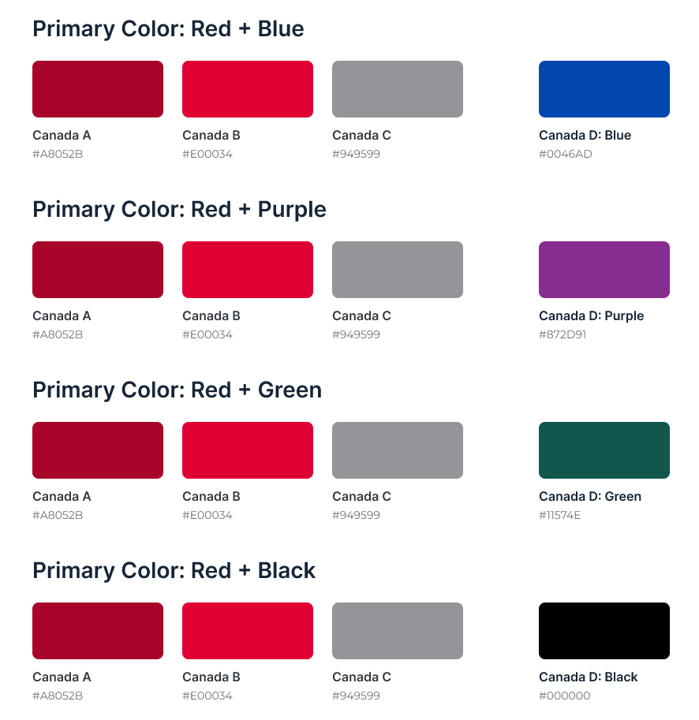
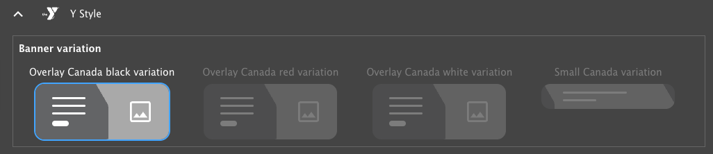

```markdown
---
title: "How to use the Canadian Colourway for Layout Builder"
linkTitle: "Use the Canadian Colourway"
description: With a few clicks, Canadian YMCAs can use their own set of brand-compliant, accessible styles.
---

YMCA of the USA has partnered with [YMCA Canada](https://www.ymca.ca/) to create a brand-compliant and accessible colorway for use by Canadian YMCAs. This allows Canadian YMCAs to easily implement their specific branding requirements within the YMCA Website Services platform.



## Designs

The colorway is packaged as the [Canada Layout Builder Colorway](https://www.drupal.org/project/ws_colorway_canada) module on Drupal.org and is included with the full [YMCA Layout Builder](https://github.com/YCloudYUSA/y_lb) package. The `ws_colorway_canada` module provides colorways, logos, and banner styles approved by YMCA Canada. It also depends on the `y_lb` (YMCA Layout Builder) and `responsive_favicons` modules.

The Canada Layout Builder Colorway includes the `lb_hero_canada` submodule, which provides helper functionalities for the Canada variations of the Hero Banner block type.

Explore the designs and components in Figma:

-   [YMCA Canada UI Kit](https://www.figma.com/proto/nQ8GfYR5CXkkaOxYAlITeC/YMCA-Canada-Design-System?type=design&node-id=614-11498&t=aGKtr2E2dDMfsYsF-1&scaling=min-zoom&page-id=614%3A11497&mode=design)
-   [YMCA Canada Components](https://www.figma.com/proto/nQ8GfYR5CXkkaOxYAlITeC/YMCA-Canada-Design-System?type=design&node-id=1640-14094&t=H3ljPnNvxOWrGqhd-0&scaling=scale-down&page-id=1640%3A10978&starting-point-node-id=1640%3A14094)
-   [YMCA Canada Demo Pages](https://www.figma.com/proto/nQ8GfYR5CXkkaOxYAlITeC/YMCA-Canada-Design-System?type=design&node-id=2201-21973&t=feeJM61aY5EhpgKl-1&scaling=min-zoom&page-id=2201%3A20920&mode=design)

### Colorways




The Canadian Colorway package includes four options for content type or page-level colorways: **Y Canada Blue**, **Y Canada Purple**, **Y Canada Green**, and **Y Canada Black.** Each colorway uses the same three primary colors - dark red, lighter red, and grey, along with a highlight color of blue, purple, green, or black.

### Banners


The Canadian Colorway for Banners package contains 4 banner variations that utilize the unique Y Canada chevron:

-   Black
-   Red
-   White
-   Short (no image, title and subtitle only)



These can be selected in the [Y Styles](../../user-documentation/layout-builder/advanced-options/#y-block-styles) selector for each banner on your site.

Y Canada sites can also use the existing "Overlay" Banner style as it does not utilize any YUSA-specific styling.

## Setup

### Enable the required modules

{}
Enabling `ws_colorway_canada` immediately changes the site logo from the Y-USA logo to the Y Canada logo.  It is strongly recommended to perform this action on a development environment first.
{}

To enable the Canadian colorway:

1.  Visit **Admin** > **Extend** (`admin/modules`).
2.  Enable the following modules (search for `Canada`):
    -   Layout Builder - Canadian Colorway (`ws_colorway_canada`)
    -   Y Layout Builder - Canada Colorway for Banner (`lb_hero_canada`)

Alternatively, enable the modules via `drush`:

```
drush en ws_colorway_canada lb_hero_canada -y
```

### Configure Site Defaults

After enabling the new colorway, follow these steps to ensure the new colorways are used across your site:

1.  Set the [default layout styles](../set-up-lb#configure-layouts--listings) to use the Canadian colorway of your choice.
2.  For any existing demo content and pages:
    -   Set the page colorway to one of the new "Y Canada" options.
    -   Change the banner style to one of the new [Y Canada Styles](../../user-documentation/layout-builder/advanced-options/#y-block-styles).

### Hide YUSA Styles

Y Canada site developers may want to hide the existing YUSA styles to prevent unintentional usage. While there isn't a configuration option for this, custom CSS can achieve this:

```css
#edit-ws-design-settings-colorway .form-item-ws-design-settings-colorway:has(div[class*="colorway-ws"]),
#drupal-off-canvas .form-item-appearance-ws-style-ws-style-option-hero-banner:not(:has(input[value*="canada"])) {
  display: none;
}
```
