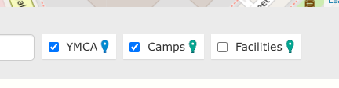
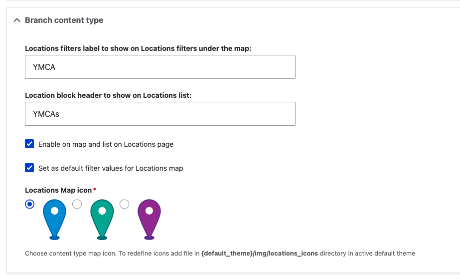

```markdown
---
title: How to customize your locations map
linkTitle: "Customize Your Map"
aliases:
  - /docs/development/map-settings-config/
---

YMCA Website Services includes robust mapping functionality defined in the [openy_map subproject](https://github.com/open-y-subprojects/openy_map). Maps are typically displayed on the `/locations` page using the [Location Finder component](../../user-documentation/layout-builder/location-finder) and are highly customizable.

Here are a few common customizations:

## Changing Map Options

By default, content types have these labels on the map:

*   Branch = YMCAs
*   Camp = Camps
*   Facility = Facilities



These labels can be customized in the Drupal administration pages to better suit your YMCA's member-focused terminology. To do so:

1.  In the Admin Menu, go to **YMCA Website Services** (or **Open Y** on prior versions) > **Settings** > **Map Settings**.
2.  In the **Branch/Camp/Facility Content Type** sections, you can:

    *   Edit the label names.
    *   Show or hide the content type on the Locations page.
    *   Set the filter to be on or off by default.
    *   Set the map icon.

    
3.  Edit each content type as needed, then **Save** the form.
4.  Reload `/locations` to see your changes.

## Adding Additional Location Types

You can add new content types to the map with a few steps. This may require some trial and error, so be sure to work in a testing environment first. The **Field UI** module must be enabled to do this through the Drupal admin UI.

1.  Create a new content type via **Structure** > **Content types** > **Add content type**.
2.  Add these existing fields to the content type:

    *   `field_location_coordinates` - Required
    *   `field_location_address` and `field_location_phone` - Suggested for display on the map and location teasers.
    *   `field_location_amenities` - If the location should be searchable with the Amenities search.
3.  Set up the Teaser display on the new content type:

    *   Navigate to **Manage display** then **Teaser**.
    *   Update these settings to match the Branch Teaser display at `/admin/structure/types/manage/branch/display/teaser`.
4.  Go back to the Map Settings at `admin/openy/settings/openy_map` and configure the options for your new location type.
