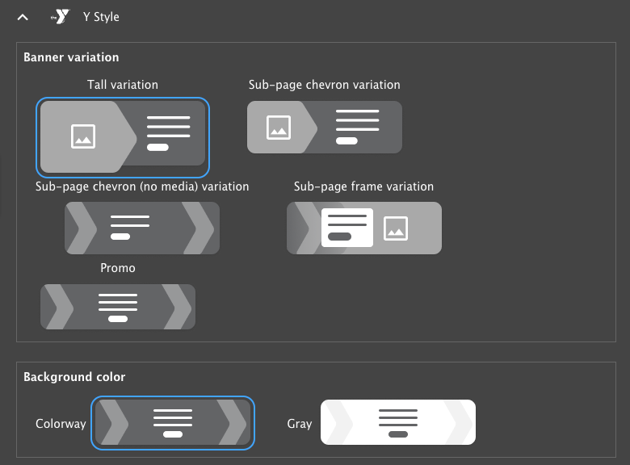
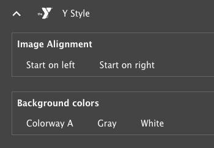

```markdown
---
title: "How to set up a site with the Small Y template"
linkTitle: "Set up a Small Y site"
description: The Small Y template is a set of modules and themes tailored to the needs of Small YMCAs.
---

## What is the Small Y template?

The Small Y template is a pre-configured set of modules and themes designed to meet the specific needs of Small YMCAs. It provides a lightweight and user-friendly solution for small organizations requiring a simple and effective website. The Small Y template is based on the [YMCA Website Services](https://github.com/YCloudYUSA/yusaopeny) distribution and built using [Y Layout Builder](https://github.com/YCloudYUSA/y_lb).

A fully functional sandbox environment showcasing the Small Y template is available at [https://small-y-stable.y.org/demo-ui-kit](https://small-y-stable.y.org/demo-ui-kit).

### Key Features and Differences

#### Simplified Theme

The Small Y template incorporates updates to the Layout Builder design system, a collaborative effort between VML and the YMCA of the USA. A visual representation of the new theme is available as a [mockup in Figma](https://www.figma.com/proto/yjxiX0VDNIeyefeDcuOWkS/YMCA_Small-Y-Template_Design-System?node-id=185-2300&node-type=canvas&t=ON1Hn9VBB4YT6xuQ-1&scaling=min-zoom&content-scaling=fixed&page-id=185%3A2299).

#### Essential Modules

The Small Y template is built with a curated selection of modules that are essential for a basic YMCA website. This streamlined approach simplifies setup and maintenance while minimizing the website's overall footprint.

Key modules and features included:

-   Updated header and footer
-   [Layout Builder](../../user-documentation/layout-builder)
-   [Articles](../../user-documentation/content-types/lb-article)
-   [Events](../../user-documentation/content-types/lb-event)
-   [Branches](../../user-documentation/content-types/branch)
-   [Camps](../../user-documentation/content-types/camp)
-   [CKEditor 5 Text Editor](../../user-documentation/text-editor)

Additional modules and features from the main distribution can be added via the Drupal admin interface as needed.

#### Features Contributed to the Main Distribution

Several features developed for the Small Y Template have been incorporated into the main YMCA Website Services distribution, benefiting all users:

-   The [Partners/Sponsors](../../user-documentation/layout-builder/partners) block now supports the division of partners into multiple tiers.
-   The [Simple Text/Table](../../user-documentation/layout-builder/table) block provides more consistent responsive table styling.
-   An additional [Utility Menu](../../user-documentation/layout-builder/header-footer/#utility-menu) has been added to the Header, allowing content editors to include extra links in the header's top-right corner.
-   [Events Listings](../../user-documentation/layout-builder/event-views) and [Articles Listings](../../user-documentation/layout-builder/article-views) now include a **Number of items** field to control the number of displayed items.
-   [Alerts](../../user-documentation/content-types/alert) feature a new set of styles aligned with the colorway color scheme.

#### Small Y Specific Features

The Small Y template includes features tailored to simplify setup and maintain content consistency for small organizations:

-   Limits have been implemented on the number of items for the main menu and various components.
-   [Breadcrumbs](../../user-documentation/layout-builder/breadcrumbs) are automatically enabled on all pages.
-   The [Banner](../../user-documentation/layout-builder/banner) block offers additional variants, each compatible with the colorway color or a grey background:
    -   **Tall** - Designed for use as the primary hero banner on a page.
    -   **Sub-page chevron** - Suitable as a secondary banner.
    -   **Sub-page chevron (no media)** -  A secondary banner option without media.
    -   **Sub-page frame** -  A secondary banner that uses dark text on a white background.
    -   **Promo** - A smaller banner option for use on pages needing a call to action with no media.

    

-   [Ping-pong](../../user-documentation/layout-builder/ping-pong) blocks can be added to sections using the **Ping-pong Section** content block. This simplifies adding alternating content blocks with section-level formatting, rather than formatting each block individually.
    -   When adding a **Ping-pong Section**, two sets of options can be configured under **Styles** > **Y Styles**:
        -   **Image Alignment** -  Choose whether the image starts on the left or right.
        -   **Background colors** - Select a colorway, white, or grey background for items within the section.

    
-   [Statistics](../../user-documentation/layout-builder/statistics) blocks have been redesigned, and include the option for grey or colorway backgrounds.
-   [Grid CTA](../../user-documentation/layout-builder/grid-cta) blocks now have CTA buttons positioned between the subheading and the items. [Icon Grid](../../user-documentation/layout-builder/icon-grid) blocks position the CTA below the items.

## Install the Small Y template

The Small Y template can be installed using either the YMCA Website Services Installation wizard or the command line.

-   **Installation Wizard**: This web-based tool provides a guided, step-by-step process for setting up a new YMCA website.
    -   During the installation process, select "Small Y" as the Installation Type.
-   **Command line**
    -   Execute the following Drush command:

        ```bash
        drush -vy si openy openy_configure_profile.preset=small_y openy_theme_select.theme=openy_carnation openy_terms_of_use.agree_openy_terms=1 install_configure_form.enable_update_status_emails=NULL --account-name=admin --site-name='YMCA Website Services'
        ```

## Build Your Site

After installing the Small Y template, you can begin building your site by adding content and configuring the layout. Refer to [How to set up a Layout Builder site](../set-up-lb) for detailed instructions.
