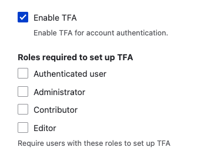

Multi-factor authentication (MFA), also known as two-factor authentication (2FA or TFA), provides an extra layer of security for your site. It can be enabled for specific roles, such as administrators, while allowing other users to log in with just a username and password.

The community-contributed [TFA module](https://www.drupal.org/project/tfa) is the recommended way to implement MFA.

## Requirements

The TFA module requires the PHP OpenSSL extension, which is typically included in modern PHP stacks. You can verify its installation by running:

```shell
php -i | grep openssl
```

To install the TFA module and its soft dependency, use Composer:

```shell
composer require drupal/tfa drupal/real_aes
```

## Installation and Configuration

1.  **Install the module:** Use the command-line instructions above, or install via the Extend page `/admin/modules`.

2.  **Encryption Key and Profile:** Follow the instructions in the TFA module's README file for your branch:

    *   [8.x-1.x branch](https://git.drupalcode.org/project/tfa/-/blob/8.x-1.x/README.md)
    *   [2.x branch](https://project.pages.drupalcode.org/tfa/)

    These files will walk you through setting an encryption key and an encryption profile.

3.  **Enable TFA:** Go to **Admin** > **Configuration** > **People** > **TFA** (`/admin/config/people/tfa`) and enable the module.

4.  **Configure Roles:** After enabling TFA, you can require it for specific roles on your site.

    

## Basic Authentication and MFA

It is important to note that enabling TFA does not disable basic username/password authentication.  Users *without* the roles required to use TFA will continue to log in as normal.  Users with roles that *do* require TFA will first enter their username/password, and *then* will be prompted for their MFA code.

## Security Considerations

*   **Basic Authentication for Web Services:** Be aware that modules like [Basic Authentication](https://www.drupal.org/project/basic_auth) use HTTP Basic Authentication, which transmits usernames and passwords in plain text (though base64 encoded). While Basic Authentication provides a way for web services to authenticate, it is crucial to secure the connection using HTTPS (SSL/TLS) to encrypt the transmission and prevent eavesdropping.  Consider using other authentication methods, like OAuth, for improved security where possible.

*   **Permissions:** The core User module allows users to register, log in, and log out, and administrators to manage user roles and permissions. The core Ban module allows administrators to ban certain IP addresses from accessing the site. Ensure that permissions are properly configured for each role to maintain a secure environment. Grant permissions only to trusted roles, especially those with security implications. Periodically review the permissions assigned to each role at **Admin** > **People** > **Permissions** (`/admin/people/permissions`).
