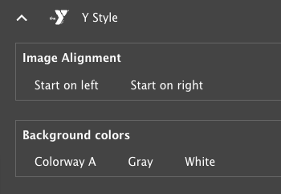

The Small Y template is a set of modules and themes tailored to the needs of Small YMCAs. It is designed to be a lightweight, easy-to-use solution for small organizations that need a simple, effective website.

A full working sandbox of the Small Y template is available at [https://small-y-stable.y.org/demo-ui-kit](https://small-y-stable.y.org/demo-ui-kit).

## What's different?

### New, simplified theme

The Small Y template includes updates to the Layout Builder design system provided by VML in collaboration with the YMCA of the USA. View a [mockup of the new theme (Figma)](https://www.figma.com/proto/yjxiX0VDNIeyefeDcuOWkS/YMCA_Small-Y-Template_Design-System?node-id=185-2300&node-type=canvas&t=ON1Hn9VBB4YT6xuQ-1&scaling=min-zoom&content-scaling=fixed&page-id=185%3A2299).

### Only the most essential modules

The Small Y template is built with a small set of modules that are essential for a basic YMCA website. This makes it easier to set up and maintain, and reduces the weight of the site.

Modules and features included with the Small Y template include:

- Updated header and footer
- [Layout Builder](../user-documentation/layout-builder)
- [Articles](../user-documentation/content-types/lb-article)
- [Events](../user-documentation/content-types/lb-event)
- [Branches](../user-documentation/content-types/branch)
- [Camps](../user-documentation/content-types/camp)
- [CKEditor 5 Text Editor](../user-documentation/text-editor)

Any other modules or features of the distribution can be added as needed via the Drupal admin interface.

### Additions to the main distribution

The Small Y Template provided a number of features back to the main distribution for all YMCA Website Services users to benefit from. These include:

- [Partners/Sponsors](../user-documentation/layout-builder/partners) block now allow for partners to be split into multiple tiers.
- [Simple Text/Table](../user-documentation/layout-builder/table) block now applies responsive table styles more consistently.
- An additional [Utility Menu](../user-documentation/layout-builder/header-footer/#utility-menu) has been added to the Header to allow content editors to add additional links in the top right of the header.
- [Events Listings](../user-documentation/layout-builder/event-views) and [Articles Listings](../user-documentation/layout-builder/article-views) have been updated to include a **Number of items** field to limit the number of items displayed.
- [Alerts](../user-documentation/content-types/alert) have a new set of styles that follow the colorway color scheme.

### Small Y Specific Features

The Small Y template includes a few additional features that are not included in the main distribution. These are intended to simplify the setup process for small organizations and add guardrails to keep content consistent.

- Limits have been added to the number of items for the main menu and many components.
- [Breadcrumbs](../user-documentation/layout-builder/breadcrumbs) are now automatically added to all pages.
- Additional variants have been added to the [Banner](../user-documentation/layout-builder/banner) block. Each banner can be used with the colorway color or grey background.
  - **Tall** - for use as the primary hero banner on a page.
  - **Sub-page chevron** - for use as a secondary banner on a page.
  - **Sub-page chevron (no media)** - for use as a secondary banner on a page with no media.
  - **Sub-page frame** - for use as a secondary banner on a page with dark text on a white background.
  - **Promo** - for use as a smaller banner on a page with a call to action and no media. 
- [Ping-pong](../user-documentation/layout-builder/ping-pong) blocks can be added in sections using the **Ping-pong Section** content block. This allows for alternating content blocks to be added to a page with section-level formatting, instead of block-by-block formatting.
  - When adding a **Ping-pong Section**, you can choose from two sets of options for the blocks contained within in **Styles** > **Y Styles**.
    - **Image Alignment** - Choose whether the image starts on the left or right.
    - **Background colors** - Choose between a colorway, white, or grey background for items in the section. 
- [Statistics](../user-documentation/layout-builder/statistics) blocks have been redesigned and have the option to be displayed with a grey or colorway background.
- [Grid CTA](../user-documentation/layout-builder/grid-cta) blocks have their CTA buttons moved between the subheading and the items. [Icon Grid](../user-documentation/layout-builder/icon-grid) blocks have the CTA below the items.

## Install the Small Y template

The Small Y template can be installed via the YMCA Website Services Installation wizard or the command line.

- **Installation Wizard**: The YMCA Website Services Installation wizard is a web-based tool that guides you through the process of setting up a new YMCA website. It includes a step-by-step process for configuring the site.
  - When asked to choose the Installation Type, choose "Small Y" and proceed with the installation steps.
- **Command line**
  - `drush -vy si openy openy_configure_profile.preset=small_y openy_theme_select.theme=openy_carnation openy_terms_of_use.agree_openy_terms=1 install_configure_form.enable_update_status_emails=NULL --account-name=admin --site-name='YMCA Website Services'`

## Build your site

Once you've installed a site with the Small Y template, you can start building your site by adding content and configuring the layout. See the [Layout Builder documentation](../user-documentation/layout-builder/) to get started.
