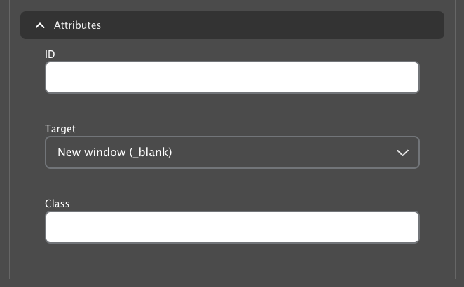

```markdown
---
title: Content Editing Basics
---

## Adding New Content

To add new content:

1.  Select the **Content** tab in the administration toolbar at the top of the page.

    

2.  Click the **Add New Content** button.
3.  On the next page, select the type of content you want to add. **[Learn About Content Types ⇒](../content-types/)**

    *   Fields marked with a red asterisk are required. You must complete these fields to save the content.
    *   To save the content as a draft, deselect the **Published** checkbox near the bottom of the page.
4.  Click the **Save** button.

## Searching for Content

You can find content to edit in two ways:

*   **Front-end:** Navigate to the page on your live site (what your users see). If you're logged in and have edit permissions, you'll see the following tabs:

    *   View
    *   Edit
    *   Revisions
    *   Delete

    

    Click the **Edit** tab to edit the content.

*   **Content administration page:**
    1.  Select **Content** in the administration toolbar. This opens the Content administration page.
    2.  Use the text field on the left to search by title.
    3.  To narrow your results, filter by:

        *   Content type
        *   Published status
        *   Language

    

    4.  Click the **Edit** button on the right side of the row to make changes.
    5.  If you're unsure whether you've found the correct content, click the title to view it.

## Deleting Content

You can delete content in these ways:

*   Click the **Delete** tab when viewing the content.
*   Click the **Delete** tab when editing the content.
*   Select **Delete** from the dropdown menu on the Content administration page.

You can also delete content in bulk:

1.  On the Content administration page, select the checkboxes next to the content you want to delete.
2.  Select **Delete content** from the dropdown menu above the results table.
3.  Click **Apply to Selected Items**.

    >**Warning:** This action is irreversible. Be sure you're deleting the correct content.

## Open Y Fields

Each content type has different fields, but they generally fall into these categories:

### Unformatted/String Text

These are single-line text boxes, such as page titles. Simply enter text into the box.


### Unformatted Textbox

A larger box that allows line breaks, paragraphs, and longer amounts of text.

### Dropdowns/Radio Buttons

Select one of the available options. You might need to click a button to apply or submit your selection.

### Multiselect Fields


Similar to a dropdown, but you can select multiple options by holding **Control** (Windows) or **Command** (Mac) and clicking the selections.

### WYSIWYG/Formatted Text Editor

A text editor that styles your text visually and allows you to add links and embed different types of media.

[More on the Text Editor ⇒](../text-editor/)

### Autocomplete Field

A text field with a circle on the right that's used for searching content, blocks, or taxonomy terms.

1.  Type what you want to enter.
2.  Select from the options that appear below the field. The results narrow as you type.


### Links/Button Fields

These typically appear as a single box with two fields inside and add a link onto a page, often as a button:

*   **URL:** The link destination.
*   **Link Text:** The call to action that's displayed.


The URL field supports relative URLs for links on your site (e.g., `/join` for `http://myymca.org/join`) and full URLs for links on other sites (e.g., `http://someotherymca.org/join`). You can also search for content by title and select it, like in other autocomplete fields.

#### Link Attributes

Some link fields contain an **Attributes** section that you can expand to add attributes to your link:



*   **ID:** Identifies the link in the page's HTML and can be targeted by anchor links. [More on anchor/jump links](../text-editor/adding-links/#anchor-links).
*   **Target:** Determines how the link opens:

    *   **New Window `_blank`:** Opens the link in a new tab or window.
    *   **Same Window `_self`:** Opens the link in the same tab or window.
*   **Class:** Applies a CSS class to the link for styling.

### Image Fields/Image Library

You can add, edit, and upload images any time you see a tab with "Image" in the title. To use the media browser, click the button in the image field.

[More on Using the Image Library ⇒](../text-editor/adding-images)

## Cloning Content

You can clone content using the **Clone** button on many pages:


or on the Content list in the site administration:


After selecting **Clone**, you'll see a screen asking which entities you want to clone. Generally, you can leave the checkboxes as they are, as changing the options could cause unintended consequences.


At the bottom of the options, select **Take ownership** if you want your user account to own the new content, then click **Save**.
