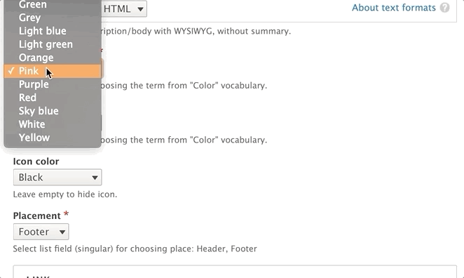

Unlike most content types in YMCA Website Services, you don't use Alert to create pages. Instead, Alerts display as a *rendered entity* or a section of content on other pages.

Alerts also don't use paragraphs. By design, the layout of Alerts are rigid; however, text editor and the the color options listed below allow content editors some flexibility.

## When Should You Use an Alert?

* Timely updates for centers, such as when your hours change or facilities close.
* Marketing promotions, such as for membership campaigns or even promotions.

## How to Use an Alert

Click on "Content" from your admin toolbar, and then click on the blue "Add Content" button." Select "Alert" on the next page.

* **Title**: Displays as the headline for your alert.

* **Description**: The main body of your alert. Sentences should be short and minimally styled in this section. Uses [the Text Editor](../../text-editor).

* **Color Fields**: These three dropdown fields control different aspects of color in your alert. All three dropdowns reference the [color vocabulary](../../taxonomy/#color).

  * ***Background Color***: The color of your alert.
  * ***Text Color***: Stick to using either black or white for accessibility.
  * ***Icon Color***: Changes the appearance of the icon to the left of the title.

* **Link**: Adds a button with a call to action to the alert on the right. Button color defaults to black.

* **Placement**: Choose "Header" to show your alert above your main content or "Footer" to show below your main content.

* **Visibility pages**: This is where you control where the alert displays on your site. In the large text field, you write the relative path of the pages where you want this to appear or not appear. Enter each path on a new line.

  You also have the option to use an asterisk character `*` as a wildcard so you don't have to enter a large number of relative paths. For example, if you wanted to add an alert to a `/health-and-fitness` section, you would enter `/health-and-fitness*` in the text area.

> **What is a relative path?**
> A *relative path* is the part of your url after your *domain name.*
>
> At `https://example.com/community`, for example, the *domain name* is **`example.com`**, while the *relative path* is **`/community`**.

Using the **Alert visibility state** radio buttons at the bottom, you can either show or hide your alert from the page paths listed in the text area above.
