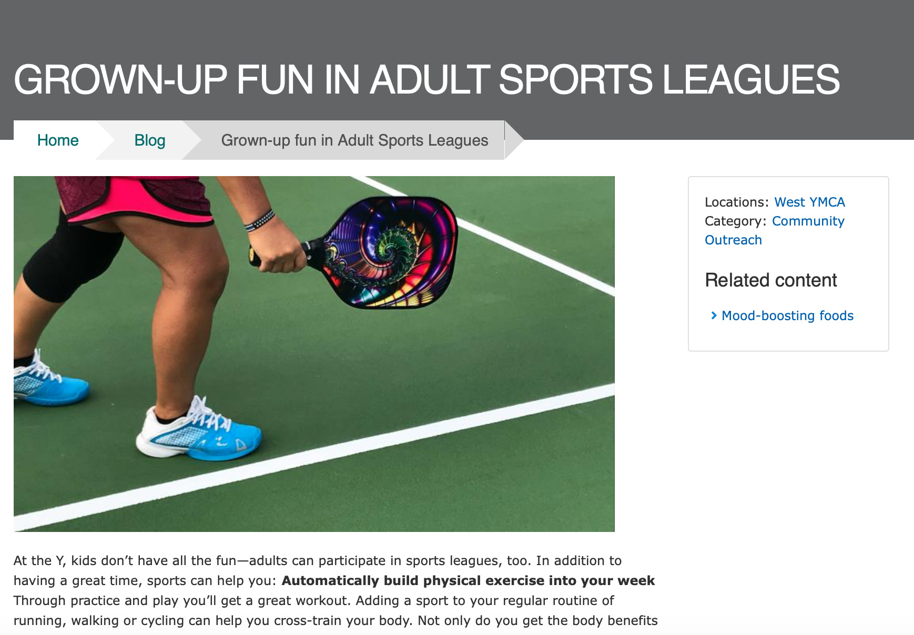
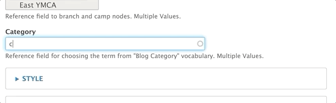
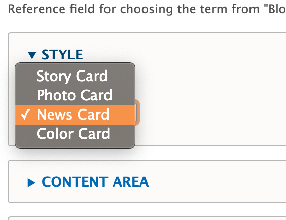
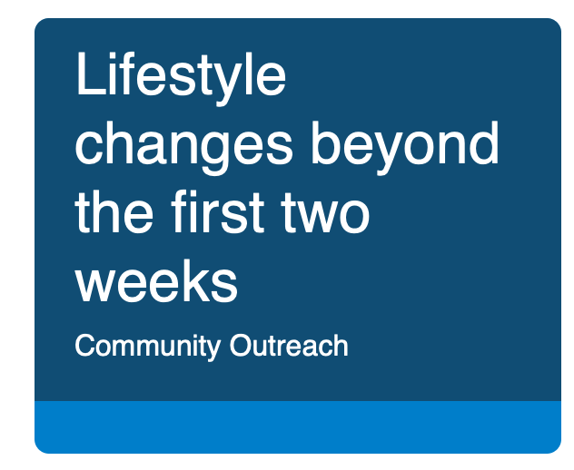
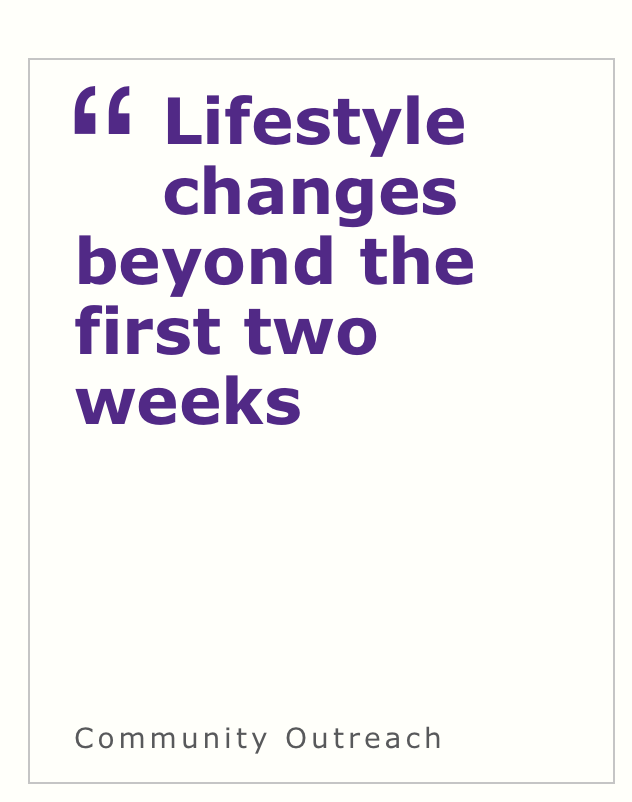
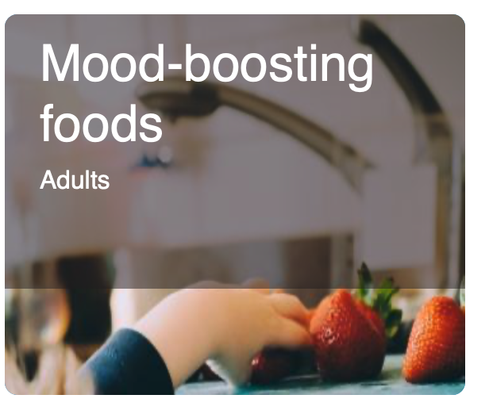
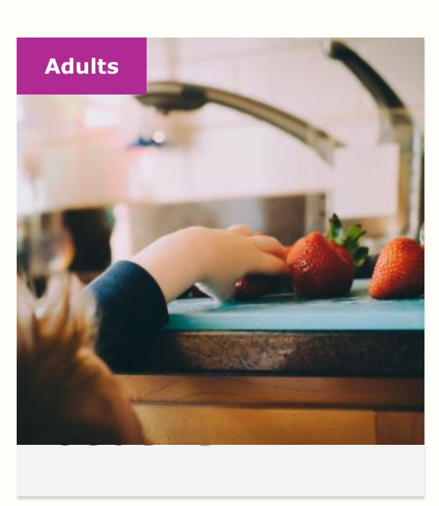
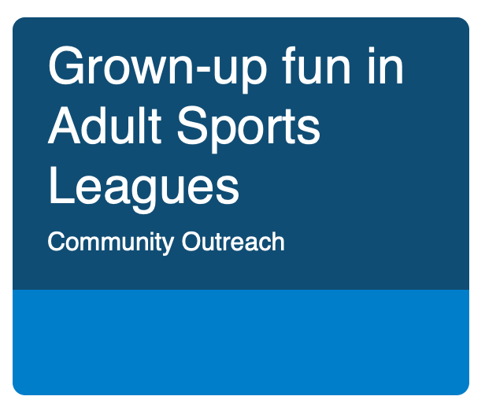
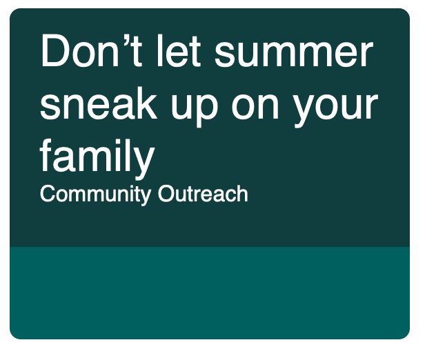
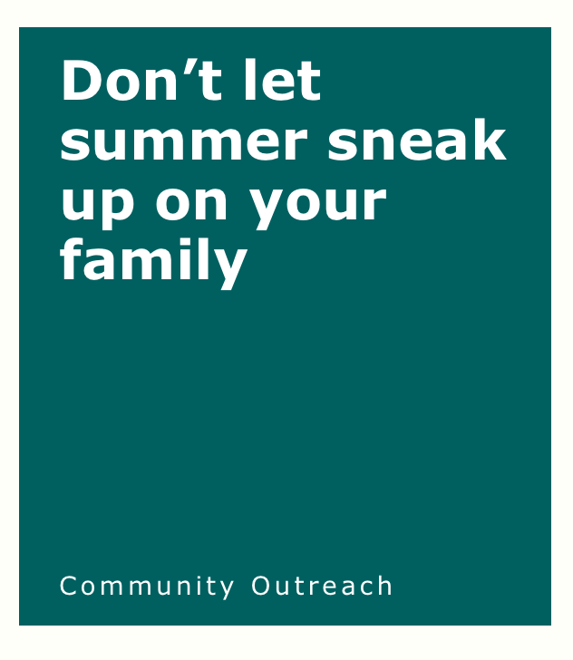

```markdown
---
title: Blog Post
description: Timely content, articles, and news pieces tagged with one or more physical locations.
---

> *Note: This Content Type is [similar to the News Post content type](../news-post).*



Blog posts in YMCA Website Services allow you the flexibility to create simple posts using only the text editor or more robust layouts with paragraphs. Blog posts utilize a two-column layout, with the content area on the left and the sidebar area on the right.

## When Should I Use a Blog Post?

When you decide to use a blog post [depends greatly on your Association's content strategy](https://www.youtube.com/watch?v=myGNK_qUGDM). However, blog posts are designed for publishing timely content and listing them throughout your site. Examples of blog posts may include:

*   Member Stories
*   Workouts and Recipes
*   Updates about a Center/Branch
*   Promotions and Contests
*   Press Releases

## How Do I Use a Blog Post?

There are three fields that appear above the accordion tabs:

*   **Title**: The name of the blog post. Displays in the header area of your blog post and in [the cards that display in a list of blogs](../../paragraphs/blog-posts-listing).

*   **Locations**: An *option select* field to tag a post with one or more locations (Camp or Branch). Use `Ctrl+Click` (Windows) or `Cmd⌘+Click` (Mac) to select multiple locations.

    > Each time you create a new Branch Page or Camp Page, it automatically populates into the locations field.

*   **Category**: An *entity reference* to [the Blog Category vocabulary](../../taxonomy/#blognews-category). Type in the name of the category and select from the options that appear, or create a new category/term by typing in a new one.

    

### Style

This dropdown changes the style of the post's card when it appears in a listing format. This dropdown does not affect any layouts on the page itself.



#### Story Card

| Carnation                                                         | Lily                                                    |
| :------------------------------------------------------------------ | :-------------------------------------------------------- |
|  |  |

#### Photo Card

| Carnation                                                         | Lily                                                    |
| :------------------------------------------------------------------ | :-------------------------------------------------------- |
|  |  |

#### News Card



#### Color Card

When choosing the Color Card style, you are presented with two styling options in dropdowns. Both are *entity references* to [the Color vocabulary](../../taxonomy/#color):

*   **Background color**: Changes the color of the card's background.
*   **Text color**: Changes the color of the text. It's recommended you only use white or black for optimal readability.

| Carnation                                                         | Lily                                                    |
| :------------------------------------------------------------------ | :-------------------------------------------------------- |
|  |  |

### Content Area

The content area is the main body of your page. You can use the default fields or build a more robust layout using paragraphs.  The content area displays on the left side of the page.

*   **Image**: Displays above your description and inside a Photo Card. This field is optional. It uses the [media browser and image field](../../media).

*   **Description**: You can enter a brief summary or the entire body of your text by [using the text editor](../../text-editor).

### Sidebar Area

The sidebar area allows you to embed paragraphs below a section that links to the centers tagged in the post, the categories, and a *Related Content field*.  The *Related Content field* allows you to promote other Blog Posts by tagging them with the autocomplete widget. The sidebar area displays on the right side of the page.

### Layouts

Blog posts utilize a two-column layout. The Content Area displays on the left, while the Sidebar Area displays on the right. You can build layouts within these areas using paragraphs.
