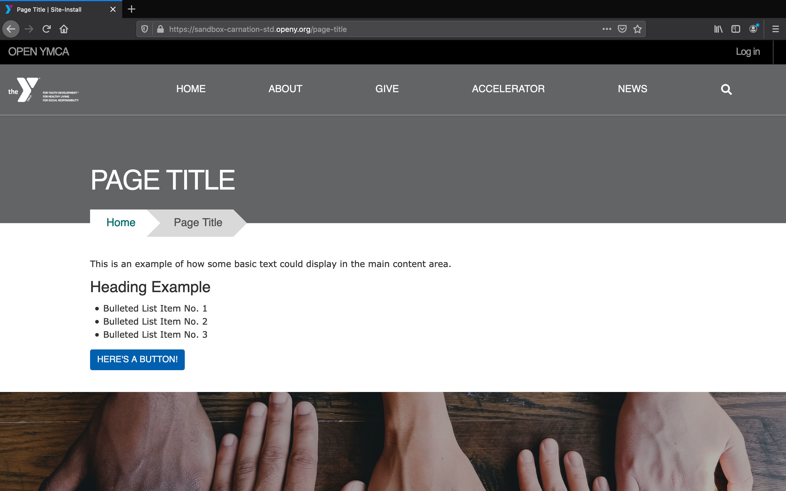
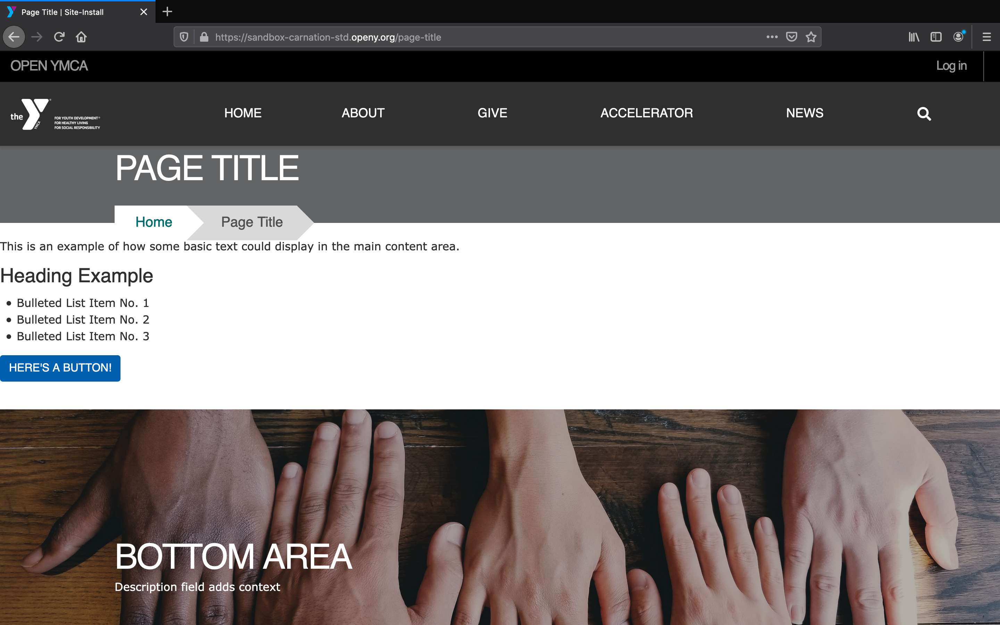
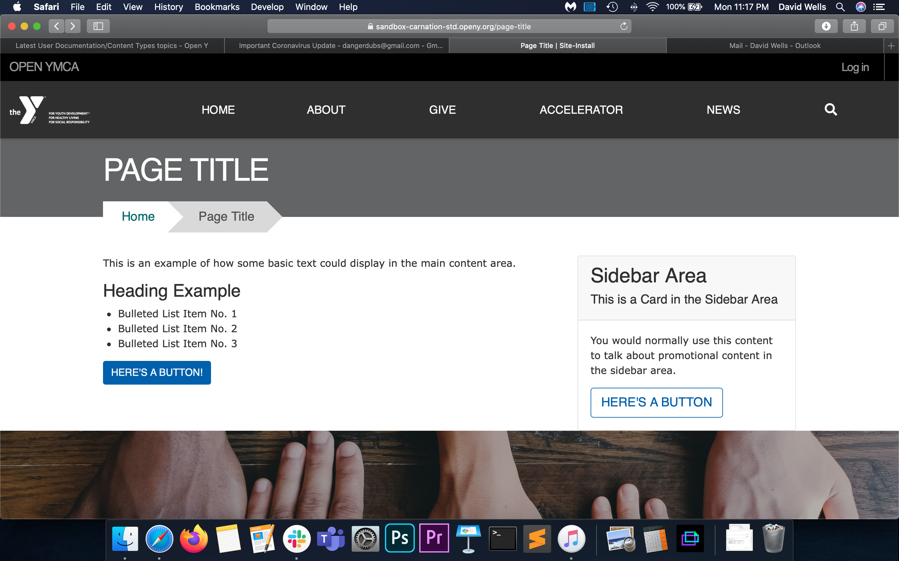
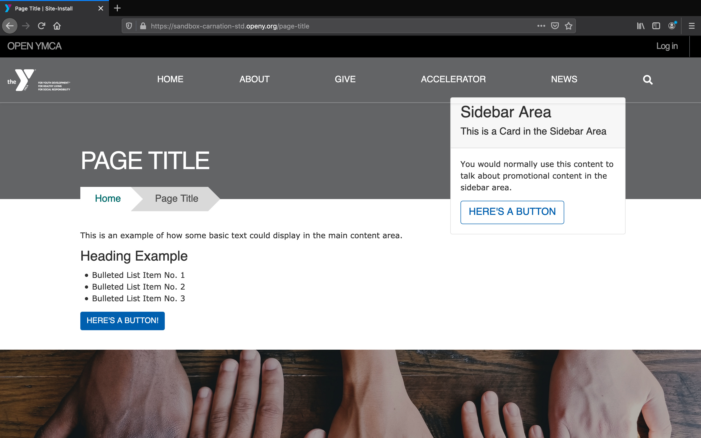

  <h4 class="alert-heading"><i class="fas fa-exclamation-triangle me-2"></i>Legacy Content Type</h4>
  
<strong>This is a legacy Paragraphs-based content type.</strong> For new pages, use <a href="../lb-landing-page/"><strong>Landing Page (Layout Builder)</strong></a> instead.

  

  

    <strong>Why migrate?</strong> Layout Builder offers:
    <ul class="mb-0">
      <li>✅ Drag-and-drop page building (easier, more flexible)</li>
      <li>✅ 30+ modern blocks vs limited paragraph types</li>
      <li>✅ Real-time visual preview</li>
      <li>✅ Better mobile responsiveness</li>
      <li>✅ Active development and support</li>
    </ul>
  

  

    <a href="../../howto/migrate-paragraphs-to-layout-builder/" class="alert-link"><strong>→ See Migration Guide</strong></a> |
    <a href="../lb-landing-page/" class="alert-link"><strong>→ Landing Page (Layout Builder) Documentation</strong></a>
  

---

## Fields in Landing Page (Paragraphs)

#### Title (Required)

This is what you will see in your admin portal as your content's name. it will also show as the page title in the Header unless you add a paragraph in the *Header Area*.

#### Layout (Required)

Landing Pages come with four basic layouts for desktop. For mobile, all layouts display in a single column, with the *Sidebar Area* stacking below the *Content Area*.

#### One Column Layout

#### One Column (Full Width)

### Two Columns

### Two Columns (Fixed Sidebar)

### Paragraph Areas

You can use any number of [Paragraphs](../../paragraphs) in these fields.

* **Header Area**: Used for inserting banners, small banners and galleries. Date blocks are also great in this area for scheduled content.
* **Content Area**: The main body of your content.
* **Sidebar Area** *(Two Column Layouts Only)*: For aside pieces of content, such as side navigations, promotional cards and content related to the main part of your page.
* **Bottom Area**: Add an anchoring element to your page, such as a promotional banner or webform.
