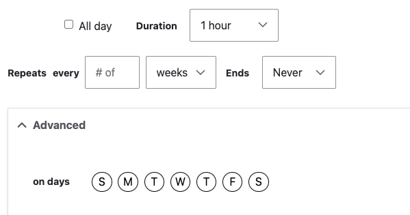

The **Event (Layout Builder)** content type is the modern way to create event pages for your YMCA's community programs, fundraisers, classes, workshops, and special activities. It combines structured event data (date, time, location) with flexible drag-and-drop Layout Builder capabilities.

**Machine name:** `lb_event`

**Designs:**
- [Mobile](<../../../../../../assets/img/designs/lb/Event_Mobile_Recurring.png>) | [Desktop](<../../../../../../assets/img/designs/lb/Event_Desktop_Recurring.png>)
- (before March 2024) [Mobile](<../../../../../../assets/img/designs/lb/Events Mobile.png>) | [Desktop](<../../../../../../assets/img/designs/lb/Event Desktop.png>)

{}

---

## When to Use Event (Layout Builder)

### Use Event (LB) for:

- ✅ **Community events** - Health fairs, family fun days, open houses, volunteer events
- ✅ **Fundraising events** - Charity runs, galas, auctions, donation drives
- ✅ **Special programs** - Summer camp kickoffs, member appreciation nights, holiday events
- ✅ **Recurring events** - Weekly fitness classes, monthly meet-ups, seasonal programs
- ✅ **Workshops & classes** - CPR training, parenting workshops, wellness seminars
- ✅ **Sporting events** - Youth tournaments, adult leagues, fitness challenges

### Do NOT Use Event (LB) for:

- ❌ **Ongoing programs** - Use Program or Program Subcategory content types
- ❌ **News announcements** - Use Article (Layout Builder) instead
- ❌ **Static information pages** - Use Landing Page (Layout Builder)
- ❌ **Branch hours/schedules** - Add to Branch content type

---

## Event Types Explained

Events typically fall into these categories:

### Community Events
**Best for:** Free or low-cost events that build community engagement

**Example uses:**
- "Family Fun Day at the YMCA"
- "Healthy Kids Day"
- "Community Open House"
- "Volunteer Appreciation Event"

**Display:** Typically shown on `/events` page, homepage, and Branch pages

### Fundraising Events
**Best for:** Events that raise money for programs or capital campaigns

**Example uses:**
- "Annual Charity 5K Run/Walk"
- "Spring Gala & Auction"
- "Giving Tuesday Campaign Kickoff"
- "Donate for a Cause"

**Display:** Events page, fundraising landing pages, homepage promotions

### Program Events
**Best for:** Kickoff events, info sessions, special programming

**Example uses:**
- "Summer Camp Open House"
- "Youth Sports Registration Night"
- "Swim Lesson Information Session"
- "New Member Orientation"

**Display:** Program pages, Branch pages, event listings

### Recurring Events
**Best for:** Regular classes, weekly groups, monthly activities

**Example uses:**
- "Monday Morning Yoga Class"
- "Weekly Teen Game Night"
- "Monthly Senior Social"
- "Every Saturday Family Swim"

**Display:** Event listings with recurring schedule display

---

## Creating an Event

### Step 1: Add New Event

1. Navigate to **Admin** > **Content** > **Add Content**
2. Select **Event (Layout Builder)**
3. You'll see the Event creation form

### Step 2: Fill in Required Fields

#### Title (Required)
The event name that appears at the top of the page and in event listings.

**Best practices:**
- Be specific and action-oriented
- Include event type or benefit ("5K Run for Healthy Kids" not "5K")
- Keep under 60 characters for search display
- Front-load important keywords

**Examples:**
- ✅ "Family Fun Day - Free Activities for All Ages"
- ✅ "Annual Charity 5K Run & Walk"
- ✅ "Youth Basketball Tournament Registration"
- ✅ "CPR & First Aid Certification Workshop"
- ❌ "Event" (too vague)
- ❌ "The YMCA of Greater Example City Presents the Annual Spring Community Health and Wellness Fair" (too long)

#### Subtitle (Optional)
Additional context or supporting detail for the event title.

**Best practices:**
- Add date, location, or key benefit
- Keep to 1 short sentence
- Complements title without duplicating info

**Example:**
- Title: "Summer Camp Open House"
- Subtitle: "Meet staff, tour facilities, and register for summer - Saturday, March 15"

#### Location Info (Required)

You must provide either **Event Location** OR **Address**:

**Event Location (Recommended):**
- Select from existing Branch, Camp, or Facility pages
- Automatically includes address, phone, directions
- Links event to location page
- Multiple locations supported

**Address (Manual):**
- Use if event is at non-YMCA location (park, school, partner venue)
- Enter full address manually
- Overrides Event Location if both are filled

**Directions (Optional):**
- Auto-generated link uses address from Event Location or Address
- Override with custom directions URL if needed

**Best practices:**
- **In-person events:** Always include full address with city/state
- **Virtual events:** Add "Virtual Event" in subtitle, provide platform details in body
- **Multi-location:** List all locations or create separate events per location
- **Parking/transit:** Mention in event body ("Free parking available" or "Bus route 5")

#### Event Date(s) (Required)

Add start and end date/time for the event.

**Single Date Event:**
1. Select start date and time
2. Select end date and time (or use start time if no end time)
3. If event has no specific end time, use start time for both

**Recurring Event (March 2023+):**
1. Set the **Repeats** option (daily, weekly, monthly)
2. Choose **Number** of recurrences or **End date**
3. Expand **Advanced** options to customize (e.g., "Every Monday and Wednesday")
4. After saving, use **Manage Instance** to edit/remove individual occurrences



**Multiple Non-Recurring Dates:**
- Use **Add another item** below date selector
- Example: Event on May 5, May 12, and May 19 (but not weekly pattern)

**Best practices:**
- **Display prominently:** Date/time should be impossible to miss
- **Time zones:** Specify if event serves multiple time zones (virtual events)
- **All-day events:** Use start time of 12:00 AM and end time of 11:59 PM
- **TBD dates:** Use placeholder date, add "Date TBD" in subtitle, update when confirmed
- **Registration deadlines:** Mention in event body ("Register by May 1")

#### Header Image (Required for most themes)
Featured image displayed at the top of the event page and in event listings.

**Best practices:**
- **Size:** 1920x1080px recommended (16:9 aspect ratio)
- **File size:** Under 500KB (compress with TinyPNG or similar)
- **Format:** JPG or WebP for photos, PNG for graphics
- **Alt text:** Always include descriptive alt text ("Families running at annual 5K charity event")
- **Content:**
  - **Past events:** Use real photos from previous year's event
  - **New events:** Use location photo, activity photo, or branded graphic
  - **Avoid:** Text-heavy images (text may not scale on mobile)

**Image tips:**
- Show people engaged in similar activities
- Include YMCA branding when appropriate
- Ensure faces are visible and in-focus
- Check image looks good when cropped to square (some listing views)

#### Tags (Recommended)
Categories for organizing and filtering events.

**Best practices:**
- **Number:** Choose 1-3 relevant tags per event
- **Consistency:** Use existing tags (avoid creating duplicates)
- **User-focused:** Use terms your audience would search for

**Example tag structure:**
- Event types: Community Event, Fundraiser, Workshop, Class, Tournament
- Audiences: Family, Youth, Seniors, Adults, Teens
- Program areas: Aquatics, Wellness, Youth Programs, Sports

**Common event tags (3-10 tags recommended):**
- Community Events
- Fundraising
- Family Events
- Youth Programs
- Wellness & Fitness
- Free Events
- Registration Required

**Avoid:** Over-tagging (10+ tags), one-off tags, jargon

#### Body (Required)
Main event content using the WYSIWYG editor.

**Best practices:**
- **Paragraph length:** 2-3 sentences per paragraph (easier to scan on mobile)
- **Essential info first:** What, when, where, who, why in lead paragraph
- **Subheadings:** Use H2 and H3 headings to organize content
- **Length:** 200-500 words for most events (more for complex events like fundraisers)
- **Lists:** Use bulleted or numbered lists for schedules, activities, what to bring
- **Bold:** Highlight key details (registration deadline, cost, special notes)

**Structure template:**
1. **Lead paragraph:** Hook + essential details (what, when, where, cost)
2. **Event details:** Schedule, activities, speakers, agenda
3. **Registration info:** How to register, deadlines, cost, what's included
4. **Logistics:** Parking, what to bring, accessibility, contact info
5. **Call to action:** Register now, RSVP, learn more

**Example structure:**
```
[LEAD] Join us for Family Fun Day on Saturday, May 15 from 10am-2pm at our Main Street YMCA. This free community event features activities for all ages, healthy snacks, and prize giveaways!

[H2] Event Schedule

10:00am - Welcome & Opening Activities
10:30am - Kids Fitness Challenge
11:00am - Family Yoga Session
11:30am - Healthy Cooking Demo
12:00pm - Lunch & Prize Drawings
1:00pm - Open Swim (weather permitting)

[H2] What to Bring

- Comfortable clothes for activities
- Water bottle (refill stations available)
- Sunscreen for outdoor activities
- Towel and swimsuit (optional)

[H2] Registration

Free for all community members! No registration required, but RSVP helps us plan: [RSVP Button]

Questions? Call (555) 123-4567 or email events@exampleymca.org
```

#### Locations (Optional)
Associate the event with specific Branch pages.

**When to use:**
- Event is hosted at or affiliated with a Branch
- You want event to appear on Branch page "Upcoming Events" section
- Local community events specific to one location

**Example:** "Youth Basketball Tournament" at Westside YMCA should be tagged with Westside YMCA location.

### Step 3: Configure Layout (Optional)

After saving, click **Layout** tab to add Layout Builder sections and blocks.

**Common Event layouts:**

**Community Event Layout:**
- Header image + event details (auto-generated from fields)
- Simple Content - Event description and schedule
- Cards - Activities or highlights
- Related Events - Other upcoming events
- Button - Registration/RSVP link

**Fundraising Event Layout:**
- Banner - Hero image with registration CTA
- Simple Content - Event purpose and impact
- Cards - Sponsorship levels or giving options
- Testimonials - Past participant quotes (if available)
- Webform - Donation or registration form
- Related Events - Other fundraising events

**Workshop/Class Layout:**
- Header image + details
- Accordion - Session topics/agenda
- Simple Content - Instructor bio
- Cards - What you'll learn / takeaways
- Button - Registration link

[**→ See Layout Builder documentation**](../../layout-builder/)

### Step 4: Set SEO & Metadata (Recommended)

If your site has SEO modules enabled (Meta tags, Pathauto):

**Meta title:** Auto-generated from event title (usually fine)
**Meta description:** 150-160 characters summarizing event
- Include: Event type, date, location, key benefit
- Example: "Join our free Family Fun Day on May 15 at Main Street YMCA. Activities for all ages, healthy snacks, and prizes. RSVP today!"

**URL alias:** Auto-generated from title (e.g., `/events/family-fun-day-may-15`)

**Pro Tip:** Include location and date in URL if event recurs annually (`/events/2025-charity-5k`)

### Step 5: Preview and Publish

1. Click **Save** to create draft
2. Click **Preview** to see how event looks
3. Check mobile responsive display
4. Verify date/time/location display correctly
5. Test registration/RSVP links
6. Check **Published** checkbox
7. Click **Save** to publish live

---

## Event Planning Best Practices

### Publishing Timeline

**Recommended event publishing schedule:**

| Event Type | Publish Timeline | Update Frequency |
|------------|------------------|------------------|
| **Major fundraisers** | 3-6 months ahead | Weekly updates leading up to event |
| **Community events** | 1-3 months ahead | Bi-weekly updates |
| **Workshops/classes** | 1-2 months ahead | Update as spots fill |
| **Recurring events** | Create once, update quarterly | Update for schedule changes |
| **Time-sensitive** | ASAP + promote heavily | Daily updates last week |

**Why timing matters:**
- **SEO:** Google needs 1-2 months to rank event pages
- **Planning:** People plan community events 1-3 months in advance
- **Promotion:** Allows time for email, social media, partner outreach

### Event Information Hierarchy

**Make these details impossible to miss:**
1. **Date & Time** - Large, prominent display
2. **Location** - Full address + parking/directions
3. **Cost** - Free, ticket price, or registration fee
4. **Registration** - How to RSVP or sign up

**Use visual cues:**
- Icons for date 📅, location 📍, cost 💵
- Bold text for critical deadlines
- Contrasting button color for registration CTA
- Alert boxes for important notices ("Space limited!")

### Event Content Updates

**Pre-Event:**
- Add event page 1-3 months ahead (depending on event type)
- Update with speaker/activity details as confirmed
- Add countdown or "limited spots" notice 2 weeks before
- Final reminder updates 1 week before (parking, what to bring)

**Day-Of Event:**
- Post live updates if multi-day event (conference, camp)
- Share photos/videos in real-time (social media)
- Update any schedule changes immediately

**Post-Event:**
- Add photo gallery within 1 week
- Include testimonials/quotes from attendees
- Add "Thank you" message or event recap
- Link to "Next Year" or similar future event
- Use for promotion of next year's event

### Registration & Ticketing

**Registration details to include:**
- **How to register:** Button/link to external system (Daxko, Eventbrite) or webform
- **Deadline:** "Register by May 1" with countdown if possible
- **Cost breakdown:** Early bird, regular, group rates
- **What's included:** Meals, materials, t-shirt, swag
- **Cancellation policy:** Refunds, transfers, no-shows

**Ticket tiers (if applicable):**
- **Early Bird** - Discount for registering 1+ months ahead
- **Regular** - Standard pricing
- **Group Rate** - Discounts for families, teams, groups of 5+
- **VIP/Premium** - Exclusive access, better seats, extra perks

**Example ticket display:**
```
[Cards block with 3 cards]

EARLY BIRD
$25 per person
Register by April 1
✓ Event admission
✓ Free t-shirt
✓ Healthy lunch

REGULAR
$35 per person
Register by May 10
✓ Event admission
✓ Free t-shirt
✓ Healthy lunch

GROUP RATE
$25 per person
Groups of 5+
✓ Event admission
✓ Free t-shirts
✓ Healthy lunch
✓ Reserved seating
```

### Accessibility

**Make events accessible:**
- **Physical access:** Note wheelchair accessibility, elevators, accessible parking
- **Sensory:** Mention quiet spaces, sensory-friendly accommodations
- **Dietary:** List food options (vegetarian, gluten-free, allergens)
- **Language:** Offer translation or interpretation if available
- **Contact:** Provide accessibility coordinator contact for questions

**Example:**
> **Accessibility:** Our facility is fully wheelchair accessible with elevator access to all floors. Reserved accessible parking available. ASL interpretation available upon request (contact by May 1). Dietary restrictions accommodated - note in registration form.

---

## Common Event Patterns

### Community Event

**Purpose:** Free or low-cost event to build community engagement

**Key elements:**
- Emphasize "FREE" or low cost prominently
- Highlight activities for all ages
- Include schedule with specific activity times
- Show diverse community in photos
- Easy RSVP (not required but helpful for planning)

**Sample layout:**
1. Banner - Event hero image
2. Simple Content - Event overview and schedule
3. Cards - Activity highlights (3-4 activities featured)
4. Gallery - Photos from last year's event
5. Button - RSVP link (optional)
6. Related Events - Other community events

---

### Fundraising Event

**Purpose:** Raise money for programs, capital campaigns, or community needs

**Key elements:**
- Explain impact ("Your $50 sponsors one child for swim lessons")
- Show sponsorship or giving levels
- Include testimonials from past participants
- Highlight sponsors/partners
- Make donation/registration prominent

**Sample layout:**
1. Banner - Event image with impact stat ("Raised $50K last year!")
2. Simple Content - Event purpose and how funds are used
3. Cards - Sponsorship levels (Bronze, Silver, Gold)
4. Testimonials - Donor or participant quotes
5. Webform - Donation or registration form
6. Simple Content - Event schedule and logistics
7. Logos - Past sponsors (if sponsor block available)

---

### Workshop or Class

**Purpose:** Educational event with registration and limited capacity

**Key elements:**
- Instructor/speaker credentials
- Learning outcomes ("You will learn...")
- Session agenda or topics
- What to bring / prerequisites
- Registration deadline and capacity ("Limited to 20 participants")

**Sample layout:**
1. Header image + event details
2. Simple Content - Workshop overview and benefits
3. Accordion - Session agenda with topics
4. Simple Content - Instructor bio with photo
5. Cards - Key takeaways or skills learned
6. Button - Registration link with "Limited Spots!" notice
7. Related Events - Other workshops or classes

---

### Recurring Event

**Purpose:** Regular class, group, or activity that repeats

**Key elements:**
- Clear recurring schedule ("Every Monday at 6pm")
- Drop-in vs. registration required
- Session dates (start/end of series)
- New participant information ("First class free!")

**Sample layout:**
1. Header image + recurring schedule display
2. Simple Content - Class description and benefits
3. Table or Accordion - Weekly schedule breakdown
4. Simple Content - Instructor info
5. Button - "Join Us Monday!" registration link
6. Related Events - Other recurring programs

---

## SEO Best Practices for Events

### Event Title Optimization

- **Length:** 50-60 characters (Google's display limit)
- **Keywords:** Include event type + benefit + location
- **Date:** Add year for annual events ("2025 Charity 5K")
- **Avoid:** Excessive punctuation, all caps, clickbait

**Examples:**
- ✅ "Family Fun Day 2025 - Free Activities | Main Street YMCA"
- ✅ "CPR Certification Workshop - May 15 | Downtown Y"
- ❌ "EVENT!!!" (not descriptive)
- ❌ "The Best Event You'll Ever Attend" (clickbait)

### Meta Description

- **Length:** 150-160 characters for desktop, 120 for mobile
- **Include:** Event type, date, location, key benefit, CTA
- **Keywords:** Natural inclusion of search terms

**Example:**
"Join our Annual Charity 5K Run on June 10 at Riverside Park. Raise funds for youth programs while getting fit. All ages welcome. Register today!"

### Schema Markup (Structured Data)

If your site has Schema.org markup enabled, events automatically include:
- Event name and description
- Start date, end date, and time
- Location (name, address, coordinates)
- Organizer (YMCA organization)
- Ticket/pricing information
- Event image

This helps search engines display rich snippets (enhanced search results with date, location, price).

### Local SEO

- **Location keywords:** Include city/neighborhood in title or body
- **Google My Business:** Event may sync to GMB if integration enabled
- **Local directories:** Submit event to community calendars, partner sites
- **Geotagging:** Ensure location coordinates accurate for map display

---

## Common Mistakes to Avoid

### ❌ Mistake 1: Buried Date/Time/Location
**Problem:** Users can't quickly find essential event details
**Solution:** Display date, time, location prominently at top of page (event fields auto-display)

### ❌ Mistake 2: No Clear Registration Path
**Problem:** People want to attend but don't know how to sign up
**Solution:** Registration CTA above the fold + in event body + at bottom of page

### ❌ Mistake 3: Outdated Event Information
**Problem:** Event details change but page isn't updated
**Solution:** Calendar reminder to review event pages weekly leading up to event

### ❌ Mistake 4: Generic Stock Photos
**Problem:** Event looks inauthentic, low engagement
**Solution:** Use real photos from past events or real YMCA location photos

### ❌ Mistake 5: Missing Parking/Logistics
**Problem:** Attendees arrive late or can't find venue
**Solution:** Include parking info, public transit, entrance directions

### ❌ Mistake 6: No Post-Event Follow-Up
**Problem:** Missed opportunity to engage attendees for future events
**Solution:** Update page with photos, thank you message, link to next event

### ❌ Mistake 7: Not Archiving Past Events
**Problem:** Old events clutter listings, confuse users
**Solution:** Unpublish events 1 week after end date (or keep for next year's promotion)

---

## Troubleshooting

### Event Not Appearing in Event Listings

**Problem:** Published event doesn't show on /events page or Branch page

**Solutions:**
- Verify **Published** checkbox is checked
- Check **Event Date** is not in the past (some views filter old events)
- If Branch-specific, verify **Locations** field includes the Branch
- Clear cache (Admin → Configuration → Performance → Clear all caches)
- Check Views settings for event listing (may have date/tag filters)

---

### Date/Time Displaying Incorrectly

**Problem:** Event shows wrong date, time, or timezone

**Solutions:**
- Verify date field has correct timezone selected
- Check site timezone settings (Admin → Configuration → Regional → Date and time)
- For recurring events, check **Manage Instance** for individual date issues
- Ensure browser timezone doesn't interfere (test in incognito mode)

---

### Location Not Displaying

**Problem:** Event location address not showing on event page

**Solutions:**
- Verify either **Event Location** OR **Address** is filled (not both, unless Address should override)
- Check Event Location (Branch/Camp/Facility) is published
- If using Address field, ensure all required fields (street, city, state) are complete
- Check theme displays location field (Admin → Structure → Content types → Event → Manage display)

---

### Recurring Event Issues

**Problem:** Recurring event instances not creating or displaying correctly

**Solutions:**
- Verify **Repeats** is set correctly (daily, weekly, monthly)
- Check **Advanced** settings for specific day selection
- Use **Manage Instance** to view all created instances
- Delete and recreate if instances are malformed
- Check module updates (recurring events added March 2023+)

---

## Related Resources

- [Layout Builder Documentation](../../layout-builder/) - Customize event layouts
- [Block Library](../../layout-builder/block-library/) - Add components to events
- [Related Events Block](../../layout-builder/related-events/) - Show similar events
- [Text Editor Guide](../../text-editor/) - Format event body content
- [Taxonomy Guide](../../taxonomy/) - Manage event tags
- [Content Types Library](../) - Compare all content types

---

## Need Help?

- [YMCA Community Slack](https://ycloud.y.org/slack) - #content-editors channel
- [Monthly Community Calls](/blog/monthly-calls/) - Ask questions live
- [Troubleshooting Guide](/docs/troubleshooting/) - Common solutions
- [Quick Reference](/docs/quick-reference/) - Fast answers

**Happy event planning!** Well-designed event pages drive registrations, build community, and showcase the great work your YMCA does. 📅

<style>
table {
  width: 100%;
  margin: 1rem 0;
  border-collapse: collapse;
}

table th,
table td {
  padding: 0.75rem;
  border: 1px solid #ddd;
  text-align: left;
}

table th {
  background-color: #f8f9fa;
  font-weight: 600;
}

code {
  background-color: #f4f4f4;
  padding: 2px 6px;
  border-radius: 3px;
  font-family: 'Courier New', monospace;
}
</style>
