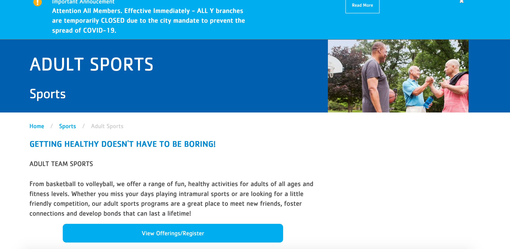
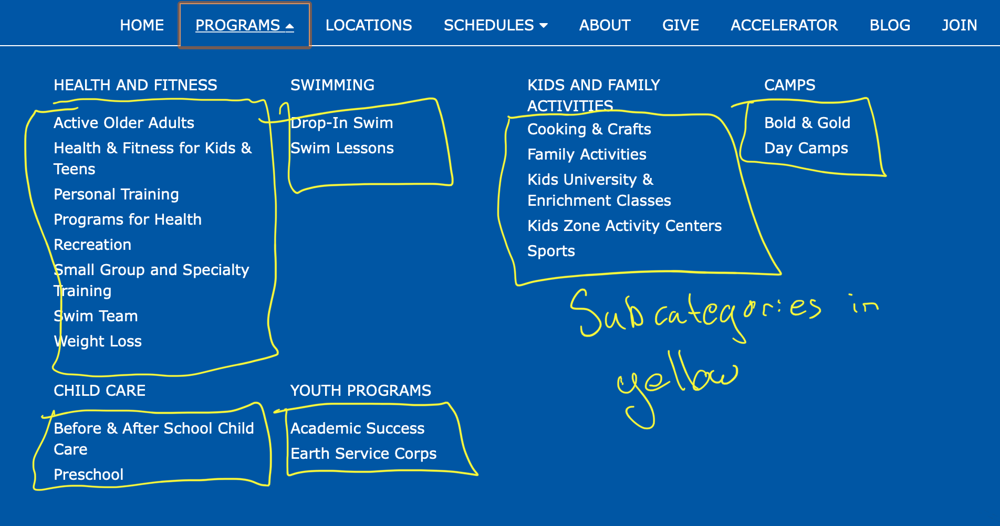
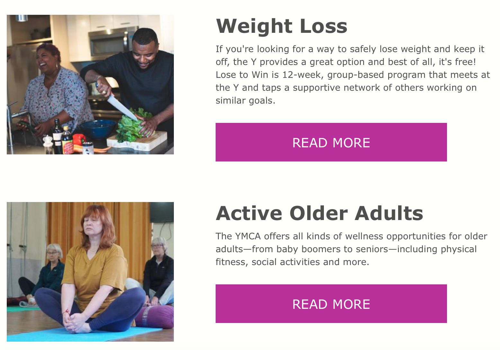
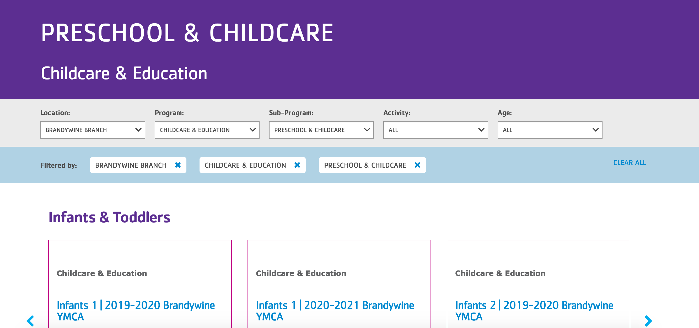

A subset of a [Program](../program), Program Subcategory pages list different types of program offerings, which can be grouped into [Activities](../activity-class-session).

Whereas a Program page would describe a Y's Health & Fitness offerings in general, a Program Subcategory would break that down into subcategories such as:

*   Personal Training
*   Group Exercise Classes
*   Pilates

## When Should I Use a Subcategory?

Most Ys have opted to use Program pages as the top-level categories in their Programs mega menu. Subcategories are then the items underneath each category.

Subcategories also appear as horizontal cards on Program pages.

[Learn about the Categories Listing Paragraph ⇒](../../paragraphs/categories-listing)

## How Do I Use the Program Subcategory Content Type?

Start by adding a *Title* for your Program Subcategory and tag it with a *Program*.

The Program tag will pull your Program Subcategory in as a horizontal card on a Program page. **You can only tag a Subcategory with one Program.**

### Header Area

*   **Image**: Select an image from the media browser using the image field. It displays in the header and as a thumbnail in [Categories Listing](../../paragraphs/categories-listing).

*   **Color**: Use the dropdown to select a background color for your header.

    > Note: The background color does not display on desktop in Carnation unless you do not have an image selected.

You have the option to add paragraphs in the Header Area. However, these paragraphs display below the image and title you enter above.

For example, if you add a banner in the Header Area, it will display below the title and image entered in those Header Area fields.

> Subcategory was originally designed to work with the *Classes Listing Filters* paragraph in the Header Area and the *Classes Listing* paragraph in the Content Area.
>
> **[View Subcategory Demo on YMCA Website Services Sandbox ⇒](https://sandbox-carnation-cus.y.org/programs/health-and-fitness/small-group-specialty-training?location=All)**

> With the integration of Activity Finder into YMCA Website Services, Classes Listing and Classes Listing Filters are becoming less popular among YMCA Website Services sites.

### Content Area

The Content Area includes a *Description* that displays full-width just below the Header Area.

When your Subcategory is showed in a *Categories Listing* on a Program page, the *Description* is the text inside the card.

You can embed content inside the Content Area, all of which will display below the Description.

#### YMCA of Greater Brandywine Example

### Sidebar Area

The Sidebar Area will change the layout of the page into two columns once you enter content.

### Bottom Area

Use the Bottom Area for anchoring elements, such as [small banners](../../paragraphs/small-banner) and [webforms](../../paragraphs/webform).

## Customizing with Layout Builder

Beginning in [Website Services 10.3.1.1]({}) content editors have the option of customizing the Program Subcategory page with [Layout Builder](../../layout-builder). You can migrate from using Paragraphs to using Layout Builder on a program-by-program basis to ease the transition.

The **Use Layout Builder** checkbox on the Program Subcategory edit page non-destructively switches between Paragraphs and Layout Builder. If the checkbox does not appear, ensure the **Y Program Subcategory** (`y_program_subcategory`) module is installed at **Admin** > **Extend** (`/admin/modules`).

### Layout Builder Blocks

Program Subcategory pages do not utilize any specialized blocks. See [Layout Builder](../../layout-builder) for the list of all components.

### Migrating to Layout Builder

Migrating Program pages to Layout Builder uses the same process as [building a new Landing Page](../../layout-builder/#creating-a-new-page). See [How to migrate to Layout Builder](../../../howto/migrate-to-lb/#prepare-your-content) for information about preparing for the migration.
