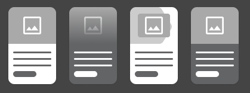

```markdown
---
title: Advanced Options
description: Configuration for Layout Builder Sections and Blocks.
weight: -5
---

A wide range of configuration options are available for Layout Builder components using the contributed [Layout Builder Blocks](https://www.drupal.org/project/layout_builder_blocks) module, which is included with the distribution. In addition to those configuration options, we provide an extra layer of "Y Styles" that help site builders customize their sites in an accessible and brand-compliant manner.



## Y Styles

These options provide customizations for Layout Builder-enabled pages at the Content Type, Page, and Block level.

Styles inherit from content types, to pages, to blocks. Some styles can also be overridden at each level - block styles can override page styles, which can override content type styles.

```mermaid
flowchart
  classDef ct fill:#5C2E9133;
  classDef page fill:#92278F33;
  classDef block fill:#C6168D33;
  subgraph ct[Content Type]
    direction LR
    subgraph page[Page]
      direction LR
      subgraph block[Block]
        blockStyles[Block Styles]
      end
      pageStyles[Page Styles]
    end
    ctStyles[Content Type Styles]
  end
  blockStyles -- override --> pageStyles
  pageStyles -- override --> ctStyles
  class ct ct
  class page page
  class block block
```

### Content Type Styles

> **Note:** This configuration may not be accessible to all content editors. Ask an administrator for assistance if necessary.

<details>
<summary>The default values for page-level Y Styles options are set in the Content Type display options.</summary>

To access them:

-   Go to **Admin** > **Structure** > **Content types** > **Landing Page (Layout Builder)** (or another LB-enabled content type) > **Manage display**
-   Ensure you're acting on the **Default** display, then click **Manage layout**.
    
-   Expand the **Y Styles** section
-   Choose your default configuration options. These will set the defaults for **every _new_ node of this Content Type**. Existing content will _not_ be affected.
-   Click **Save layout**
</details>

### Page Styles

Every Layout Builder-enabled page that you create will allow you to override the default settings. All of these settings will affect all items on a page, unless they are overridden at the block level.


-   Edit the **Layout** on a page
-   Expand the **Y Styles** section
-   Choose your configuration options.
    -   **Color scheme**:  The color scheme of all components on the page. Choose from four brand-compliant and accessible options:
        -   Blue/Purple
        -   Green/Blue
        -   Purple/Red
        -   Red/Orange
    -   **Border radius**:  The curvature of container corners.
        -   0px (square)
        -   10px (small curve)
        -   20px (larger curve)
    -   **Border style**:  The style of container borders.
        -   No border
        -   1px border
        -   Drop shadow
    -   **Text/Button alignment**:  The vertical placement of elements in containers.
        -   Left
        -   Center
    -   **Button position**:  Where buttons sit in containers.
        -   Inside container
        -   Overlapping container
    -   **Button fill**:  How buttons are colored.
        -   Filled by default, outlined on hover
        -   Outlined by default, filled on hover
-   Click **Save layout**

### Y Block Styles

Some blocks have additional styles that can be configured per-block. For these blocks (e.g. Banner, Cards), look for the **Y Styles** section in the [block styles section](#block-styles) and set the options accordingly.

-   Banner
    -   **Variant**:  Choose from five designs.
        -   Standard
        -   Overlay
        -   Chevron
        -   Frame
        -   Small - This variant hides all but the title and description and does not use an image background.
    -   **Button fill**: Override the page-level styles.
-   Card
    -   **Variant**:  Choose from four designs.
        -   Standard
        -   Overlay
        -   Chevron
        -   Color
    -   **Border style**: Override the page-level styles.
    -   **Text/Button alignment**: Override the page-level styles.
    -   **Button position**: Override the page-level styles.
    -   **Button fill**: Override the page-level styles.

## Section Styles

When creating or editing a **Section** you have the option of configuring **Layout**, **Style**, and **Settings**.


Support for these options is a work in progress and may require involvement of your development partner. Feel free to experiment with the options. Be sure to follow proper brand guidelines and accessibility practices.

### Layout Styles

In this section, you can control the container of the Section.


-   **Container type**
    -   **Boxed:** Section is narrower than the header of the page. Good for text-heavy layouts.
    -   **Full:** Section extends to the edges of the main content container.
    -   **Edge to Edge:** Section extends to the edges of the page. Good for full-width components like Banners and Ping-Pong blocks.
-   **Gutters**
    -   **With Gutters:** Section has left and right padding. Good for most non-full-width containers.
    -   **Without Gutters:** Section has no left and right padding. Best for Edge to Edge containers.

## Block Styles

When creating or configuring a block, you have the option of opening the **Style** tab to access additional style options including:

-   Background
-   Typography
-   Spacing
-   Borders
-   Animation


Support for these options is a work in progress and may require involvement of your development partner. Feel free to experiment with the options. Be sure to follow proper brand guidelines and accessibility practices.

After you have completed setting the **Style** options, click back to **Content** and **Save** or **Update** to commit your changes.
