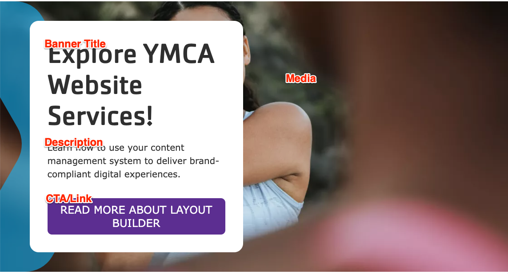
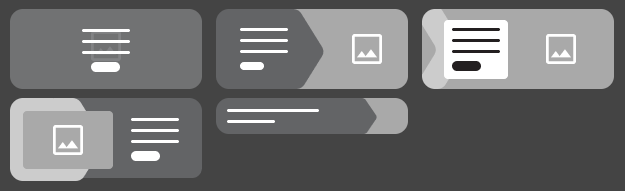


  
    
  
  {}

  {}


-----

**Designs:**

*   [Design System](../../../../../../assets/img/designs/lb-ui-kit/Banner.jpg)
*   Pre-release: [Mobile](<../../../../../../assets/img/designs/lb/Hero Banner Mobile.png>) | [Desktop](<../../../../../../assets/img/designs/lb/Hero Banner Desktop.png>)



### Content Fields

Fill in the following content fields:

*   **Title** (required): This field is for administrative purposes only and is not displayed on the banner, even if "Display Title" is checked.
*   **Banner Title** (required):  A heading to display prominently on the banner.  Consider using the `<H1>` tag if the banner is at the top of the page.
*   **Description**: A full text editor allows you to add descriptive content to the banner.  Basic styling such as bold and underline is recommended.
*   **Media**: Choose an image or icon from the media library to be displayed behind the banner text, or upload a new one.
*   **CTA/Link**: Add a call-to-action link that will appear at the bottom of the banner text.





### Banner Variations

The banner block comes in several variations, including:

*   **Standard:** A basic banner with text and an optional image.
*   **Overlay:** Text is overlaid on the image.
*   **Frame:**  The text appears within a frame.
*   **Chevron:** A banner with a chevron shape.
*   **Small:** A smaller banner variation.
*   **Tall:** A taller banner variation.
*   **Promo:** A banner designed for promotional content.
*   **Sub Chevron:** A variation with a sub-chevron design.
*   **Sub Frame:** A variation with a sub-frame design.

Some variations also have "Canada" specific styles in red, white, and black.

These variations can be selected during the block configuration process, allowing you to choose the most appropriate style for your content and design preferences.

### Best Practices

*   **Image Size:** Use high-quality images that are appropriately sized for the banner area. Consult with your agency partner for recommended image sizes.
*   **Text Length:** Keep the banner title and description concise and engaging.  Avoid lengthy text that could overwhelm the user.
*   **Call to Action:**  Use a clear and compelling call to action to encourage user interaction.
*   **Accessibility:**  Ensure that your banner content is accessible to all users, including those with disabilities.  Provide alt text for images and use appropriate heading levels.
