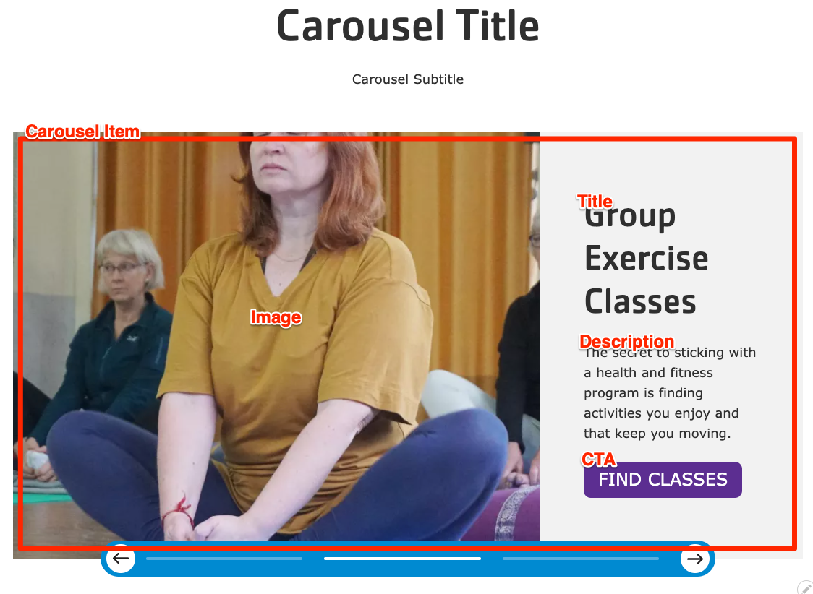


  
    
  
  {}

  {}


-----

**Designs:**

*   [Design System](../../../../../../assets/img/designs/lb-ui-kit/Carousel.jpg)
*   Pre-release: [Mobile](../../../../../../assets/img/designs/lb/Carousels Mobile.png) | [Desktop](../../../../../../assets/img/designs/lb/Carousels Desktop.png)



Fill in the content fields:

*   **Title** (required): This title is for administrative purposes only and is never displayed, even if "Display Title" is checked.
*   **Carousel heading**:  This heading is displayed above the carousel.
*   **Carousel subheading**: This subheading is displayed below the heading.
*   **Carousel Item**:  You can add multiple items to the carousel by using the **Add Carousel Item** or **Add new custom block** button. Make sure to click **Create/Update tab** or **Create/Update custom block** to save each item after adding or editing. Each item includes the following fields:
    *   **Heading**
    *   **Image**: You can choose an existing image from the media library or upload a new image.
    *   **Description**
    *   **Link**:  This creates a link that appears at the bottom of the carousel item.


