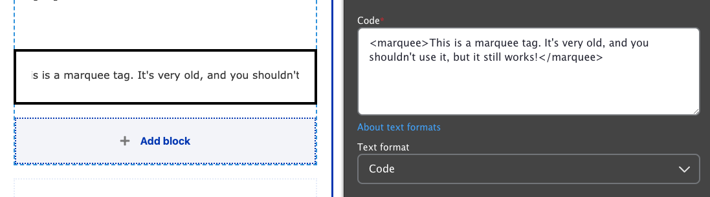


  
    
  
  {}

  {}


**Designs:** This block provides no additional presentation outside of the embedded content. It renders the code you provide directly into the page. Ensure the code is properly formatted and safe for display.



## Configuration

Fill in the following content fields:

-   **Title** (required): This field is for administrative purposes only. The title is never displayed, even if "Display Title" is checked. Use a descriptive title to easily identify the block in the Layout Builder.
-   **Code**: Paste the HTML, JavaScript, CSS, or other code to be embedded on the page.

!!! warning
    Be extremely cautious when embedding code from untrusted sources. Unfiltered code can introduce security vulnerabilities and potentially compromise your site. Always validate and sanitize code before embedding it.


