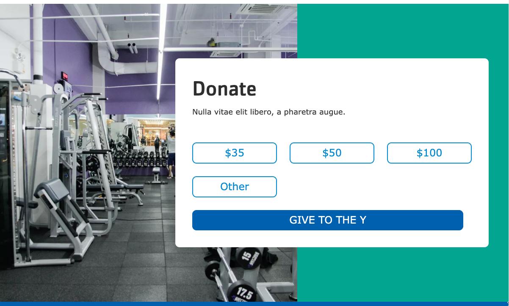

```markdown
---
title: Donate
description: A call to action with donation buttons linking to an embedded form.
---

> NOTE: This module requires per-provider configuration. Currently, support is provided for donation forms from:
> - **Blackbaud Online Express**
> - **Convio Luminate**
>
> Please [submit a feature request](/roadmap) for additional provider support.


  
    
  
  {}

  {}


**Designs:** [Mobile & Desktop](<../../../../../../assets/img/designs/lb-ui-kit/Donate.jpg>)

The **Y Layout Builder - Donate** (`lb_donate`) and **YMCA Website Services Donation Embed Form** (`y_donate`) modules work together to allow content editors to add an embedded donation form to the site and create a separate call to action to direct users there.

## Embedded Form

The **YMCA Website Services Donation Embed Form** (`y_donate`) module provides a block that allows you to embed a donation form directly onto a page.

To get started:

1.  Enable the **YMCA Website Services Donation Embed Form** (`y_donate`) module at **Administration** > **Extend**.
2.  Navigate to the **Layout** tab of a Layout Builder-enabled page.
3.  Select **Add block** on the page, then search or scroll to find **Donation Form Embed Block**.
4.  Select the form type and enter the form ID from your donation provider.

### Troubleshooting

If your embedded form does not work in your non-production environment, you may need to add a domain to the allow-list either on the provider-side or in your site's Content Security Policy.

If your provider is not listed, you can add the form by selecting the **Code** Custom Block and pasting in your code. Alternatively, you can work with your development partner to [add a new donation provider](https://git.drupalcode.org/project/y_donate#information-for-developers).  Refer to the [Information for Developers](https://git.drupalcode.org/project/y_donate#information-for-developers) section of the `y_donate` project for details on how to implement a new provider.

## Donate Block

The Donate Block (`lb_donate`) provides a call to action with donation amount buttons and a link to the embedded donation form page. This block can be placed in an [edge-to-edge container](../advanced-options#layout-styles).



Fill in the content fields:

*   **Title** (required): Never displayed, even if "Display Title" is checked. For administrative use only.
*   **Section heading**: Displayed as a heading above the items.
*   **Section subheading**: Displayed below the heading.
*   **Giving amounts**: Configure any number of buttons with preset donation amounts. An "Other" button will always be displayed after these buttons, allowing users to enter a custom amount.
    *   **Amount label**: The amount to be displayed on the button, including the currency symbol (e.g., "$50").
    *   **Form Element ID**: This is usually a 4-digit number found in your donation platform's backend. You may need to inspect the form using your browser's developer tools to find this ID.
*   **Donation page link**: A link displayed below the buttons that directs users to the page containing the embedded donation form.
    *   **URL**:  This **must** link to the page where the embedded donation form is located for the donation buttons to function correctly.
    *   **Link text**: The text to be displayed for the link (e.g., "Donate Now").
*   **Background image**: Choose an image from the media library or upload a new image to be displayed behind the text and buttons.


```