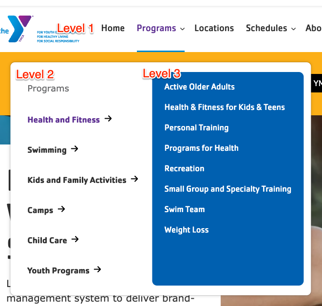
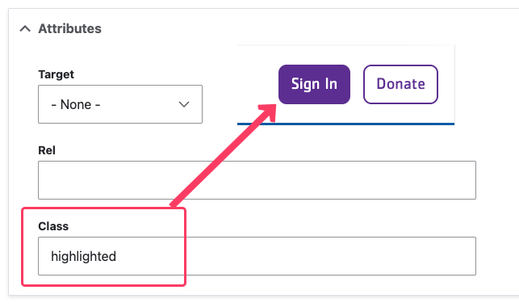
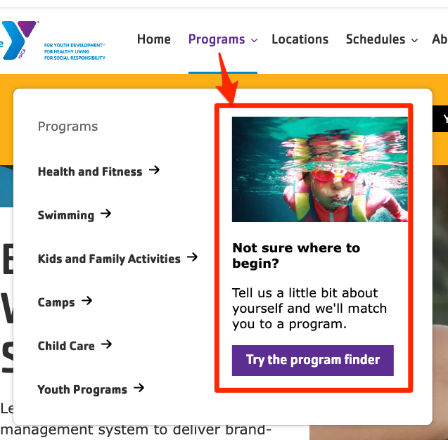
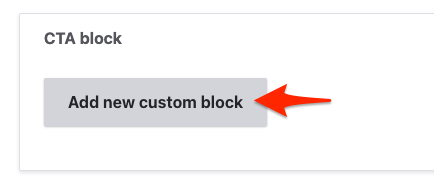


  
    
  
  {}

  {}


**Designs:**

- [Utility Menu Mobile & Desktop](<../../../../../../assets/img/designs/lb-ui-kit/Utility Menu.jpg>)
- [Menu & Search Mobile & Desktop](<../../../../../../assets/img/designs/lb-ui-kit/Menu and Search.jpg>)
- [Header Mobile & Desktop](<../../../../../../assets/img/designs/lb-ui-kit/Global Header.jpg>)
- [Footer Mobile & Desktop](<../../../../../../assets/img/designs/lb-ui-kit/Global Footer.jpg>)

The header and footer on Layout Builder pages is composed of many complimentary blocks. The Header and Footer are special Sections that are pre-populated on each Layout Builder-enabled content type. If the Header or Footer do not already exist in your content, you can add them on your own.

## Header Section

If a Header section does not already exist, add a new Section and choose the **WS Header** Layout. Then, add the following blocks by selecting **Add block** and then using the search box under **All system blocks**:

- Utility Menu area
  - Left
    - **Website Name Block**
  - Right
    - **Open Y Google Translate Block**
    - **Utility Menu**
- Main Menu area
  - Left
    - **Site Logo Block**
  - Center
    - **Main navigation**
    - **Search Bar Block**
  - Right
    - **User account menu**

Each block has some specific configuration recommendations:

### Website Name Block

**Configuration**

- Uncheck **Display title**.

**Content**

- The **Site Name** is found under **Configuration** > **System** > **Basic site settings**.

### Open Y Google Translate Block

**Configuration**

- Uncheck **Display title**.

**Content**

- The contents of this block are not configurable, but it may be omitted or removed if your site does not provide translation or uses another translation method.

### Utility Menu

The option to add a Utility Menu was added in the December 2024 release. This menu is intended to give content editors an additional space for adding links in the top right of the header.

**Configuration**

- Uncheck **Display title**.
- **Menu levels** controls which and how many levels of menu are displayed. The Utility menu styles are designed for a single level of links.

**Content**

- Menu items can be managed under **Structure** > **Menus** > **Utility Menu**.

### Site Logo Block

**Configuration**

- **Title (required):** Never displayed, even if "Display Title" is checked. For administrative use only.
- **WS Site Logo:** Choose which logo is displayed in the block.
  - **Theme logo** uses the logo defined by the active theme, in the **Appearance** > **Settings** > **(The active theme)**.
  - **Colorway logo** uses a dynamic SVG that responds to the configured YMCA colorway. This option is recommended for the Header.
  - **White logo** uses a flat white logo. This option is recommended for the Footer.
- **Hide tagline in WS logo:** (Added in the December 2024 release.) Check to hide the tagline (areas of impact) in the logo.


As per the [Brand Graphics Guide (requires Y login)](https://theybrand.org/wordpress/brand-graphics-areas-of-impact-usage-on-websites):

> The areas of impact must appear on a website, but it is at the YMCA's discretion whether to include them as the trademarked graphic paired with the logo or as a way of telling the story of our positive impact.

If you choose to hide the Areas of Impact in the logo, we recommend you include them elsewhere on the page.


### Main navigation

The main navigation supports displaying up to three levels of menu items. When adding items, be sure to check **Show as expanded** for any parent item that should be expandable.

The main navigation also supports an optional [nested CTA block](#main-menu-cta-block).

**Configuration**

- Uncheck **Display title**.
- **Menu levels** controls which and how many levels of menu are displayed. We recommend using the default configuration.

**Content**

- Menu items can be managed under **Structure** > **Menus** > **Main navigation**.


- Refer to the Drupal User Guide for more information about [managing menus](https://www.drupal.org/docs/user_guide/en/menu-concept.html).
- We recommend you **limit the main menu to 6 items or fewer** when using Layout Builder, as additional items can cause the menu to be wider than the supported area. Additional menu items can be added to the footer, if needed.


### Search Bar Block

**Configuration**

- Uncheck **Display title**.

**Content**

- The contents of this block are not configurable.

### User account menu

**Configuration**

- Uncheck **Display title**.
- **Menu levels** controls which and how many levels of menu are displayed. We recommend using the default configuration.

**Content**

- Menu items can be managed under **Structure** > **Menus** > **User account**.
- To show items with a button style, add the `highlighted` class to the menu item under **Attributes** > **Class**.
  
  - On mobile devices, only `highlighted` items from this menu will display.

## Footer Section

If a Footer section does not already exist, add a new Section and choose the **WS Footer** Layout. Then, add the following blocks by selecting **Add block** and then using the search box under **All system blocks**:

- Primary Footer
  - Site Logo
  - Footer Menu Left
  - Footer Menu Center
  - Footer Menu Right
  - Footer Social
- Sub-footer
  - Copyright
  - Footer Menu

### Site Logo

[See above](#site-logo-block). The white logo is recommended for the footer.

### Footer Menu Left, Center, Right

Each of these three blocks references a menu. The three menus can be used to split footer links across multiple columns.

**Configuration**

- **Display title:** Uncheck to hide the title, or turn the menu title on to give each column a title.
- **Menu levels** controls which and how many levels of menu are displayed. We recommend using the default configuration.

**Content**

- Menu items can be managed under **Structure** > **Menus** > **Footer Menu Left**, **Footer Menu Center**, or **Footer Menu Right**.

### Footer Social

**Configuration**

- **Display title:** It's up to you.

**Content**

- [Edit the Footer Social Block](/docs/user-documentation/virtual-ymca/managing-footer-links/) to modify this block.

### Copyright

**Configuration**

- Uncheck **Display title**.

**Content**

- Go to **Structure** > **Block layout** > **Custom block library**
- Find the **Footer Copyright Block**
- **Edit** the block, then **Save** when finished.

### Footer Menu

This menu is typically for a limited number of links such as "Privacy Policy" or "Terms of Use".

**Configuration**

- Uncheck **Display title**.
- **Menu levels** controls which and how many levels of menu are displayed. We recommend using the default configuration.

**Content**

- Menu items can be managed under **Structure** > **Menus** > **Footer**.

## Main Menu CTA Block

The [Main navigation](#main-navigation) has an additional feature that allows for adding a nested call-to-action that takes the place of the third level of the menu.

To use it:

- Go to **Extend** (`admin/modules`) and enable the **Web Services Main Menu CTA Block** module (`y_lb_main_menu_cta_block`).
- Edit a top-level menu item (like "Programs" or "Schedules") via one of these methods.
  > CTA blocks will only be displayed on _first-level menu items_. Blocks on all other levels will be ignored.
  1. Click the <kbd><i class="fas fa-pencil"></i></kbd> in the Main Menu section, then choose **Edit menu**. 
  2. Go to **Admin** > **Structure** > **Menus** > **Main navigation** then **Edit** a link.
- In the **CTA block** section, click **Add new custom block**. 
- Fill in the fields:
  - Expand the **Media** section and choose or upload an image
  - Add a short **Heading**
  - Add a short 1-2 sentence **Description**
  - Add a link and display text for the **Menu CTA Link**
  - Add a **Block description** for administrative purposes only
  - Click **Create custom block** to save the block.
- **Save** the menu item.
- Go back to a Layout Builder page with the menu and refresh. The menu CTA should now appear when the corresponding menu dropdown is open.

> Menu CTA items will not appear on pages that use Paragraphs-based layout. CTAs also ony show on desktop and not mobile displays.
