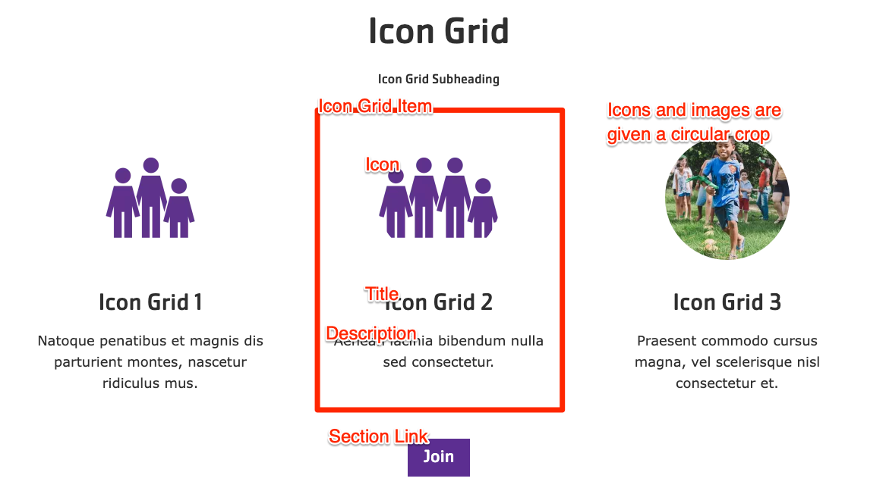


  
    
  
  {}

  {}


-----

The Icon Grid block shares similarities with the [Cards](../cards) and [Grid CTA](../grid-cta) blocks but offers a way to display more basic items with a slightly more constrained design.  It is based on the `lb_icon_grid` block content type and uses `icon_grid_item` paragraphs.

**Designs:**

*   [Design System](<../../../../../../assets/img/designs/lb-ui-kit/Icon Grid.png>)



Fill in the content fields:

*   **Title** (required): This field is for administrative purposes only and is never displayed, even if "Display Title" is checked.
*   **Section heading**: Displayed as a heading above the grid items.
*   **Section subheading**: Displayed below the heading.
*   **Icon Grid section link**:  A link button displayed below the grid items.  This uses the `field_cta` field.
*   **# of columns**:  Determines the number of columns in the grid, allowing for 2 to 4 columns of items. This uses the `field_icon_columns` field.
*   **Grid Icon Items**:  Add up to 4 items to the grid. This is managed by the `field_grid_items` field, which references `icon_grid_item` paragraphs. Each item has the following fields:
    *   **Title** (required): The title of the grid item.  This uses the `field_title` field.
    *   **Description**:  A full text editor to add content to the grid item. This uses the `field_description` field.
    *   **Icon**:  Choose an existing image from the media library or upload a new image or icon to be displayed above the item text. Circular icons are recommended, and all icons/images will be displayed with a circular crop. This uses the `field_media` field.


