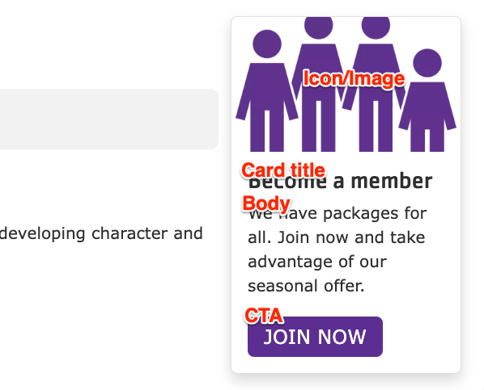


  
    
  
  {}

  {}


-----

**Designs:**

*   [Design System](<../../../../../../assets/img/designs/lb-ui-kit/Promo Cards.jpg>)
*   Pre-release: [Mobile](<../../../../../../assets/img/designs/lb/Promo Cards Mobile.png>) | [Desktop](<../../../../../../assets/img/designs/lb/Promo Cards Desktop.png>)



Fill in the content fields:

*   **Title** (required): This field is for administrative purposes only and is *never* displayed, regardless of the "Display Title" setting. Use this to easily identify the block in the layout builder.
*   **Card title**: The main title displayed on the promo card.
*   **Body**: A rich text editor for adding the main content of the card.
*   **Icon/Image**: Choose an image from the media library or upload a new one to be displayed above the card text. **The format of the image you upload affects how it will be displayed**:
    *   **JPG/PNG**: Images are cropped to a 3:2 aspect ratio.
    *   **SVG**: Images are *not* cropped, and will retain their original dimensions. Using SVGs is the recommended approach for icons.
*   **CTA**: Configure the link and the text for the call to action button at the bottom of the card.


