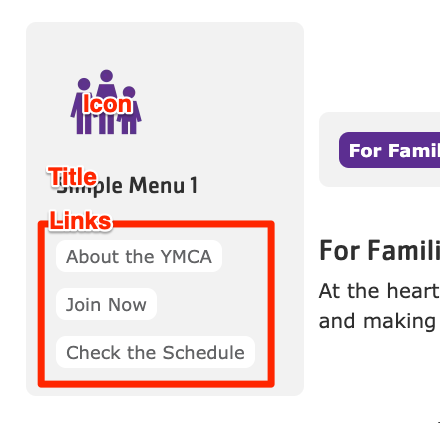


  
    
  
  {}

  {}


-----

**Designs:**
- [Design System](<../../../../../../assets/img/designs/lb-ui-kit/Side Menu.jpg>)
- Pre-release: [Mobile](<../../../../../../assets/img/designs/lb/Simple Menu Mobile.png>) | [Desktop](<../../../../../../assets/img/designs/lb/Simple Menu Desktop.png>)



Fill in the content fields:

- **Title** (required): Displayed if **Display title** is checked, otherwise, this is for administrative use.  This title will serve as the block description in the Block Layout interface.
- **Icon**: Optional icon (or small image) to be displayed to the left of the menu title.
- **Links**: An unlimited number of internal or external links.



**Additional Information:**

The Simple Menu block is a useful way to display a list of links in a sidebar.  Menus are a collection of menu links that are used for site navigation.  You can create new menus and menu links, reorder links, and disable links provided by modules.  For more information about managing menus, refer to the [Drupal User Guide](https://www.drupal.org/docs/user_guide/en/menu-concept.html).

To further customize the appearance of the menu, you can adjust the theme settings or use CSS to style the block. The administrative toolbar also provides a way to manage menus and their associated links. You can access it under *Structure > Menus*.
