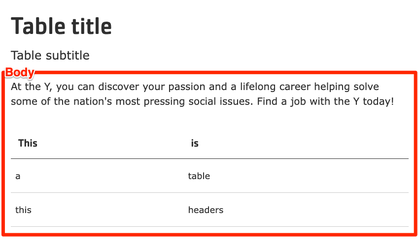

```markdown
---
title: Simple Text / Table
description: Allows users to add simple content and responsive tables within a page.
---


  
    
  
  {}

  {}


-----

The Table block allows users to add simple content and responsive tables to Landing Pages (Layout Builder content type). It utilizes the [Tablesaw](https://github.com/filamentgroup/tablesaw) library for responsive table functionality.

**Designs:**

*   [Design System](../../../../../../assets/img/designs/lb-ui-kit/Table.jpg)
*   Pre-release: [Mobile](<../../../../../../assets/img/designs/lb/Tables Mobile.png>) | [Desktop](<../../../../../../assets/img/designs/lb/Tables Desktop.png>)



To configure the Table block, fill in the following content fields:

*   **Title** (required): This title is for administrative purposes only and is never displayed, even if _Display Title_ is checked.
*   **Section title**: This title is displayed as a heading above the table and other content.
*   **Section subtitle**: This subtitle is displayed below the heading.
*   **Body**: This field provides a full text editor for adding tables, text, images, and other content to the page.

    *   **Adding a table:** Click the **Table** icon in the editor toolbar. Configure the table options (number of rows/columns, headers, etc.) in the popup window.
        
    *   **Editing table properties:** Right-click inside the table and select an option from the context menu to modify table properties such as row/column insertion/deletion, cell formatting, and other table-specific settings.
        


