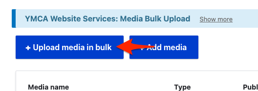
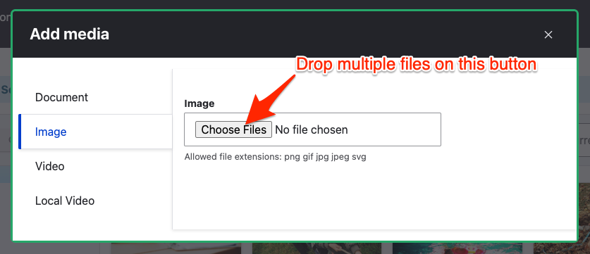

```markdown
---
title: "Images and Documents"
weight: 6
description: >
  The media library stores images and files, allowing you to have custom cropping, focal pointing, folders, and image styles.
---

## Media Items and the Media Library

Core media items include audio, images, documents, and videos. You can add other media types, such as social media posts, through contributed modules. Media items may be files located in your site's file system or remote items referenced by a URL. Media items are content entities divided into media types (which are entity sub-types); media types can have fields. The media library is a visual user interface for managing and reusing media items. Add media items to content using Media reference fields and the Media library field widget.

An image style is a set of processing steps, known as *effects*, that can be applied to images. Examples of effects include scaling and cropping images to different sizes. Responsive image styles can associate image styles with your theme's size breakpoints. This allows serving images sized for the browser width.

Modules that provide media-related functionality include:

*   The core Media module manages media items and media types.
*   The core Media module provides a Media reference field to add media to content entities. The core File and Image modules also provide reference fields. It is recommended to use the Media reference field because it is more versatile.
*   The core Media Library module provides the media library and the Media library field widget. With this module installed, the Media library field widget becomes the default widget for editing Media reference fields.
*   The core Image module provides a user interface for defining image styles. The core Responsive Image module provides responsive image styles. Using the core Breakpoint module and a breakpoint-enabled theme, these responsive styles can serve images sized for the browser.

## Video Tutorials

Learn more about media management in the distribution. Some of these videos use older versions of the distribution.

-   [Using Media Directories](https://www.youtube.com/watch?v=gcaBlhyPZEY)
-   [Embedding Images onto a Web Page](https://www.youtube.com/watch?v=xogdtPEYxgg)
-   [Tagging your images](https://www.youtube.com/watch?v=mr6HA7KvXK0)
-   [Replacing Images](https://www.youtube.com/watch?v=5xWzAwww740)
-   [Using the Media Folder](https://www.youtube.com/watch?v=4IC2h1hASF4)
-   [Embedding Videos in the WYSIWYG](https://www.youtube.com/watch?v=nC414txq3F8)
-   [Embedding Documents on a Web Page](https://www.youtube.com/watch?v=5w-_bpHtTLI)

## Bulk Upload

Your YMCA website has the ability to upload media (images, documents, videos) in bulk (since [9.2.12 - December 2022](https://github.com/YCloudYUSA/yusaopeny/releases/tag/9.2.12)).

You can batch/bulk upload from **Admin** > **Content** > **Media** (`/admin/content/media`) or **Media Browser** (`/admin/content/browser`). After uploading media, it will be available from the Media list and browser in any component on your site.

#### From the Media list



-   Go to **Admin** > **Content** > **Media** (`/admin/content/media`)
-   Click **Upload media in bulk**
-   Choose your media type
-   Drag or choose the media to upload
-   Fill in the required fields in the resulting form.

#### From the Media browser



-   **Admin** > **Content** > **Media Browser** (`/admin/content/browser`)
-   Click **Add media**
-   Choose your media type in the sidebar, then use the **Choose Files** button to choose or drop files.
-   Fill in the required fields in the resulting form.
```