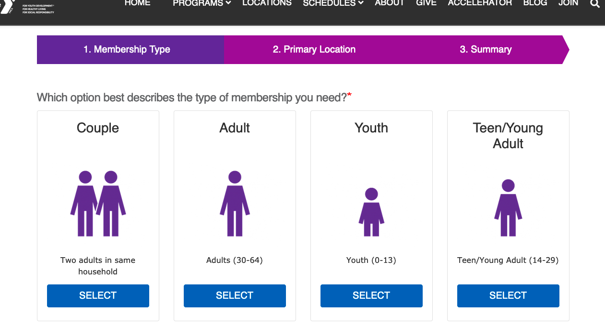
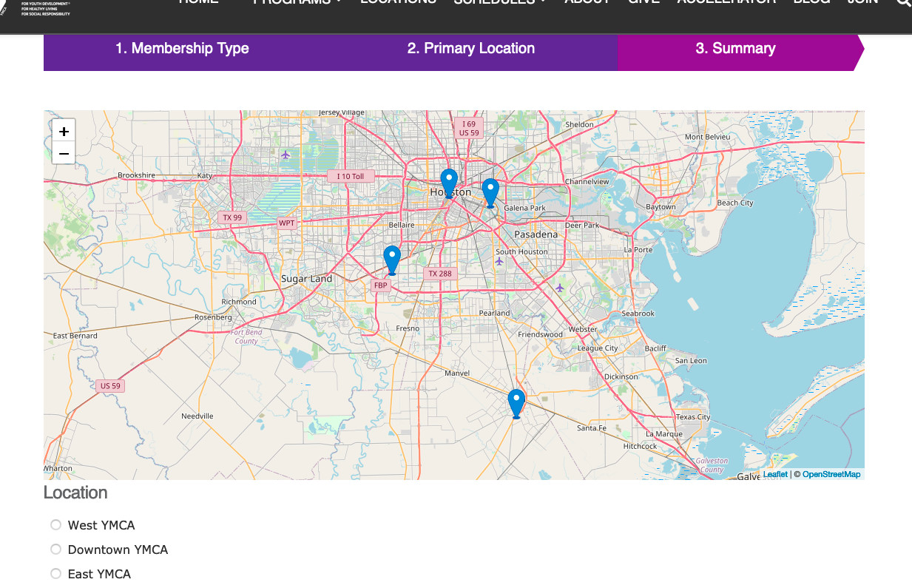
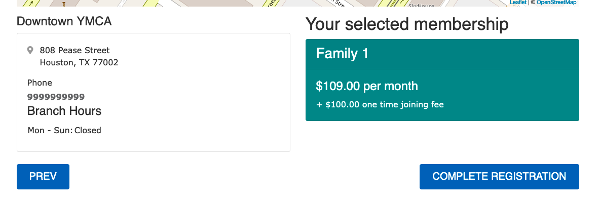
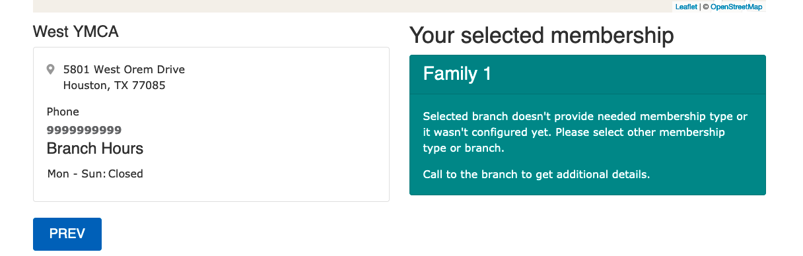
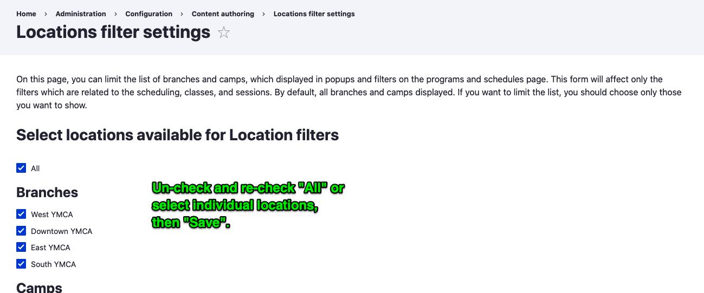

The Membership Calculator is bundled with the distribution in the [`openy_calc` module](https://github.com/open-y-subprojects/openy_custom/tree/main/openy_calc).

As of August 2024, the Membership Calculator has [an updated design](https://www.figma.com/design/wVbmVOI5zwOMDYRjI3GLEI/YUSA-Design-System?node-id=5095-21390&t=R5aJZuowJGTQIvNk-1) with improved functionality and user experience. The improved design will also respond to the selected [colorway and page styles](../../layout-builder/advanced-options/#page-styles).

## Configuring the Calculator

The **Membership Calculator** uses [Membership](../../content-types/membership) content items. Those will need to be created in order for the **Membership Calculator** to function.

First, create a Membership node for each membership type your Branch or Association offers. Then, inside each Membership node, add a Membership Info Paragraph with the details of that membership at each of your Locations.

The Membership Calculator is a three-step process:
1. Membership Type
2. Primary Location
3. Summary

### Membership Type

This step lists the Title, Image, and Description of each published Member node.

### Primary Location
This step provides a map with radio buttons for the member to select their primary location. Every location listed in the **YMCA Website Services Location Filter Settings** (see Troubleshooting section below) is listed.

### Summary

This page provides a link for the member to continue their registration, or a message indicating the selected membership is not provided at the selected location.

## Location Filtering

**As of version 10.4.0.0**, the Membership Calculator automatically excludes unpublished Branch locations from the location selector and pricing calculations.

**Impact:**
- Only **published** Branch content appears in the Primary Location step
- Pricing calculations only include rates from published locations
- Unpublished branches (e.g., temporarily closed for renovations) won't appear in the calculator

**To control location visibility:**
1. Navigate to **Content** > **Locations** (`/admin/content?type=branch`)
2. **Publish** or **Unpublish** Branch locations as needed
3. Changes take effect immediately (may require cache clear: `drush cr`)

For more details, see the [10.4.0.0 release notes](https://github.com/YCloudYUSA/yusaopeny/releases/tag/10.4.0.0).

## Placing the Calculator on a page

Once configured, the Membership Calculator can be placed on a page using:

- [Paragraphs](../../paragraphs/membership-calculator)
- [Layout Builder](../../layout-builder)

## Troubleshooting

On some sites, the second step of the *Membership Calculator* may not show any locations. In order to resolve this, visit **Administration** > **YMCA Website Services** > **Settings** > **YMCA Website Services Location Filter Settings** and ensure that any Branches you want to use in the location search are checked.

