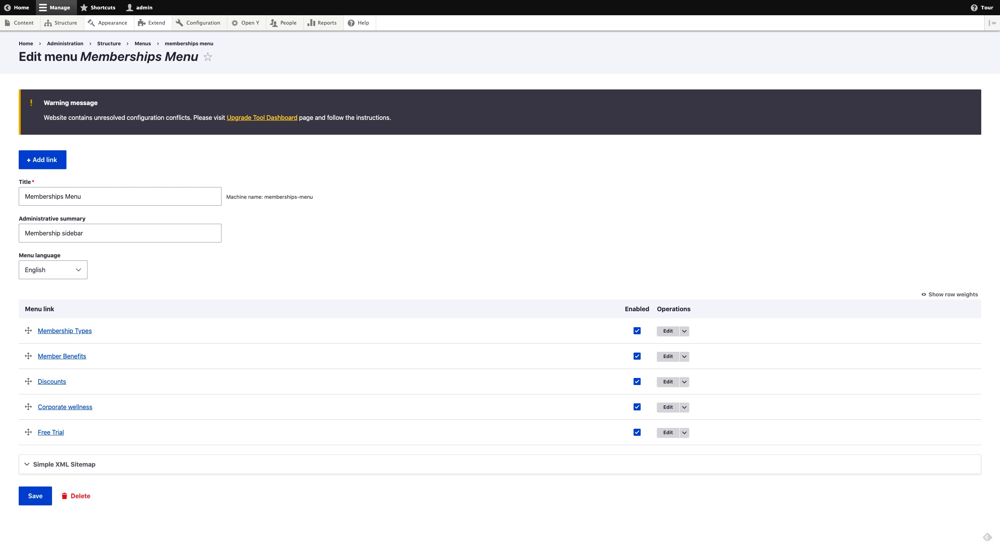
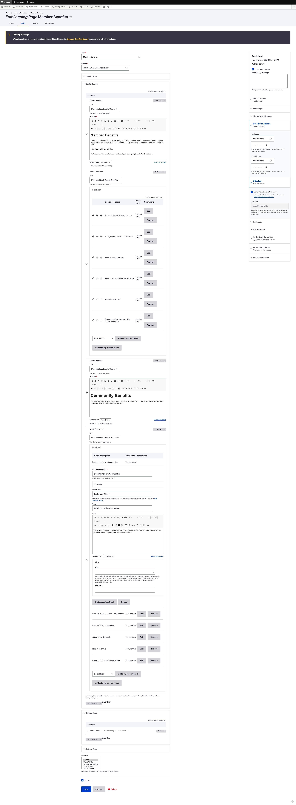
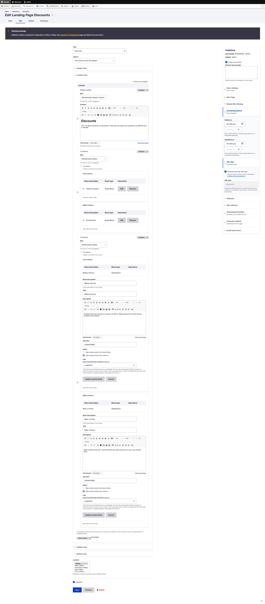
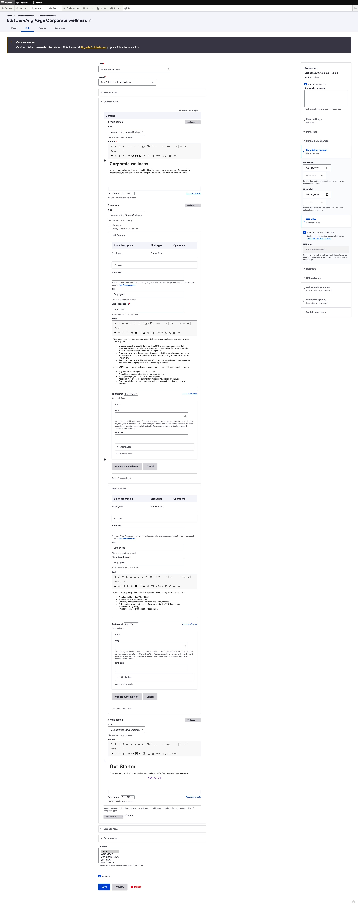
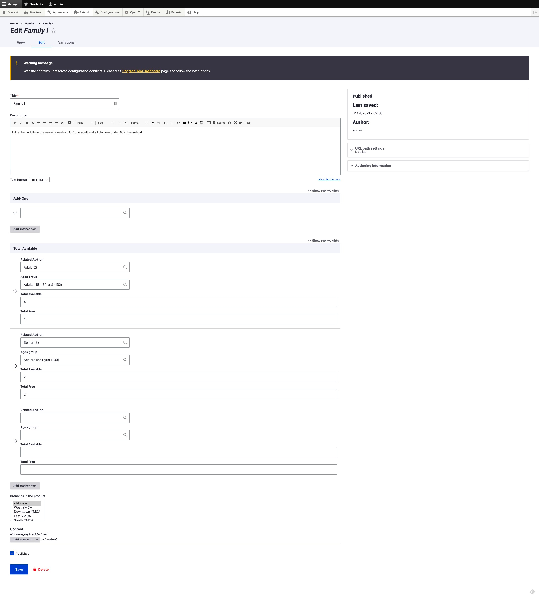
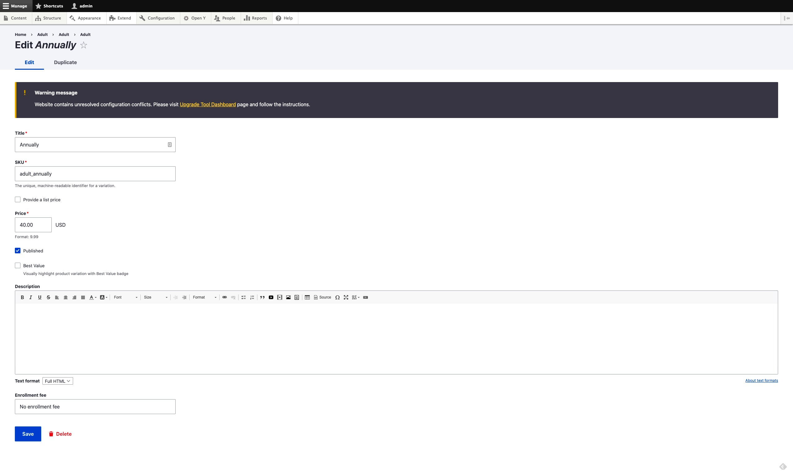

The Membership Framework is distributed in the [`openy_memberships` repository](https://github.com/YCloudYUSA/yusaopeny_memberships) and must be [added and installed](https://github.com/YCloudYUSA/yusaopeny_memberships#installation) on top of the base distribution. We recommend working with your development partner if you wish to go this route.

Check out the [Membership Framework sandboxes](../../../wiki/sandboxes/#membership-framework-sandboxes) for a demonstration.

## Membership Landing Pages

To get started with the Membership Framework, you will first need to create a number of landing pages.

The examples below use Paragraphs. Similar pages can be created using [Layout Builder blocks](../../layout-builder) and the **Membership Framework** custom block.

### Membership Builder

1.  Go to `/node/add/landing_page`
2.  **Title:** Membership Builder
3.  **Layout:** Two Columns with left sidebar
4.  **Header Area:** Add a "Small banner" paragraph and fill in the fields.
5.  **Content area:** Add a "Memberships" paragraph (it has pre-filled fields).
6.  **Sidebar Area:** Add a "Block Container" paragraph with the "Memberships Desktop Sidebar" skin.
    *   **Block_ref:** Choose "Paragraph container" with the "Memberships Menu Container" title.
7.  **Sidebar Area:** Add "Simple content" with the "Memberships Button" skin and link to the builder:

    ```html
    <p><a class="btn btn-primary" href="/membership-builder"><span class="text">JOIN THE Y</span></a></p>
    ```
8.  **Sidebar Area:** Add a "Sidebar Menu" with the "Memberships Sidebar Menu" skin to create your Memberships Menu with these items:
    *   Membership Types
    *   Member Benefits
    *   Discounts
    *   Corporate Wellness
    *   Free Trial

    

9.  **Sidebar Area:** Add a "Block container" with the "Memberships Feature card" skin. Use the "Feature Card" block type with any content allowed in this block.
10. Save the landing page.

### Membership Types

1.  Go to `/node/add/landing_page`
2.  **Title:** Membership Types
3.  **Layout:** Two Columns with left sidebar
4.  **Header Area:** Add a "Small banner" paragraph and fill in the fields.
5.  **Content Area:**
    *   Add a "Simple content" paragraph with the "Membership Simple Content" skin and text.
    *   Add a "Membership Types Listing" with the "Membership Types" skin.
6.  **Sidebar Area:** Follow the same steps for the "Membership Builder" page.
7.  Save the landing page.

### Member Benefits

1.  Go to `/node/add/landing_page`
2.  **Title:** Member Benefits
3.  **Layout:** Two Columns with left sidebar
4.  **Header Area:** Add a "Small banner" paragraph and fill in the fields.
5.  **Content Area:** Fill the area with content. An example is shown in the next screenshot.
6.  **Sidebar Area:** Follow the same steps for the "Membership Builder" page.
7.  Save the landing page.

    

### Discounts

1.  Go to `/node/add/landing_page`
2.  **Title:** Discounts
3.  **Layout:** Two Columns with left sidebar
4.  **Header Area:** Add a "Small banner" paragraph and fill in the fields.
5.  **Content Area:** Fill the area with content. An example is shown in the next screenshot.
6.  **Sidebar Area:** Follow the same steps for the "Membership Builder" page.
7.  Save the landing page.

    

### Corporate Wellness

1.  Go to `/node/add/landing_page`
2.  **Title:** Corporate Wellness
3.  **Layout:** Two Columns with left sidebar
4.  **Header Area:** Add a "Small banner" paragraph and fill in the fields.
5.  **Content Area:** Fill the area with content. An example is shown in the next screenshot.
6.  **Sidebar Area:** Follow the same steps for the "Membership Builder" page.
7.  Save the landing page.

    

### Free Trial

1.  Go to `/node/add/landing_page`
2.  **Title:** Free Trial
3.  **Layout:** Two Columns with left sidebar
4.  **Header Area:** Add a "Small banner" paragraph and fill in the fields.
5.  **Content Area:** Add "Simple content" with a description.
6.  **Content Area:** Add a "Webform" with the "Memberships Free Trial Webform" skin and the "Memberships Free Trial" webform.
7.  **Sidebar Area:** Follow the same steps for the "Membership Builder" page.

## Membership Products

1.  Go to `/admin/commerce/products`
2.  Click on **+ Add product**, then choose **Membership**.
3.  You'll see these fields:
    *   **Title**
    *   **Description**
    *   **Add-ons** (used in specific cases, skip for default setup)
    *   **Total Available**
4.  Subfields:
    *   **Related Add-on** (skip for default functionality)
    *   **Age groups** (select age groups, usually Adults, Youth, Seniors)
    *   **Total Available** (number of people allowed for the age group selected above for the membership product. You can add multiple groups by clicking "Add another item" for Family memberships)
    *   **Total Free** (designed for cases where extra people are allowed in the membership, but with an additional fee. Fill with the same value as Total Available for default functionality)
5.  **Branches in the product:** Use if a membership is specific to a branch. If "None" is selected, the membership will appear for all branches.

    A typical setup is shown in the following screenshot:

    
6.  Click on the "Save and add variations" button (or go to the "Variations" tab if editing a previously created product).

    A typical setup for variations of a membership is shown in the following screenshot:

    
