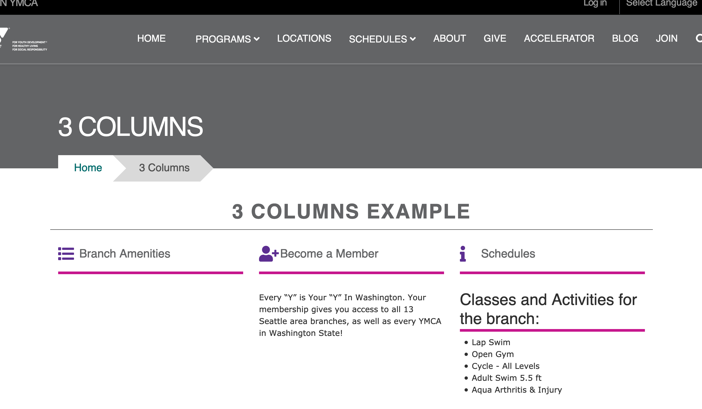
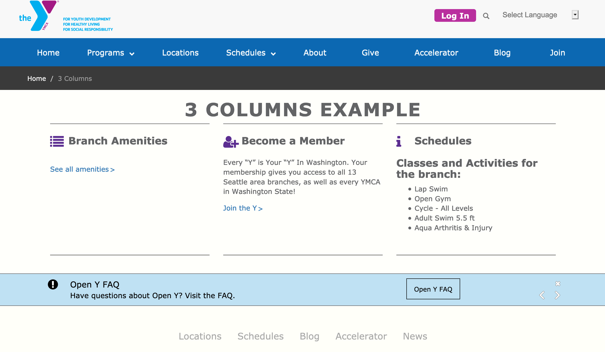
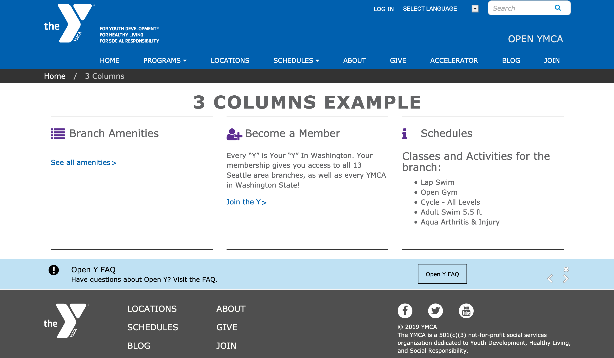
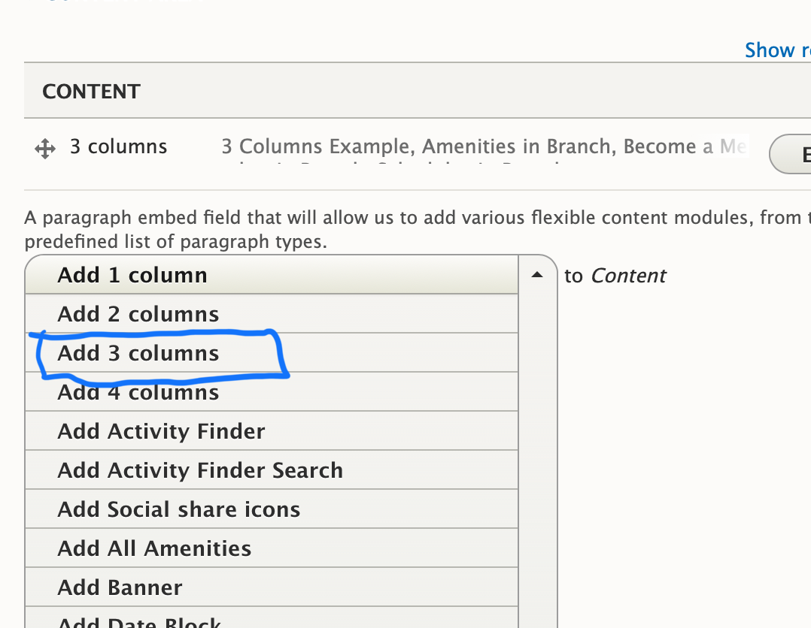
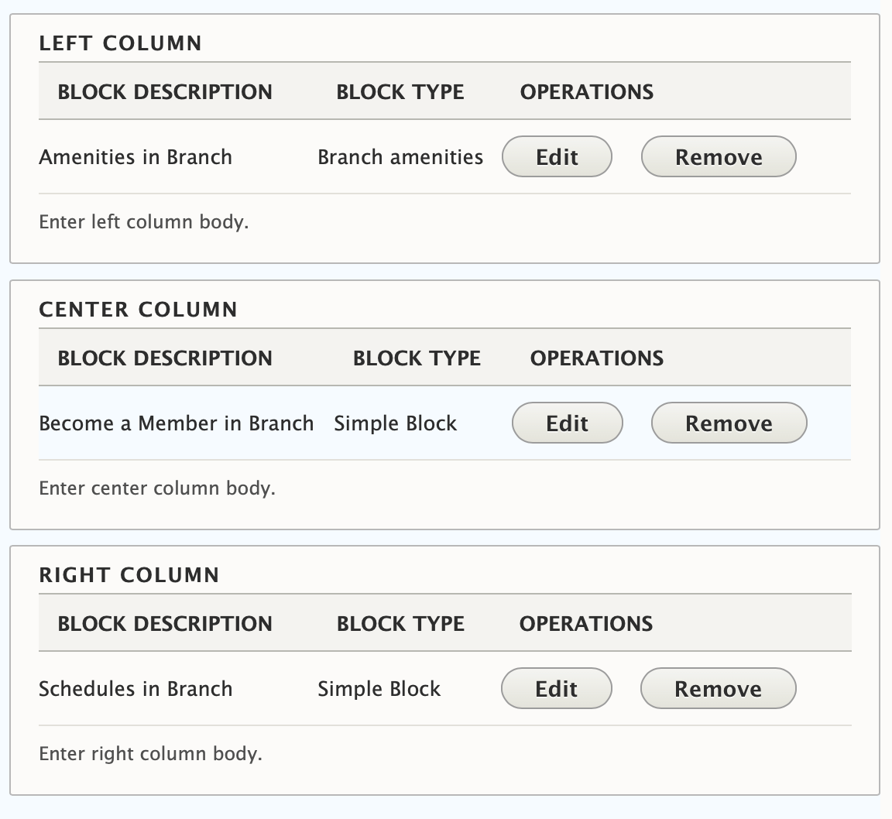

## Examples

The 3 Columns paragraph provides a way to display content in a visually appealing and organized manner. Here are a few examples of how it looks in different themes:

### Carnation

### Lily

### Rose

---

## Areas It Can Be Used

The 3 Columns paragraph can be used in the following areas:

*   Content Area
*   Bottom Area

---

## How It Works

The 3 Columns paragraph allows you to create a row with three custom blocks of content. Here's how to use it:

1.  Select **3 Columns** from the Paragraphs dropdown.
2.  **Title:** Add an optional title. The title will appear in all caps at the top of the 3 columns section.
3.  Add custom blocks to the *Left Column*, *Center Column*, and *Right Column* fields.

    [Learn more about custom blocks ⇒](../../blocks)

If you want to add multiple rows of content with 3 columns, add a new 3 Columns paragraph for each set of three blocks you want to display.

---

## Content Types That Support This Paragraph

The 3 Columns paragraph is available for use in the following content types:

*   [Landing Page](../../content-types/landing-page)
*   [Branch](../../content-types/branch)
*   [Camp](../../content-types/camp)
*   Facility
*   [Program](../../content-types/program)
*   [Program Subcategory](../../content-types/program-subcategory)
*   [Blog Post (Not Supported in Carnation)](../../content-types/blog-post)
*   Event
*   [News Post](../../content-types/news-post)
