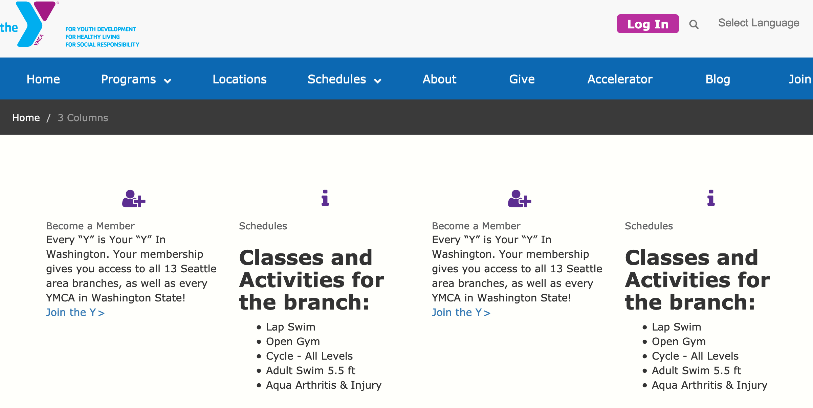
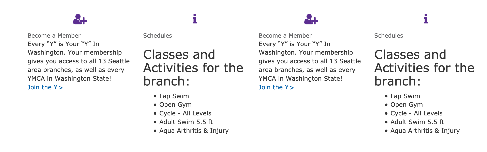
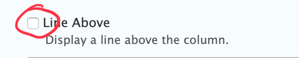
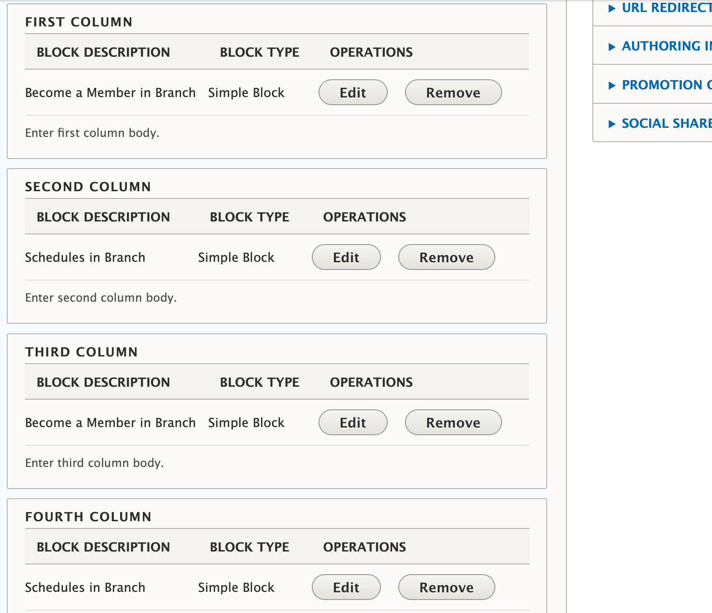
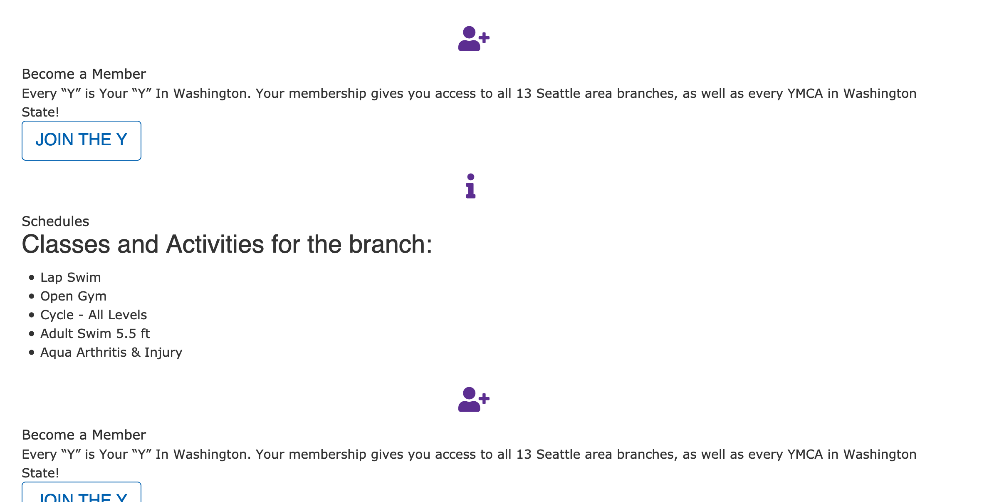

```markdown
---
title: 4 Columns
description: Add four equal-width, reusable blocks of content, side-by-side. Columns stack left to right on mobile.
---

## Examples

> **Important:** This paragraph does not work out of the box in the Carnation theme. See the "Advanced" section for theme-specific considerations.
>
> Content editors can use [Grid Content](../../paragraphs/grid-content) or [Featured Content](../../paragraphs/featured-content) paragraphs to achieve a similar layout.

### Lily



### Rose



---

## Areas it Can Be Used

*   Content Area
*   Bottom Area

---

## How it Works

*   Select **4 Columns** from the Paragraphs dropdown.
*   **Title**: Optional large, all-caps title displayed at the top of the paragraph.
*   **Line Above**: Adds a horizontal rule above each column.

    

*   **Description**: A subheader/section description displayed below the title and above the columns. Uses the [text editor](../../text-editor/basic-text-formatting) for styling.
*   Add custom blocks to the **First Column**, **Second Column**, **Third Column**, and **Fourth Column** fields.

    

    [Learn more about custom blocks ⇒](../../blocks)

> **Adding Headers to Individual Blocks**
>
> Out of the box, the *Title field* in each *custom block* renders as plain text. To work around this, add your headers directly within the text editor of the custom block.
>
> See the *Advanced* section for details about how to address this with CSS.

If you want to add multiple rows of content with 4 columns, add a new 4 Columns paragraph for each row. For example, if you have seven blocks of content, add two 4 Columns paragraphs (the second one will only have 3 columns populated).

[Learn more about the link field ⇒](../../text-editor/adding-links)

## Advanced

### Title Field Styling

In all three themes currently in YMCA Website Services (Lily, Rose and Carnation), the Title field's default styling may appear similar to the body copy. To override this and apply a more prominent style, target the `.field-sb-title` CSS class in your theme's stylesheet.

### Carnation: Columns Stacking on Desktop

By default, the 4 Columns paragraph may not render correctly in the Carnation theme, with columns stacking vertically instead of horizontally on desktop. To fix this, the `.wrapper` containing the column elements needs to be changed to `.row` using CSS.



## Content Types That Support this Paragraph

*   [Landing Page](../../content-types/landing-page)
*   [Branch](../../content-types/branch)
*   [Camp](../../content-types/camp)
*   Facility
*   [Program](../../content-types/program)
*   [Program Subcategory](../../content-types/program-subcategory)
*   [Blog Post (Not Supported in Carnation)](../../content-types/blog-post)
*   Event
*   [News Post](../../content-types/news-post)
