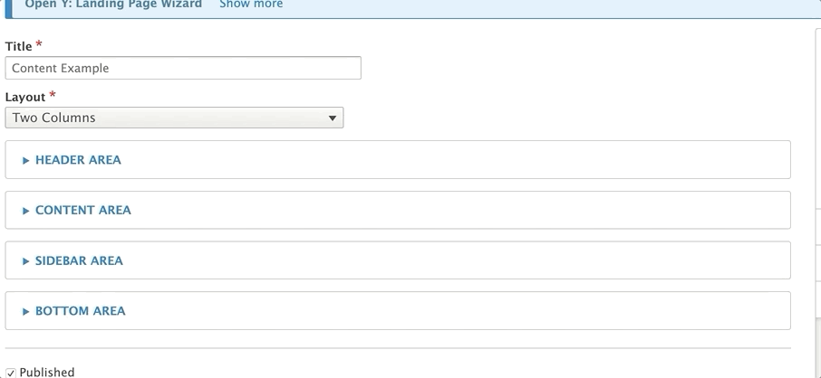
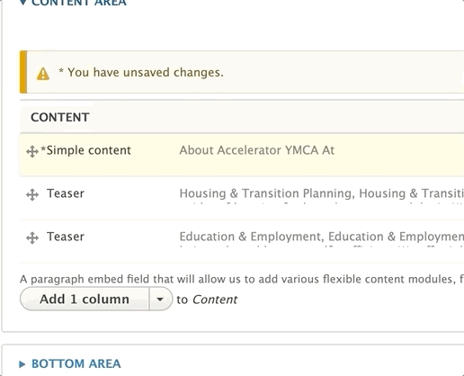

YMCA Website Services content editors use Paragraphs to create flexible and unique layouts for their pages. Each Paragraph is a self-contained section of content with its own styling, functionality, and fields. Paragraphs are based on the [Paragraphs Drupal module](https://www.drupal.org/project/paragraphs).

You can add a Paragraph to a page when you see the Paragraphs field. These Paragraphs are typically placed within one of the four main "Areas" of a content type:

*   **Header Area** - Used for adding images, page titles, and other introductory content.
*   **Content Area** - The primary area for your main content.
*   **Sidebar Area** - Used for related information, such as promotions or links to other content.
*   **Bottom Area** - Often used for calls to action or other "anchoring" elements at the end of the page.

> Not all content types use all four areas. Some content types might use fields directly to populate the Sidebar Area, while others might use an Image field instead of a dedicated Header Area.

## Two Ways to Add Paragraphs

Content editors can add Paragraphs to a page using either the inline editor or the admin portal.

### Admin Portal

To add a Paragraph to an Area:

1.  Open the desired Area.
2.  Select a Paragraph type from the dropdown. The button is typically labeled "Add [First Paragraph in List]".
3.  Helper text is usually provided above the dropdown.

> The video below provides an example of the functionality of Paragraphs; however, the specific layouts demonstrated are **not** YMCA Website Services layouts.



### Inline Editor

If you've upgraded to YMCA Website Services 2.4 or later, you can add a Paragraph from the front-end:

1.  Click the Plus icon in the desired region.
2.  Select a Paragraph type from the pop-up window.

> **Note:** Not all Paragraph types are available for inline editing yet. More Paragraphs will be added to the inline content editor in future releases.

## Rearranging Paragraphs

If the initial layout doesn't meet your needs, you can easily rearrange sections:

1.  Click the cross icon to the left of the Paragraph.
2.  Drag the Paragraph to its new position.

## Editing Paragraphs

To correct a typo or update content, click the edit button next to the Paragraph. This will open the Paragraph for editing.

## Deleting Paragraphs

To remove an unwanted section, click the remove option from the dropdown menu next to "Edit."

## Choosing the Right Paragraph Type

YMCA Website Services offers over 50 Paragraph types out of the box, and customizations by your partner might add even more. This documentation focuses on the standard Paragraph types available with YMCA Website Services and how to use them.
