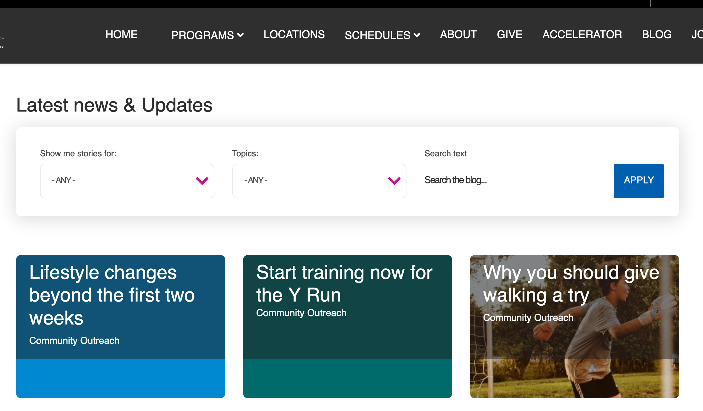
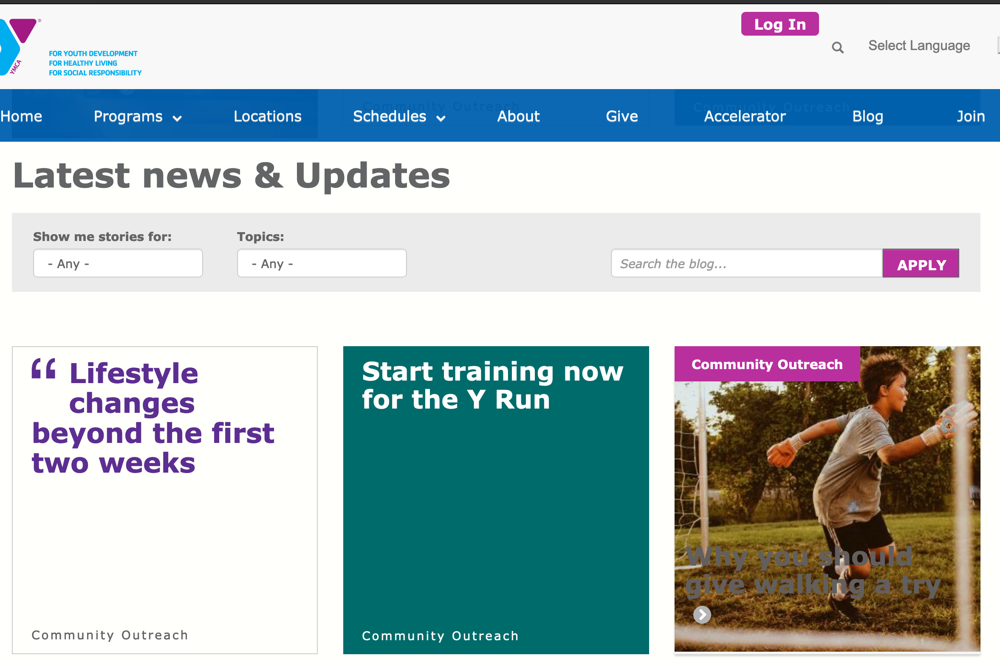
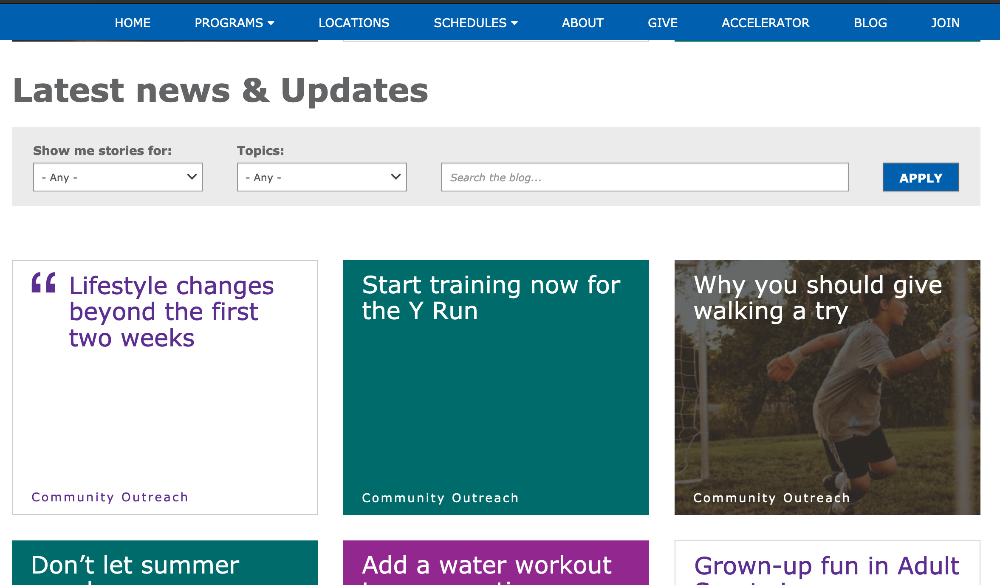
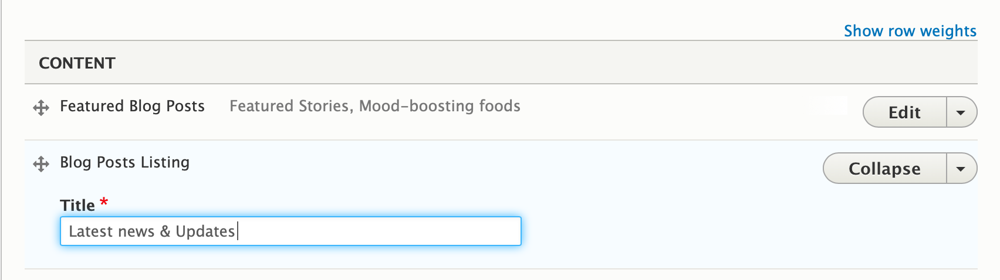

## Examples

### Carnation

### Lily

### Rose

## Areas it Should Be Used

*   Content Area
*   Bottom Area

## How to Use Blog Posts Listing

1.  From the paragraphs dropdown, add **Blog Posts Listing**.
2.  Enter a header title for the section in the text field.
3.  Hit **Save**.

This paragraph allows you to display a listing of blog posts with optional search and filtering capabilities. The appearance and available options might vary based on the theme (Carnation, Lily, Rose).

## Content Types that Support Blog Posts Listing

*   [Landing Page](../../content-types/landing-page)

## Related/Alternative Paragraphs

*   Event Posts Listing
*   [Latest Blog Posts/(Camp)/(Branch)](../latest-blog-posts) - Displays a listing of the *latest* blog posts.
*   [Latest News Posts/(Camp)/(Branch)](../latest-news-posts)
*   [News Posts Listing](../news-posts-listing)
