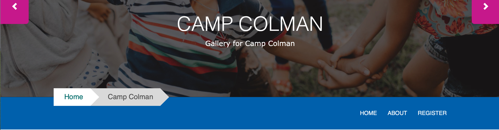
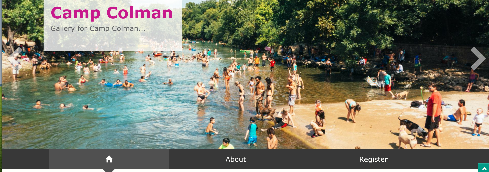
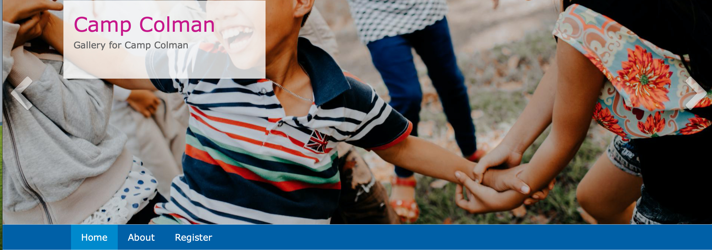
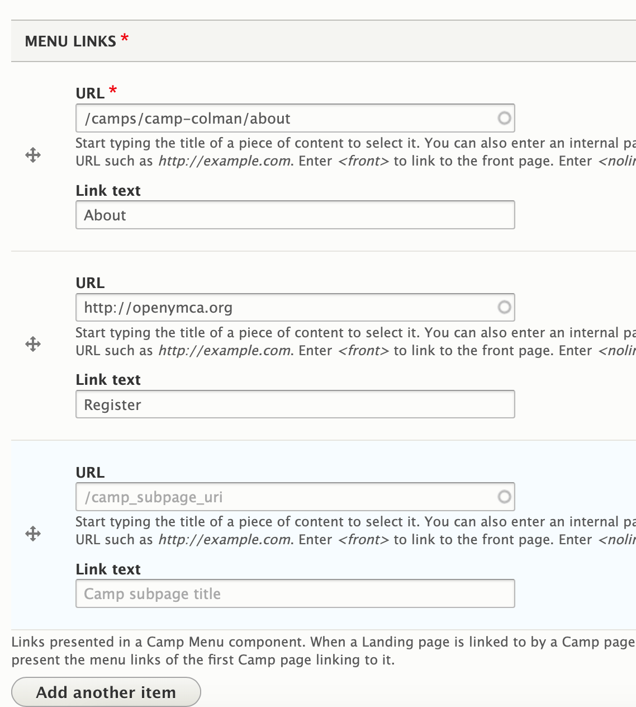
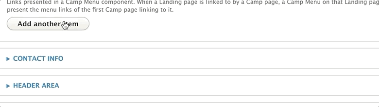
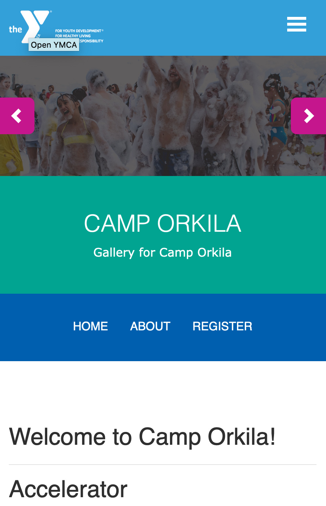

## Examples

### Carnation

### Lily

### Rose

---

## Areas It Can Be Used

*   Header Area

---

## How It Should Be Used

Before adding the paragraph, create the menu you want to use. You can create a new menu at **Admin > Structure > Menu > Add menu** (`/admin/structure/menu/add`).

After creating the menu, add links to it by navigating to **Admin > Structure > Menu > \[Your Menu] > Add link** (`/admin/structure/menu/manage/[your-menu-name]/add`).

[Learn More About Link Fields ⇒](../../content-editing-basics/#linksbutton-fields)

To add additional links to your menu, click on the **Add Another Item** button.

Once you're done adding your menu links, scroll down to the Header Area and add the **Camp Menu** block via Layout Builder. Click **Save**.

> *Note - While it is technically possible to position the Camp Menu above your banner image, it is not recommended. The Camp Menu has layout issues on desktop in the Carnation theme, and in all themes it can be hard to distinguish the Camp Menu from your main navigation.*

---

### Mobile Considerations for Camp Menu

When a user views your Camp Menu on mobile, the menu doesn't collapse; it merely shrinks. Menu items either disappear or wrap onto a new line if they do not fit the space.

It's recommended you limit your menu items to no more than 3 or 4 unless you opt to customize the styling.

---

## Content Types That Support this Paragraph

*   [Camp](../../content-types/camp)
*   [Camp Subpage (Layout Builder)](../../content-types/camp/#camp-landing-pages)
