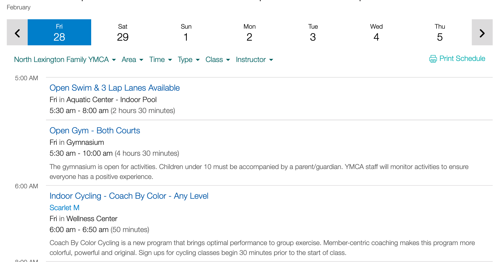
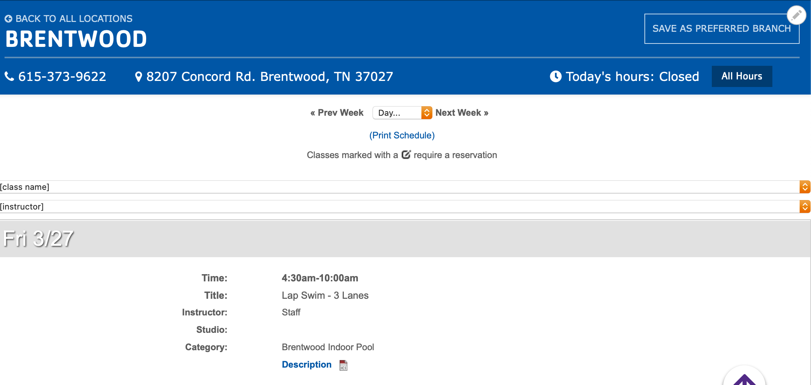
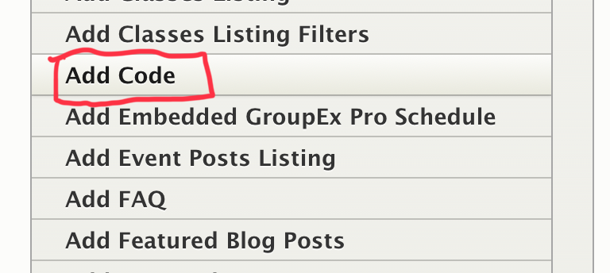
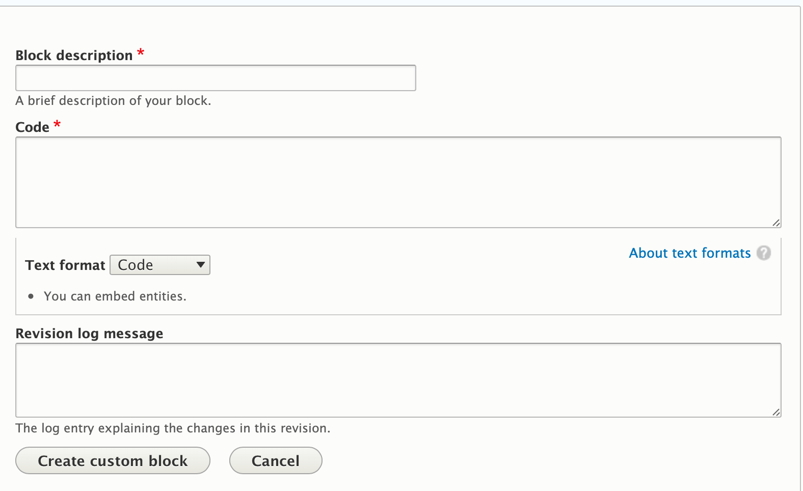

```markdown
---
title: Code
description: Unformatted, unrestricted text that supports any HTML tag and can be embedded anywhere. Great for embedding iframes, third-party scripts, and other custom HTML.
---

## Examples

### YMCA of Central Kentucky / Daxko Schedules iframe



### YMCA of Middle Tennessee / GroupEx Pro Script



## Areas It Should Be Used

*   Content Area
*   Sidebar Area
*   Bottom Area

## How to Use Code

*   Select “Add Code” from the paragraphs dropdown.

    
*   You will see two options: "Add Custom Block" to create a new code block, or an autocomplete field to search for and embed an existing custom block.

*   To search for an existing custom block, type the name of the block in the autocomplete field and click on an option that appears to embed that block.

*   To add a new block, click the “Add New Custom Block” button.

    [Learn more about blocks ⇒](../../blocks)

*   When you add your block, you will see a blank, unformatted text field. Type your HTML text into this field.

    

    > **Important Considerations When Using Code Blocks:**
    >
    > *   To use code, you **must** add HTML tags.
    > *   Hard returns will be ignored, and text will be printed out in one long string. Use HTML line breaks (`<br>`) or paragraph tags (`<p>`) to format your text.
    > *   Code will not highlight or color-code your HTML. To display code snippets with syntax highlighting, consider using a different paragraph type or a dedicated code highlighting library.
    >
    > ---
    > There is an option to change to a “Full HTML” text editor within the block configuration, which will allow you to make use of the default text editor. However, using this may strip "faulty" or disallowed HTML out of your block and may prevent you from using certain tags. Exercise caution when using the "Full HTML" editor for code blocks.

*   Once you’re done, click the button that either says *Add custom block* or *Update custom block*, depending on the option you had selected at first.

---

## Content Types that Support Code

*   [Landing Page](../../content-types/landing-page)
*   [Branch](../../content-types/branch)
*   [Camp](../../content-types/camp)
*   Facility
*   Event
*   [Activity](../../content-types/activity-class-session)
*   [Program](../../content-types/program)
*   [Program Subcategory](../../content-types/program-subcategory)
*   [Class](../../content-types/activity-class-session)
*   [Blog Post](../../content-types/blog-post)
*   [News Post](../../content-types/news-post)
