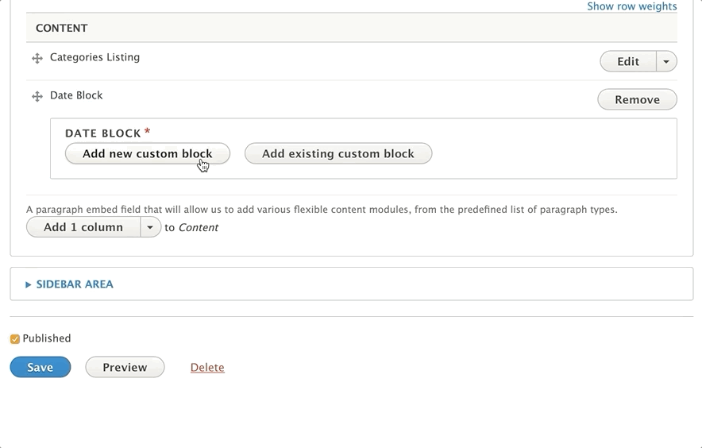
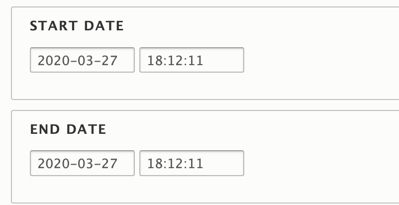
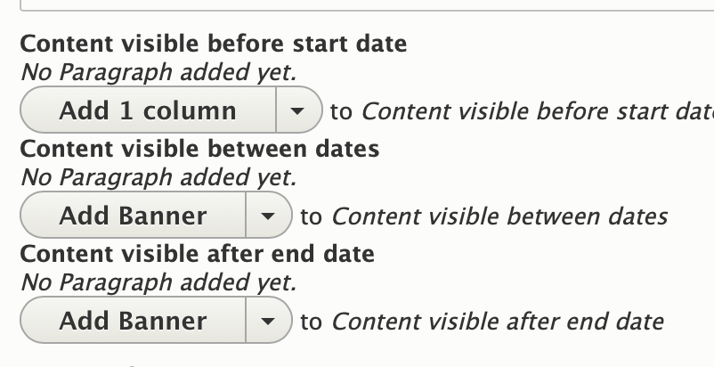
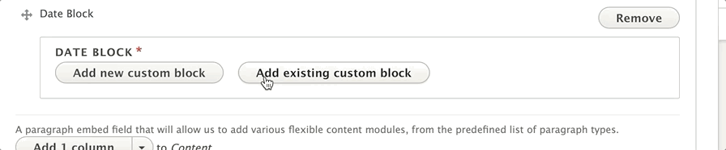

## Areas Where Date Blocks Can Be Used

*   Header Area
*   Content Area
*   Sidebar Area
*   Bottom Area

---

## How to Use Date Blocks

1.  In the desired content area, choose **Add Date Block** from the list of paragraphs in the dropdown menu.
2.  You will then see two options: **Add New Custom Block** or **Add Existing Custom Block**.

### Add New Custom Block

If you are using Date Block for the first time or want to create a new, unique date block:

1.  Choose the **Add New Custom Block** option.

    
2.  Enter a descriptive **Label** for your date block in the **Block description** field.

    *   This label is for administrative purposes and will help you identify the block when reusing it on multiple pages. It is not displayed on the front end of the site.
3.  Enter a **Start Date** and **End Date** for your block.

    *   The content within the date block will only be visible between these dates, similar to how content types can be scheduled for publishing and unpublishing.

    
4.  Add paragraphs to the designated areas to display content *Before*, *During*, and *After* your scheduled dates.

    *   Use the corresponding fields and add paragraphs as you normally would.

    
5.  If you do not want content to display before, during, or after your specified time period, leave the corresponding field blank.
6.  Click **Create custom block** to save your date block.

---

### Add Existing Custom Block

To reuse a date block that you have previously created:

1.  Click the **Add Existing Custom Block** button.
2.  Enter the **Label** of your block into the autocomplete field.
3.  Select your block from the options to add it to the content area.

    

---

### Editing a Date Block

To edit a Date Block:

1.  Click **Edit** next to the paragraph where the Date Block is located.
2.  Click the second **Edit** button that appears next to the name of your date block.
3.  Make the desired changes within the block.
4.  Click **Update Custom Block** to save your changes.

> Any changes made to a date block will be applied to every page where that block has been added.
>
> [Learn more about custom blocks ⇒](../../blocks)

---

## Content Types That Support Date Block

*   [Landing Page](../../content-types/landing-page)
*   [Branch](../../content-types/branch)
*   [Camp](../../content-types/camp)
*   Facility
*   [Blog Post](../../content-types/blog-post)
*   [News Post](../../content-types/news-post)
*   [Class](../../content-types/activity-class-session)
*   [Program](../../content-types/program)
*   [Program Subcategory](../../content-types/program-subcategory)
*   Event
