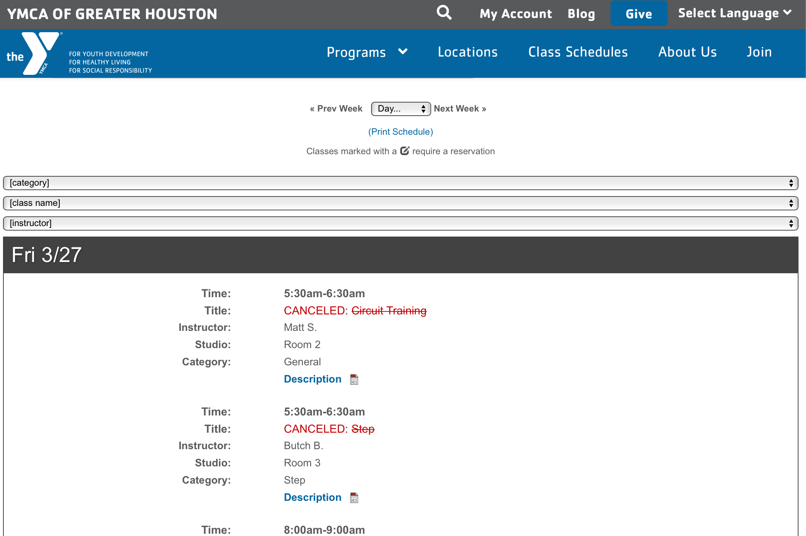
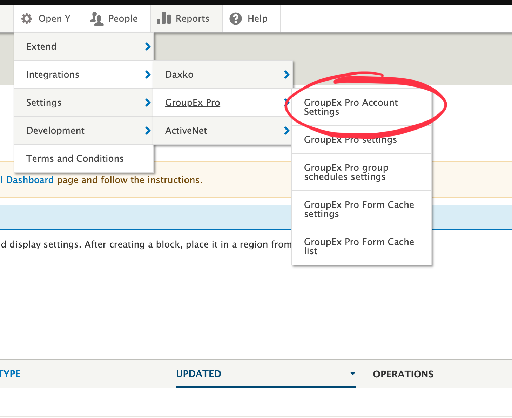
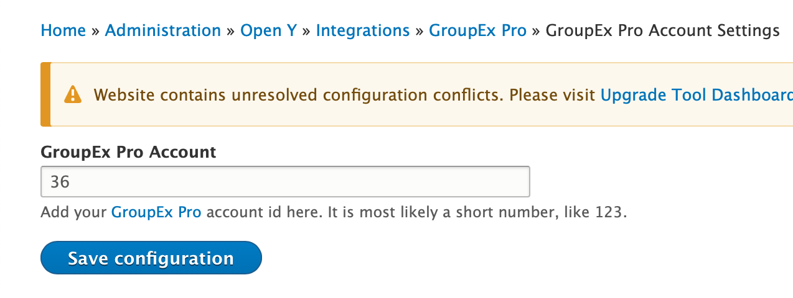
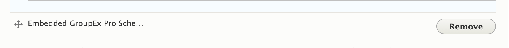

## Example

## Areas it Should Be Used

*   Content Area

## How it Works

***Prerequisite: Requires integration with third-party tool [GroupEx Pro](http://groupexpro.com).***

*   To integrate your GroupEx Pro account:

    1.  Go to the admin toolbar.

        
    2.  Navigate to: **YMCA Website Services > Integrations > GroupEx Pro > Group Ex Pro Account Settings**.
    3.  Add your account number to the designated field.

        

*   For information on where to find your GroupEx Pro account number, visit [groupexpro.com](https://groupexpro.com).

### Adding the Paragraph to Your Page

1.  Select **Embedded GroupEx Pro Schedule** from the paragraphs dropdown.
2.  Hit save.

## Content Types That Support Embedded GroupEx Pro Schedule

*   [Landing Page](../../content-types/landing-page)
*   [Branch (Single-Branch Associations Only)](../../content-types/branch)

## Related Paragraphs

*   [Group Schedules](group-schedules)
*   [Repeat Schedules](repeat-schedules)
*   Repeat Schedules (Branch)
