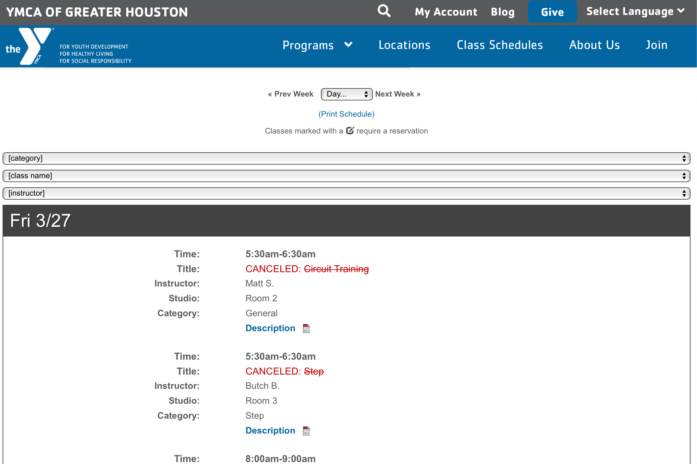
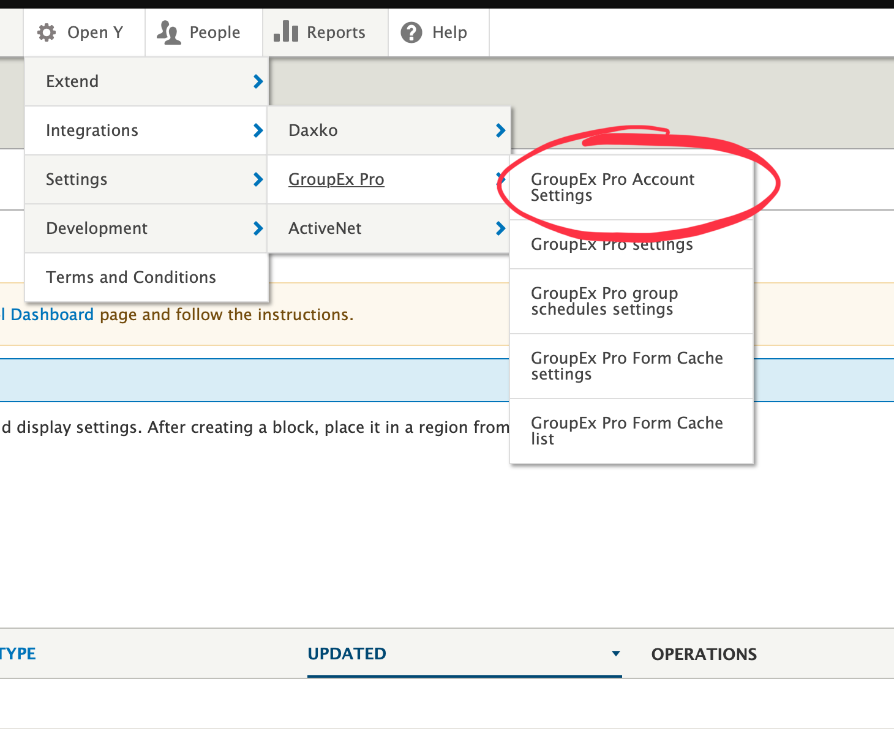
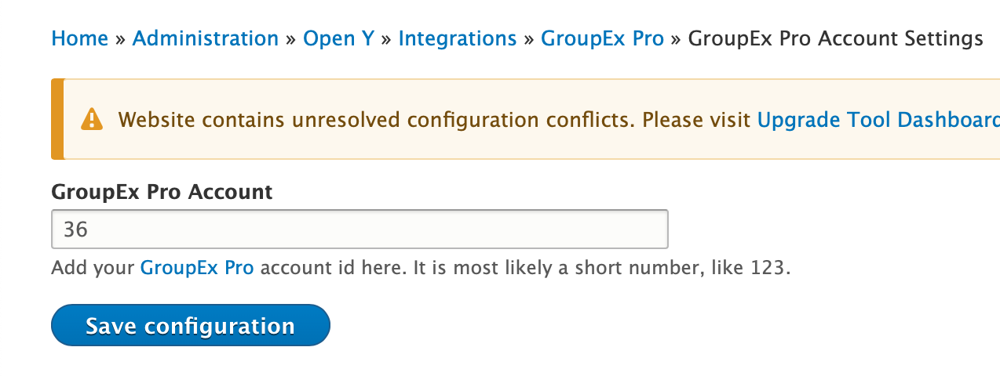
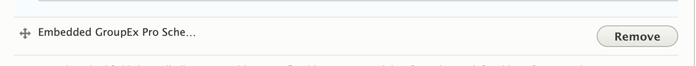

{}
The GroupEx Pro API is no longer available. As of `groupexpro` 3.0.0, the deprecated modules (`groupex_form_cache`, `openy_group_schedules`, `openy_gxp`) are automatically uninstalled during `drush updb`. No manual action is needed. Consider using [Repeat Schedules](../../schedules/group-schedules) or [Activity Finder](../../schedules/activity-finder) as alternatives.
{}

## Example

---

## Areas it Should Be Used

* Content Area

---

## How it Works
>
> ***Prerequisite: Requires integration with third-party tool [GroupEx Pro](http://groupexpro.com).***
>
> * To integrate you GroupEx Pro account, go to the admin toolbar.
    >
    >   
> * Go to YMCA Website Services > Integrations > GroupEx Pro > Group Ex Pro Account Settings. Add your account number to the field. That’s it!
    >
>
> ---
> For information on where to find your GroupEx Pro account number, visit [groupexpro.com](https://groupexpro.com).

---

### Adding the Paragraph to Your Page

Select *Embedded GroupEx Pro Schedule* from the paragraphs dropdown. Hit save.

---

## Content Types That Support Embedded GroupEx Pro Schedule

* [Landing Page](../../content-types/landing-page)
* [Branch (Single-Branch Associations Only)](../../content-types/branch)

---

## Related Paragraphs

* Repeat Schedules
* Repeat Schedules (Branch)
