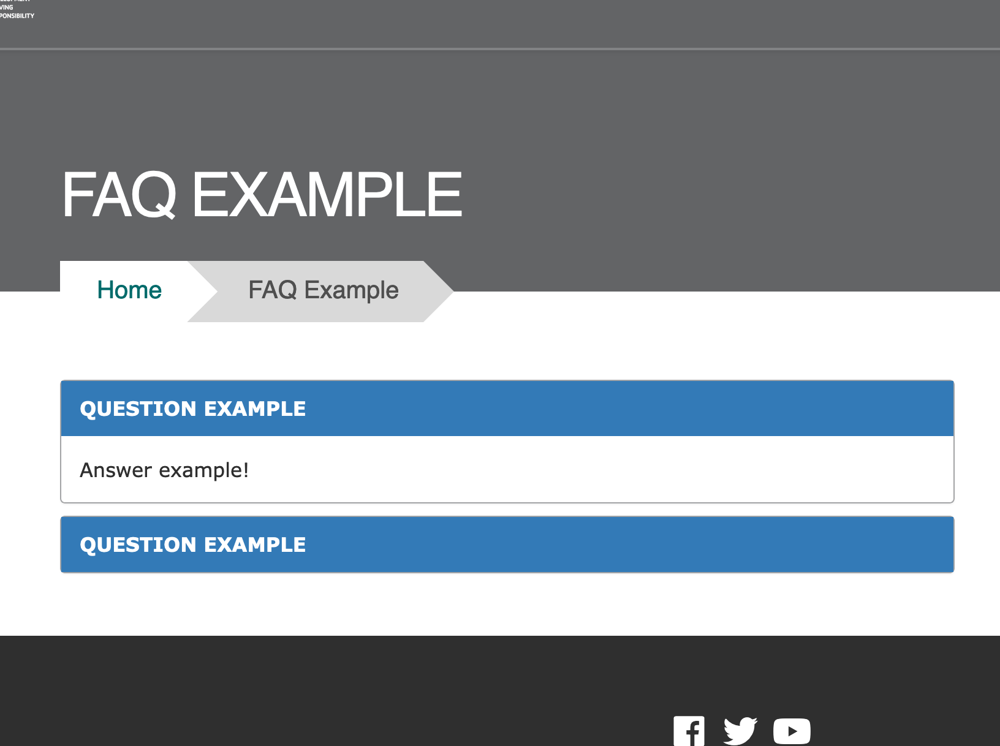
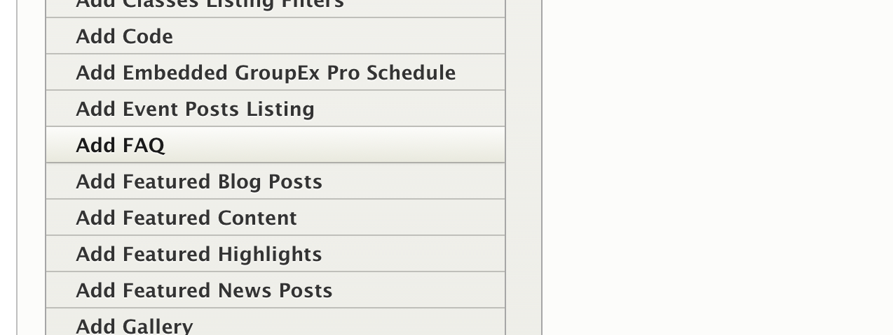
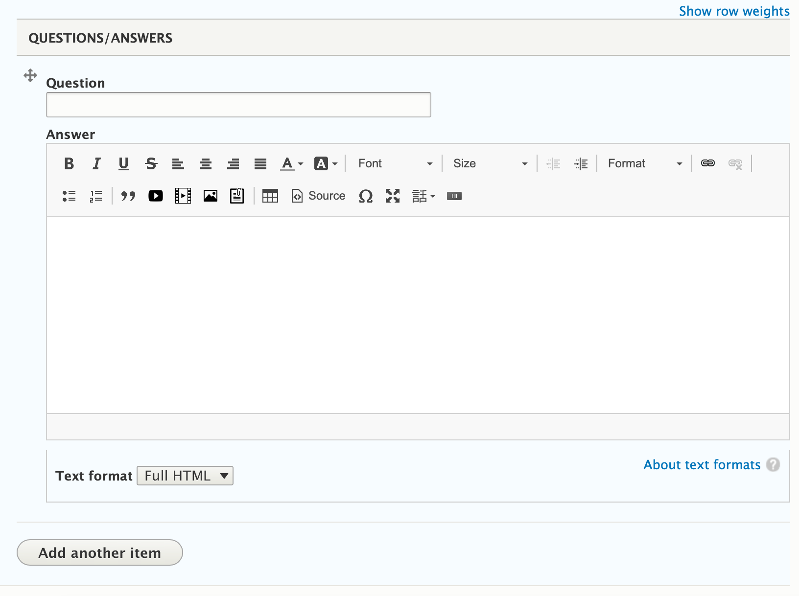

## Example

---

## Where it Can Be Used

* Content Area
* Sidebar Area

---

## How it Works

* Select *FAQ* from the paragraph dropdown

  

* Add a title or a Question into the *Question* field. This will show as the title of your section. This will be the title of the accordion.

* Use the [text editor](../../text-editor) to provide an answer/expanded section of content that is revealed when the user clicks on the section title.

  

  **[Learn how to use the text editor ⇒](../../text-editor)**

---

### Add Another Section

To add another Question and Answer, click the *Add another item* button at the bottom of your paragraph.

---

## Structured Data for SEO

If your FAQ contains Frequently Asked Questions, consider enabling the "FAQ?" option within the paragraph to output them as structured data. This can improve your site's visibility in search engine results. Ensure the content contains individual sets of questions and answers.

> Review [Google's Content guidelines for FAQs](https://developers.google.com/search/docs/appearance/structured-data/faqpage#content-guidelines) for more information.

> Only one FAQ paragraph should be added to a page to ensure correct structured data output.

## Content Types that Support this Paragraph

*   [Landing Page](../../content-types/landing-page)
*   [Branch](../../content-types/branch)
*   [Camp](../../content-types/camp)
*   Facility
*   [Blog Post](../../content-types/blog-post)
*   [News Post](../../content-types/news-post)
*   [Program](../../content-types/program)
*   [Program Subcategory](../../content-types/program-subcategory)
*   [Class (Not Recommended)](../../content-types/activity-class-session)
