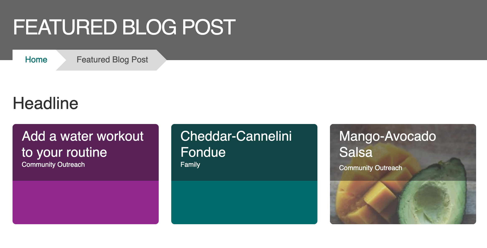
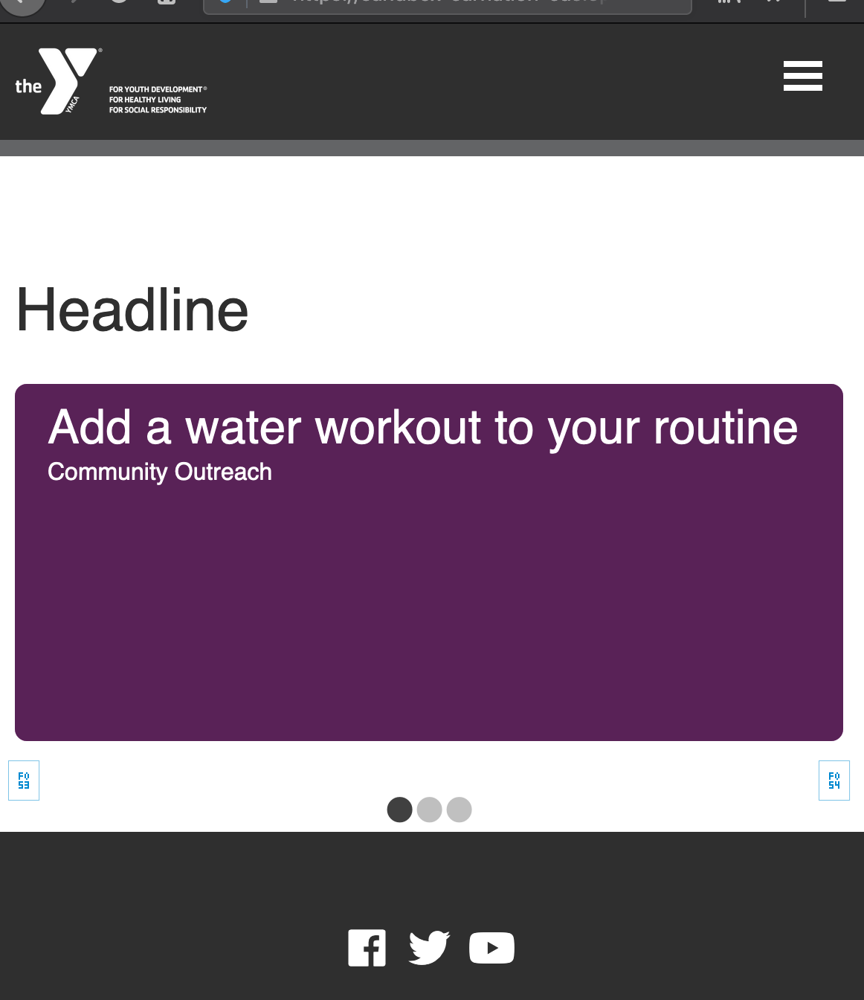
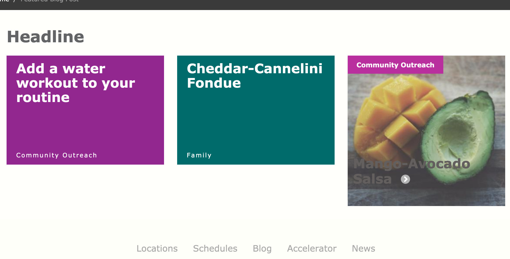
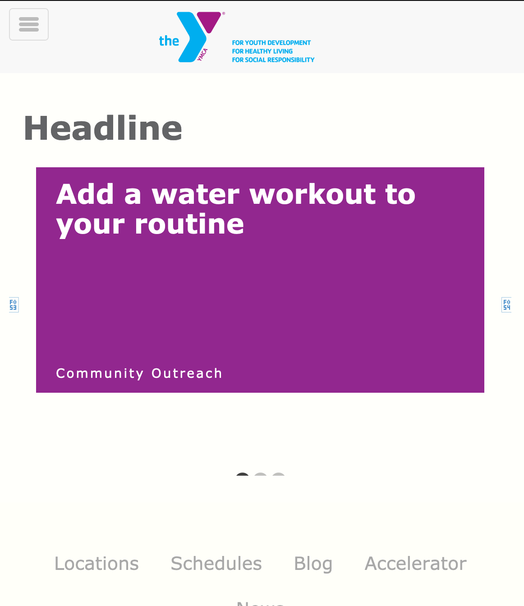
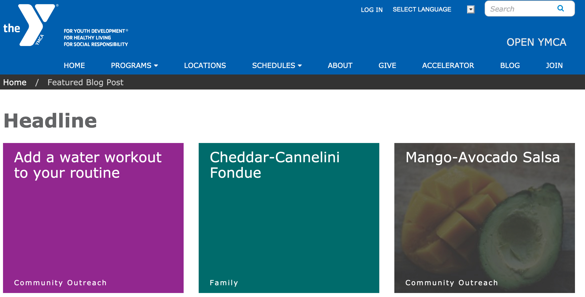
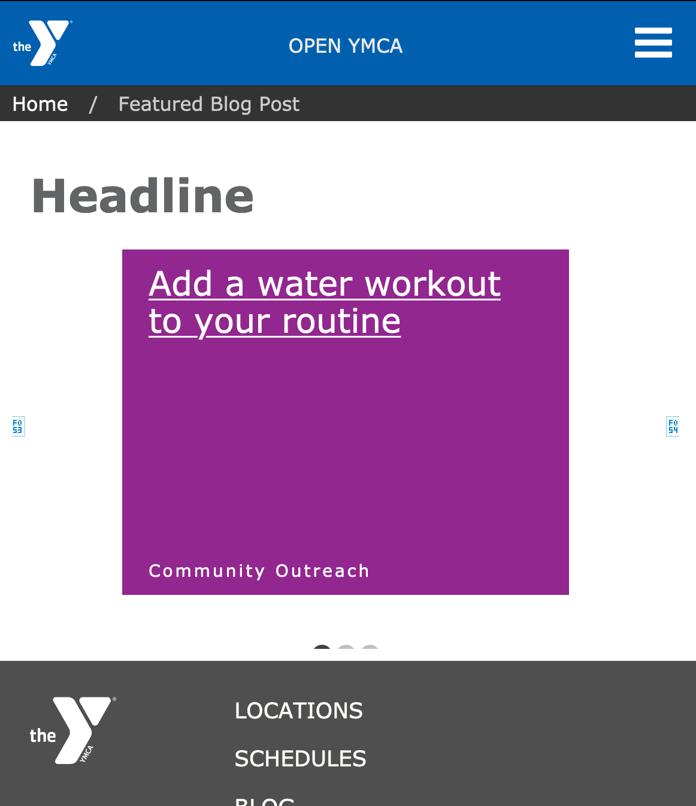
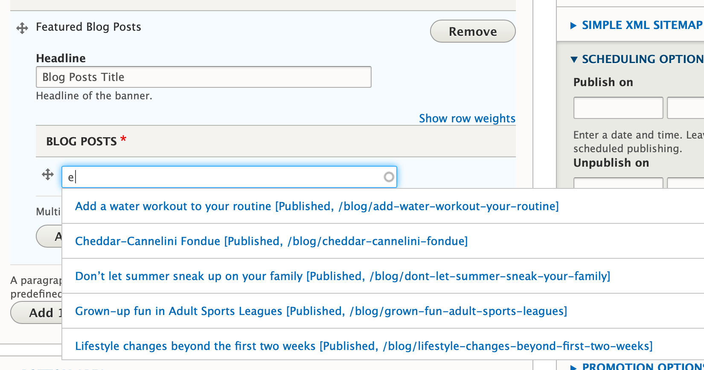

## Examples

This paragraph is rendered differently depending on the theme. Here are some examples:

### Carnation

#### Desktop

#### Mobile

### Lily

#### Desktop

#### Mobile

### Rose

#### Desktop

#### Mobile

## Usage

### When to Use

The Featured Blog Posts paragraph is ideal for:

*   Highlighting specific blog posts that are particularly relevant.
*   Creating a curated resource page of top blog content.
*   Drawing attention to older blog posts that are still valuable.

### Areas It Can Be Used

This paragraph can be used in the following areas:

*   Content Area
*   Bottom Area

## Configuration

### Adding Featured Blog Posts

1.  Add a **Featured Blog Posts** paragraph to the desired content type.
2.  In the **Headline** field, add a title for the featured blog posts section.  This is optional; if left blank, a default title of "Latest news & Updates" will be used.
3.  In the autocomplete field, begin typing the name of the blog post you want to feature.
4.  Select the desired blog post from the suggestions that appear.
5.  Repeat steps 3 and 4 to add additional blog posts.
6.  To add more blog posts, click the *Add another item* button.
7.  Click the blue **Save** button at the bottom of the page to save your changes.

### Available Fields

| Field             | Machine Name          | Required | Description                                                                           |
| ----------------- | ----------------------- | -------- | ------------------------------------------------------------------------------------- |
| Headline          | `field_prgf_headline`   | No       | Title of the featured blog posts section.                                              |
| Blog Posts        | `field_fblog_posts`     | Yes      | References to the blog posts you want to feature.  Supports multiple blog posts. |

## Supported Content Types

The "Featured Blog Posts" paragraph can be added to the following content types:

*   [Landing Page](../../content-types/landing-page)
*   [Program](../../content-types/program)
*   [Program Subcategory](../../content-types/program-subcategory)
*   [Branch](../../content-types/branch)
*   [Camp](../../content-types/camp)
*   Facility
*   [Blog Post](../../content-types/blog-post)
