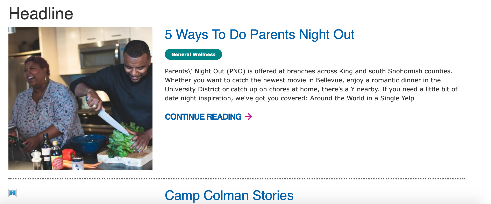
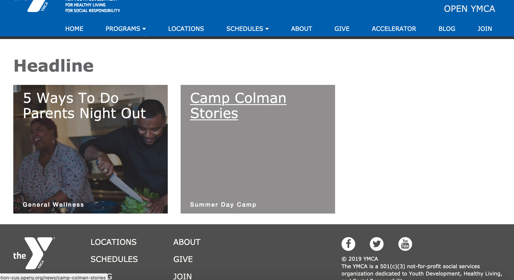
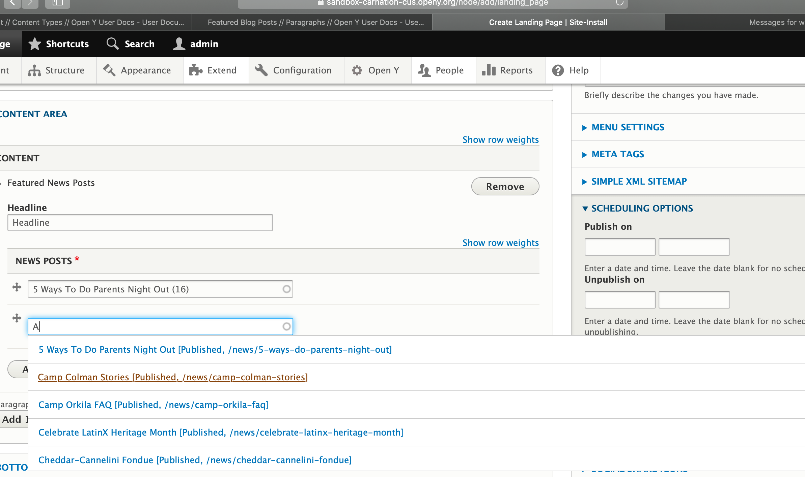

## Examples

### Carnation

#### Desktop

#### Mobile

### Rose

---

## Areas It Can Be Used

*   Content Area
*   Bottom Area

---

## How to Use Featured News Posts

1.  Add a **Headline** for this section of content in the *Title* field. This title will appear above the featured news posts.
2.  In the *News Posts* field, begin typing the name of the news post you want to feature. An autocomplete list will appear.
3.  Click on the desired news post from the autocomplete results.
4.  To add more news posts, click the *Add another item* button.
5.  Click the *Save* button to save your changes.

## Content Types that Support Featured News Posts

*   [Landing Page](../../content-types/landing-page)
*   [Program](../../content-types/program)
*   [Program Subcategory](../../content-types/program-subcategory)
*   [Branch](../../content-types/branch)
*   [Camp](../../content-types/camp)
*   Facility
*   [News Post](../../content-types/news-post)
