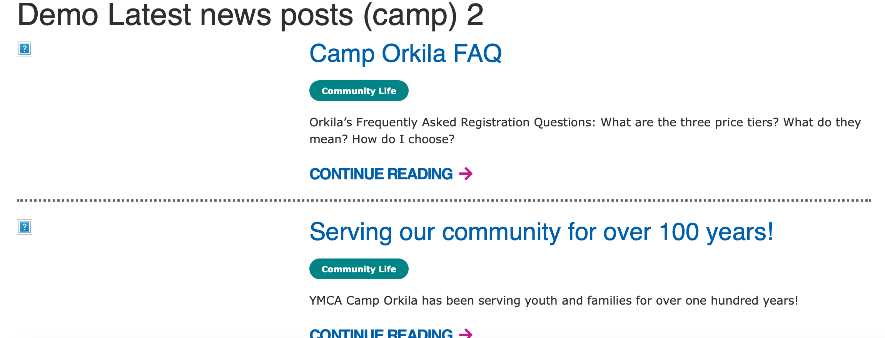
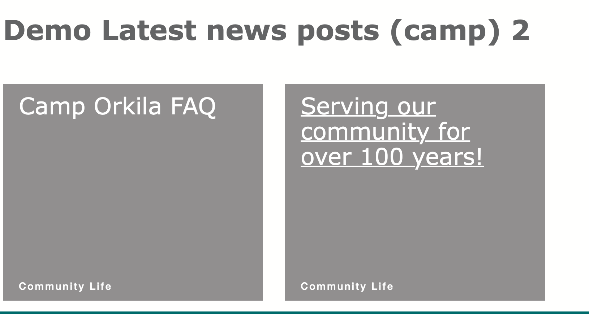
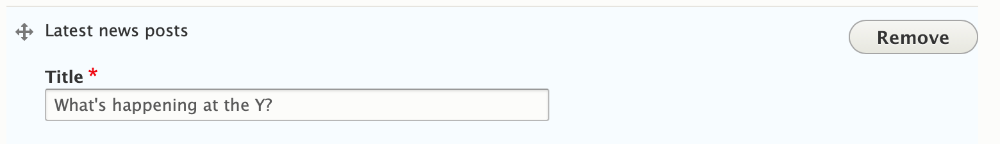

```markdown
---
title: Latest News Posts
description: Embed a listing of news posts with optional filtering by Camp/Branch.
---

These paragraphs embed listings of news posts, sorted by the most recent, in a row/listing design. There are three variations:

*   **Latest News Posts:** Displays all the most recent news posts across your entire site.
*   **Latest News Posts (Branch):** Filters news posts by the branch on which the paragraph is embedded. For example, if placed on a "Downtown YMCA" page, only "Downtown YMCA" news posts will be shown. If placed on a non-branch page, only the headline will be displayed.
*   **Latest News Posts (Camp):** Filters news posts by the camp on which the paragraph is embedded. For example, if placed on a "Camp Widjiwagan" page, only "Camp Widjiwagan YMCA" news posts will be shown. If placed on a non-camp page, only the headline will be displayed.

## Examples

### Carnation



### Rose



---

## Areas to Use

*   Content Area
*   Bottom Area

---

## How to Use Latest News Posts

From the paragraphs dropdown, add the desired "Latest News Posts" paragraph type. Enter a header title for the section in the text field, and save.



---

## Content Types that Support Latest News Posts

*   [Landing Page](../../content-types/landing-page)
*   Facility

## Content Types that Support Latest News Posts (Branch)

*   [Branch](../../content-types/branch)

## Content Types that Support Latest News Posts (Camp)

*   [Camp](../../content-types/camp)

## Related/Alternative Paragraphs

*   Event Posts Listing
*   [Blog Posts Listing](../blog-posts-listing)
*   [Latest News Posts/(Camp)/(Branch)](../latest-news-posts)
*   [News Posts Listing](../news-posts-listing)
```