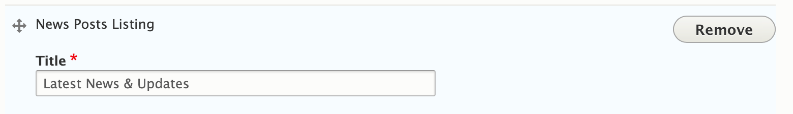

## Areas it Should Be Used

*   Content Area
*   Bottom Area

---

## How to Use News Posts

From the paragraphs dropdown, add the *News Posts Listing*. Enter a header title for the section in the text field and hit *Save*.

> ***Note:** Advanced users can make changes to the exposed fields using the Views module and the paragraphs settings.* This requires advanced knowledge of Drupal's Views and Paragraphs modules.

## Content Types that Support News Posts

*   [Landing Page](../../content-types/landing-page)
*   [Branch (not recommended)](../../content-types/branch)
*   [Camp (not recommended)](../../content-types/camp)
*   Facility (not recommended)

> It is generally **not recommended** to use the News Post Listing on Branch, Camp or Facility pages due to the availability of the Latest News Posts/(Camp)/(Branch) paragraph.

## Related/Alternative Paragraphs

*   Event Posts Listing
*   [Latest Blog Posts/(Camp)/(Branch)](../latest-blog-posts)
*   [Latest News Posts/(Camp)/(Branch)](../latest-news-posts)
*   [Blog Posts Listing](../blog-posts-listing)
