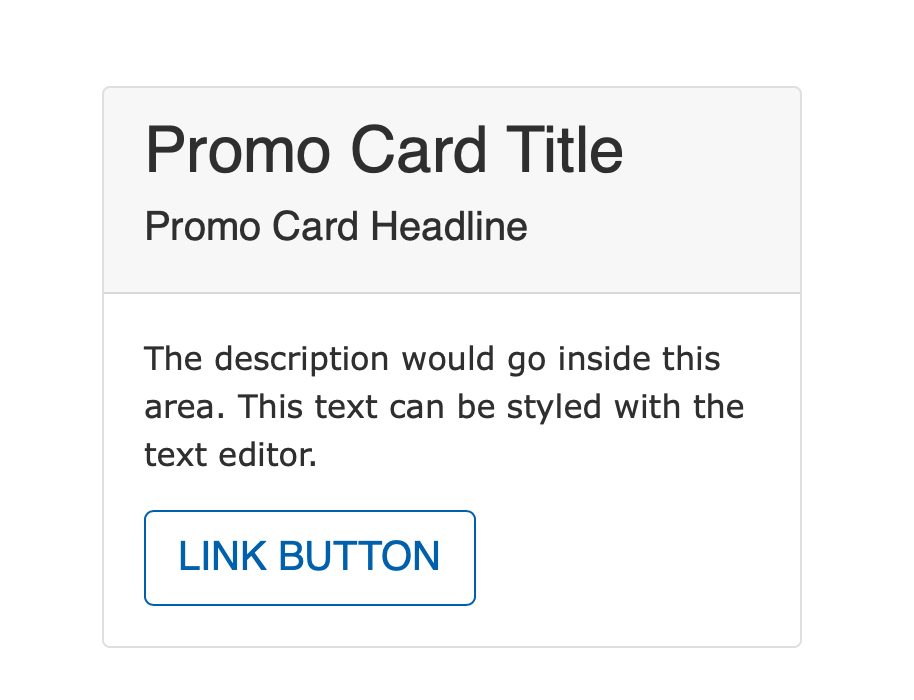
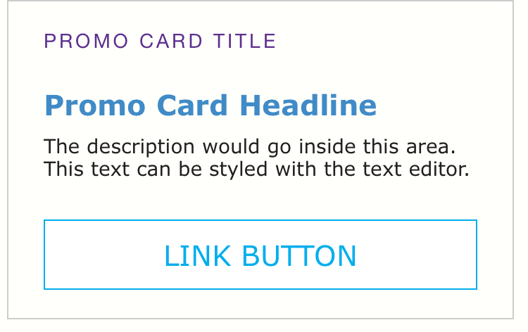
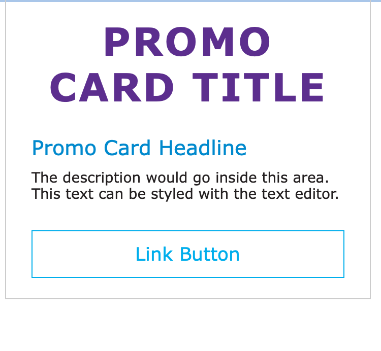

## Examples

The Promo Card comes in three default color variations: Carnation, Lily and Rose.

### Carnation

### Lily

### Rose

---

## Areas It Should be Used

*   Sidebar Area

---

## How to Use the Promo Card

In your sidebar area, select *Add Promo Card* from the paragraphs list.

The Promo Card has the following fields:

*   **Title:** (Optional) A large title that appears at the top of the card.  (Machine name: `field_prgf_title`)
*   **Headline:** (Required) A smaller headline that appears below the title. (Machine name: `field_prgf_headline`)
*   **Description:** (Optional) A WYSIWYG text editor field for entering content. Standard text editor options are available. (Machine name: `field_prgf_description`)

    [Learn how to use the Text Editor ⇒](../../text-editor)
*   **Link:** (Optional) A link field for adding a call to action. (Machine name: `field_prgf_link`)

    [Learn how to use link fields ⇒](../../content-editing-basics/#linksbutton-fields)

---

## Content Types that Support Promo Card

*   [Landing Page](../../content-types/landing-page)
*   [News Post](../../content-types/news-post)
*   [Blog Post](../../content-types/blog-post)
*   [Program](../../content-types/program)
*   Facility
*   [Program Subcategory](../../content-types/program-subcategory)
