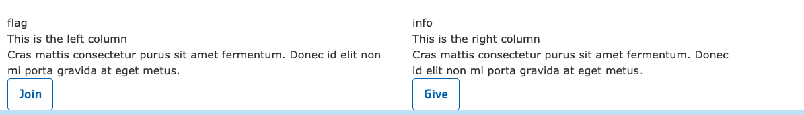
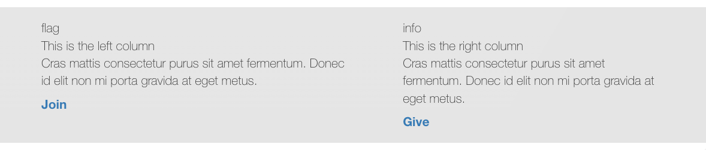
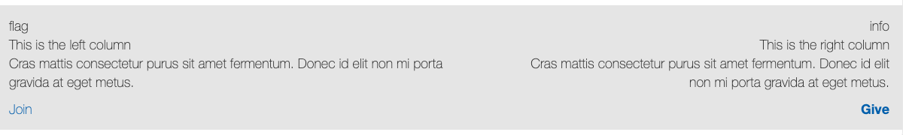
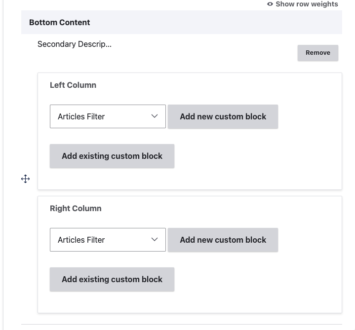

> **Warning:** This element does not work properly in the Carnation theme and is considered deprecated. It may be removed in a future update.

## Overview

The Secondary Description and Sidebar paragraph type provides a two-column layout in the bottom area of a page. It allows you to insert reusable content blocks into a left and right column.

### Fields

| Name           | Machine Name                 | Required | Description                                                                                                                                                                                                                   |
| -------------- | ---------------------------- | -------- | ----------------------------------------------------------------------------------------------------------------------------------------------------------------------------------------------------------------------------- |
| Left Column    | field_prgf_left_column_block | No       | Block reference to: Basic Block, Code Block, Date block or Simple Block. Create a new one or pick up an existed block. Content placed here typically serves as a secondary description for the page.                           |
| Right Column   | field_prgf_right_column_block | No       | Block reference to: Basic Block, Code Block, Date block or Simple Block. Create a new one or pick up an existed block. Content placed here typically serves as a sidebar with related information or calls to action. |

## Example

### Carnation

### Lily

### Rose

## Areas it Should Be Used

*   Bottom Area

## How to Use Secondary Description and Sidebar

1.  Insert the paragraph from the dropdown menu into the Bottom Area of your page.

    

2.  You will see two fields: **Left Column** and **Right Column.**
3.  Within each column, you can select from one of four different custom block types:

    *   Basic Block
    *   Code Block
    *   Date Block
    *   Simple Block
4.  You can either add a new custom block or reuse an existing block.

[Learn how to use custom blocks >](../../blocks)

> **Note:** When reusing blocks in this paragraph type, the icon field may not render correctly. Font Awesome icons might display as plain text. If you need icons, consider using inline images.
