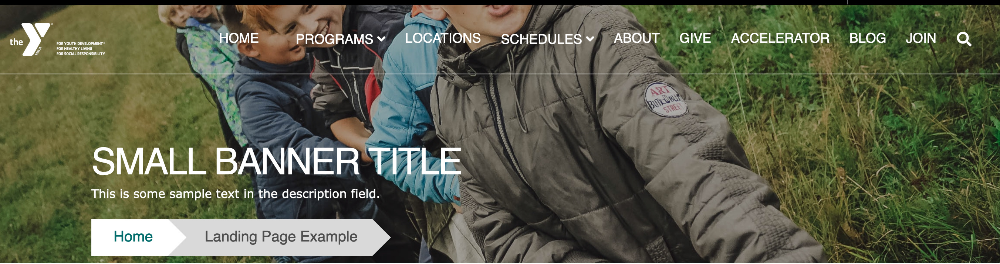
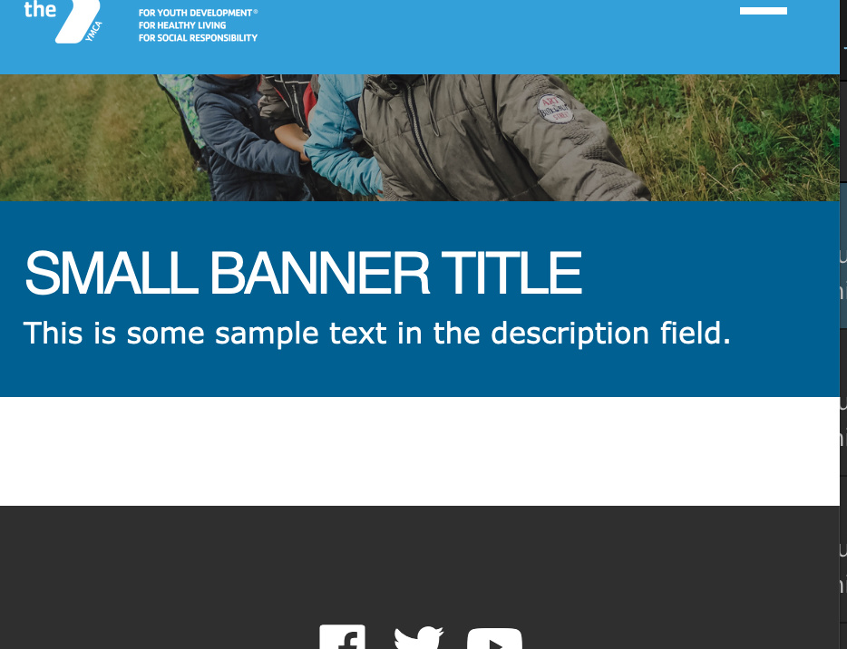
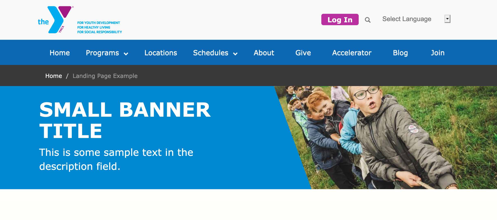
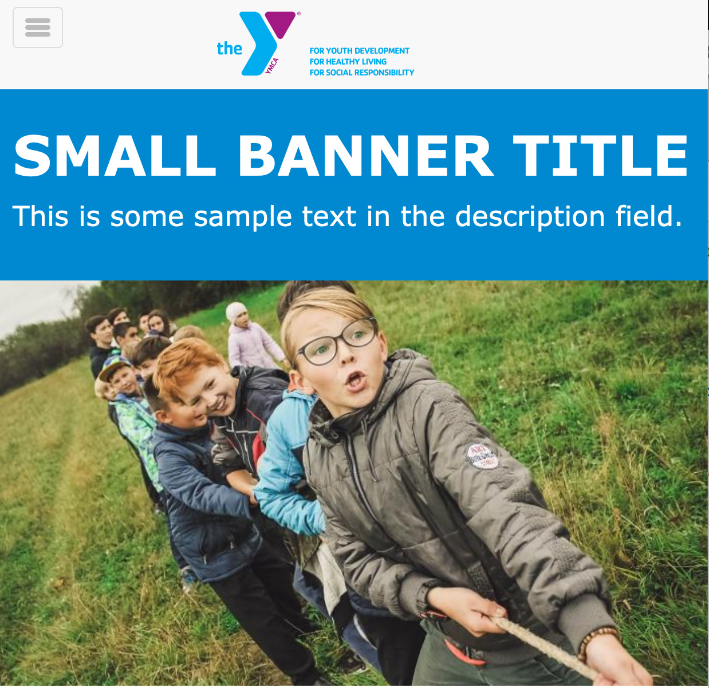
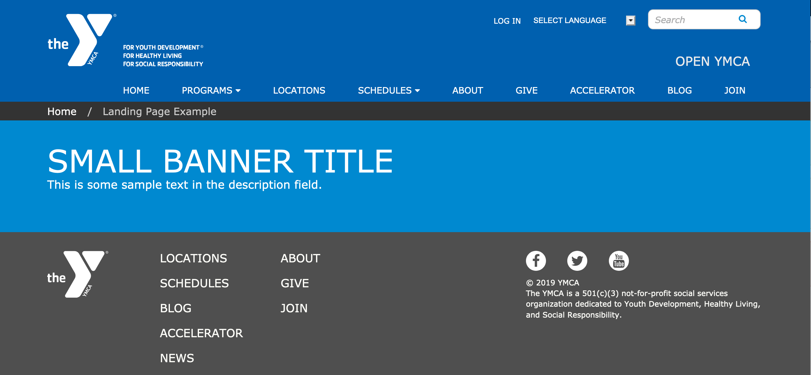

## Examples

### Carnation

#### Desktop

#### Mobile

### Lily

#### Desktop

#### Mobile

### Rose

#### Desktop

#### Mobile

---

## Areas It Can Be Used

*   Header Area
*   Content Area (1 column only)
*   Bottom Area

---

## How to Use a Small Banner

1.  Select **Add Small Banner** from the paragraphs dropdown.
2.  Fill out the following fields:

*   **Title (required):** This field adds a headline to your banner. The placement of the title depends on your theme and customization, but it typically appears as large, all-caps text. The character limit for this field is 255.

*   **Color (required):** The background color for your banner. In Lily and Rose, this background color displays behind your title and description.

    > In Carnation, you will not see the background color unless you add an image.

*   **Description (optional):** Displays beneath your Title. You can style your text using the text editor; however, it’s not as consistent as other places where you typically see the editor.

*   **Image (optional, but recommended):** Use the image library to embed an image. You can upload a new image from your computer or reuse an existing image from your library. For best results, consult with your agency partner regarding recommended image sizes for your YMCA Website Services site.

    >*Note: Image Upload does not work in Rose.*

    > *Note: Unlike [the Banner](../banner), Small Banners don’t have a specific Link field for buttons without customization.*
    >
    > To add a button to a small banner, use the [Text Editor button tool](../../text-editor/building-buttons) to create a button in your description field.

---

## Content Types that Support Small Banner

*   [Landing Page](../../content-types/landing-page)
*   [Camp](../../content-types/camp)
*   [Branch](../../content-types/branch)
