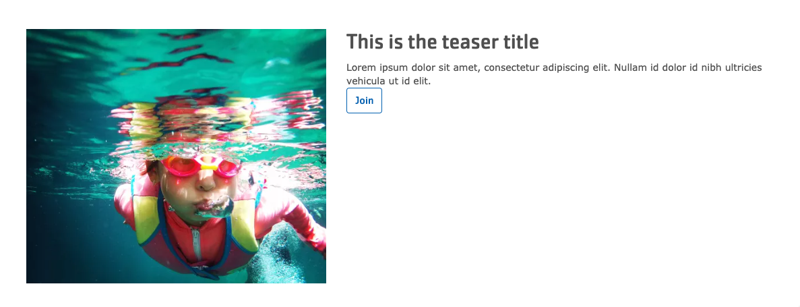
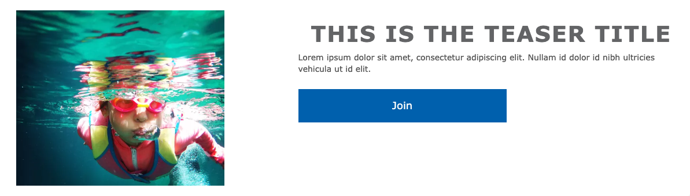
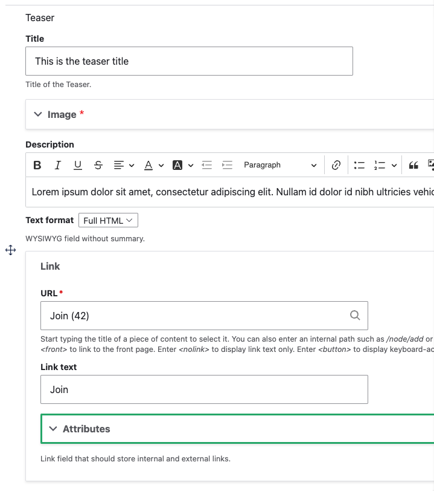

## Overview

The Teaser paragraph is a versatile component designed to highlight key content. It typically includes an image, a title, a brief description, and a call-to-action link. It can be used to promote specific programs, services, or events.

## Examples

The appearance of the Teaser paragraph can vary depending on the theme:

### Carnation

### Lily

### Rose

## Areas It Should Be Used

- Content area

## How to Use the Teaser Paragraph

1.  **Insert the paragraph:** From the content area, select "Add Teaser" from the paragraph dropdown menu.

    

2.  **Fill in the content fields:**

    *   **Title:**  Enter the title of the teaser. This should be concise and engaging.
    *   **Image:** Select an image from the [image library](../../media-library) or upload a new one. Use high-quality images that are relevant to the content.
    *   **Description:** Add a brief description using the [Text Editor](../../text-editor). Keep the description concise and focused on the key benefits or information.
    *   **Link:** Add an internal or external link. This is the call to action. Use a clear and direct call to action in the link text (e.g., "Learn More," "Register Now," "View Details"). The Link field supports adding attributes:
        *   **URL:** The destination URL
        *   **Title:** The link text for the button.
        *   **Target:** Open in a new window.
        *   **Rel:** "Nofollow" or "Sponsored".
        *   **Class:** Add custom classes if needed.

3.  **Save:** Save the page to view your Teaser.

## Best Practices

*   Use compelling imagery that is relevant to the content.
*   Write concise and engaging titles and descriptions.
*   Use a clear and direct call to action in the link text.
*   Ensure that the linked page provides more detailed information related to the teaser content.
