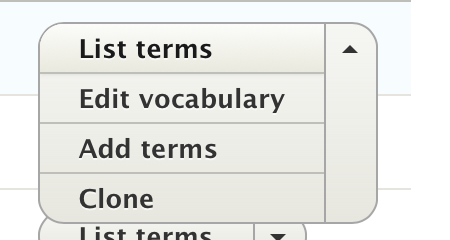
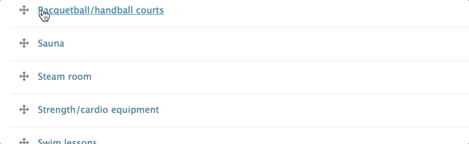
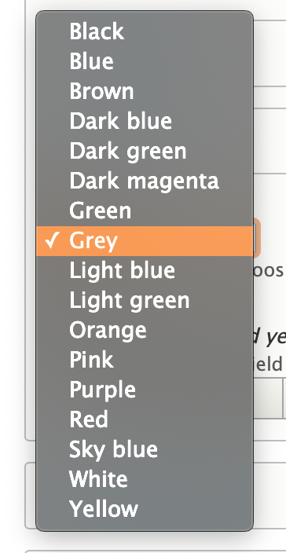
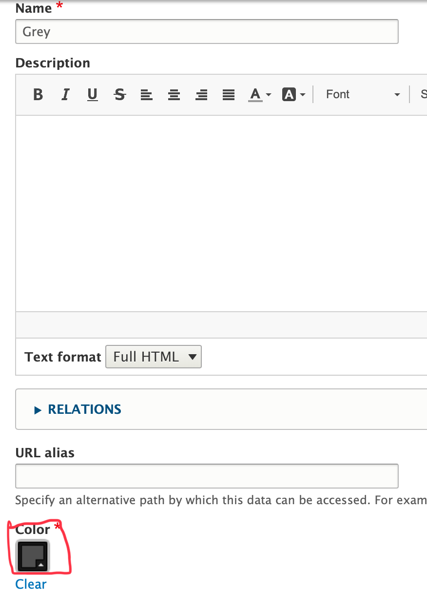
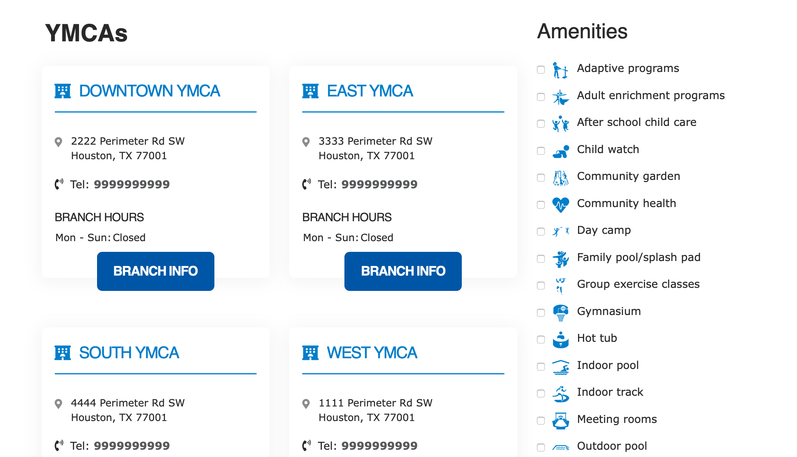

```markdown
---
title: "Taxonomy, Vocabularies, and Terms"
weight: 4
description: >
  Group pieces of related content together for tagging, filtering, sorting, and grouping.
---

Taxonomy, in YMCA Website Services, is a system for classifying and organizing website content. It uses organized lists of categories to group content, create folders for Images ([in YMCA Website Services 2.4 and later](https://github.com/ymcatwincities/openy/releases/tag/8.2.4.0)), and create standard options for dropdown fields. Think of it as a way to tag, filter, sort, and group your content.



Each list of categories is called a *Vocabulary*, and each individual category within a vocabulary is called a *Term*.  Terms consist of a Term Name and can include additional data or settings specific to that vocabulary (see *Vocabularies in YMCA Website Services* for details).  Taxonomy terms are an entity type

## How to Edit Vocabulary Lists

1.  Go to **Structure** > **Taxonomy**.
2.  Find the Vocabulary you want to edit.
3.  Click *List Terms*.



You can rearrange your terms by hovering your mouse over the cross icon and dragging them. This determines the order in which they appear on your website. By default, terms are displayed alphabetically if no specific order is set.



Moving a term to the right will "nest" it underneath another term, creating a parent-child relationship. The nested term becomes a "child" of the term above it. This allows you to create hierarchical taxonomies.

## Adding/Editing Terms

1.  To edit an existing term, click *Edit*.
2.  To add a new term, click *Add Term*.

On the next page, you can add a *Name* for your vocabulary and an optional *Description*.

Below those two fields, you can add additional information unique to your vocabulary. The available fields will depend on how the vocabulary is configured.

### Term Example - Grey Color

> The *Color* Vocabulary provides a standard list of color options across your website, such as for a background color for your header.
>
> 
> To change the shade of grey:
>
> 1.  Go to **Structure** > **Taxonomy** > **Color**.
> 2.  Click *List Terms*.
> 3.  Click *Edit* next to *Grey*.
>
> Below the name of the Grey term, you'll find a color widget where you can change your standard shade of Grey across your site.
>
> In this example, you can change the color of the *Grey* term in the *Color* Vocabulary using a Color widget.



## Vocabularies in YMCA Website Services

Vocabularies are lists of categories.  How they are used and displayed depends on the specific vocabulary. Here are some common vocabularies in YMCA Website Services:

### Amenities

Used for tagging [branches](../content-types/branch) with amenities (e.g., "Pool," "Sauna," "Gym"). Amenities are displayed on the branch page and can be used as filters on a locations page.



### Color

The Color vocabulary provides a list of colors for use across your site, primarily in page headers, [small banners](../paragraphs/small-banner), [galleries](../paragraphs/gallery), and [banners](../paragraphs/banner).  Using a standardized color vocabulary ensures brand consistency.

### Blog/News Category

These vocabularies are used to tag blog and news posts. Categories are often displayed in the sidebar and as filters in the [Blog Post Listing](../content-types/blog-post) and [News Posts Listing](../content-types/news-post) paragraphs, respectively.

### Media Folders

This vocabulary creates folders for organizing images in the media browser.

[View Media Folders tutorial ⇒](https://youtu.be/gcaBlhyPZEY)

### Media Tags

This vocabulary creates tags for filtering images (YMCA Website Services 2.3.3 and earlier), documents, and videos in the media browser. Using tags helps you organize and find media assets more easily.

[View Image and Document tutorials](../media)
