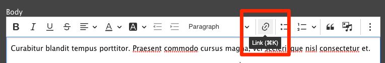
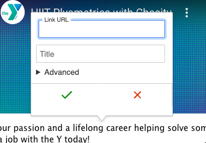
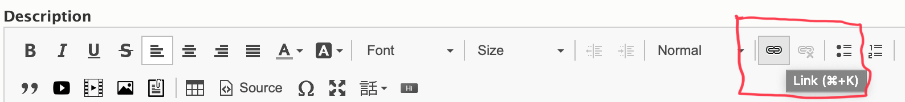
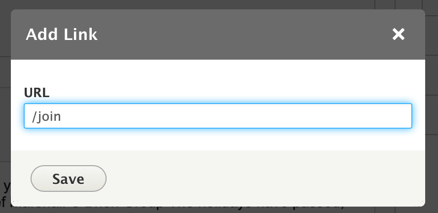
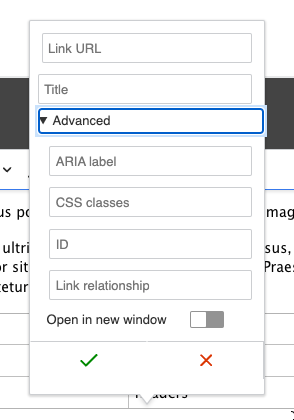
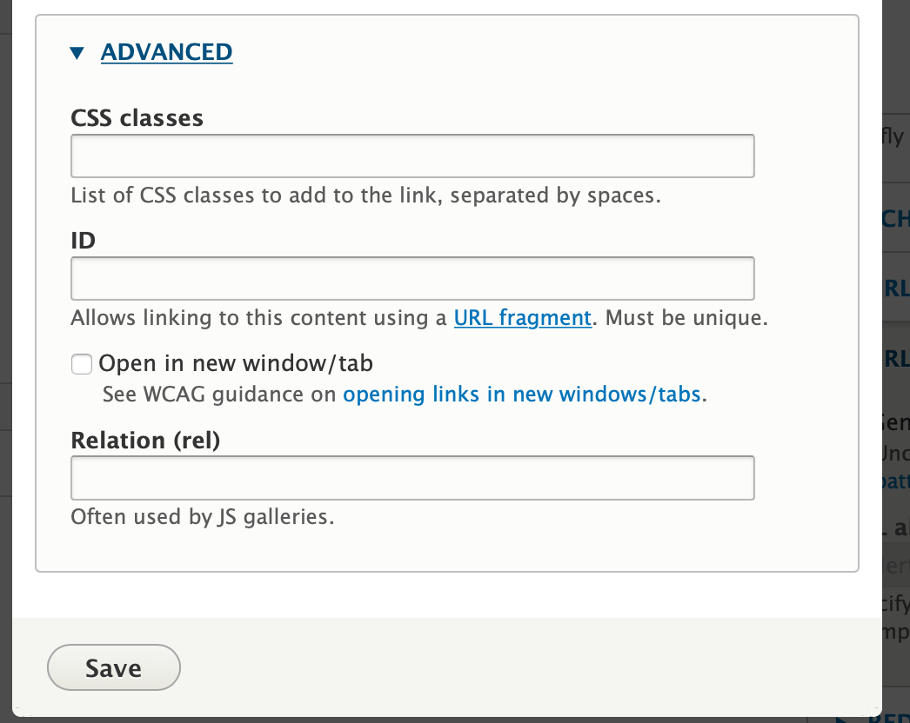
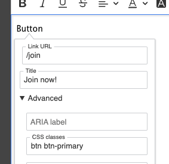
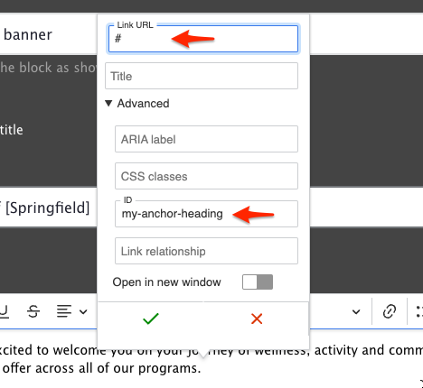
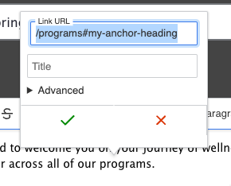

Links are simple in YMCA Website Services. Highlight your text, then click the link icon (`🔗`) in the editor toolbar, or use the keyboard shortcut <kbd>Ctrl</kbd> + <kbd>K</kbd> (Windows) or <kbd>Cmd</kbd> + <kbd>K</kbd> (Mac). In the pop-up window, type or paste your URL into the field and click **Save**.

*[Read more and see a demo on the CKEditor website.](https://ckeditor.com/docs/ckeditor5/latest/features/link.html)*


{}

{}
{}

{}


## Advanced Options

The link dialog's **Advanced** options let you add attributes to links, including a `title` (tooltip), `id`, and CSS classes. You can also configure the link to open in a new browser window or tab.


{}

{}
{}

{}


### Using Button Classes

The [Button editor](../building-buttons) that existed in CKEditor 4 has [changed with CKEditor 5 and Drupal 10](https://www.drupal.org/project/editor_advanced_link/issues/3423208). Content editors can now add button classes directly through the Advanced Link Options. This allows for more flexible button styling using [Bootstrap](https://getbootstrap.com/) classes.

To create a button:

1.  Create a regular link in a Layout Builder block or Text Editor.
    *   We recommend using custom buttons primarily within larger text blocks, such as those found in the [Table](../../layout-builder/table) or [Code](../../layout-builder/code) blocks.
2.  Open the **Advanced** options for the link.
3.  In the **CSS Classes** field, add the desired button classes for Color, Size, and Style (see [Button Classes](#button-classes)). Always begin with the `btn` prefix.

    For example: `btn btn-primary`.

    
    *   Button styles displayed in the editor might not precisely match the final rendered styles on the live site.
4.  Save the block.

#### Button Classes

Our distribution combines the default [Bootstrap button component](https://getbootstrap.com/docs/4.6/components/buttons/) with custom styles, as demonstrated at [YMCA Lincoln, NE](https://www.ymcalincoln.org/buttons).

*   Any button's **CSS classes** should begin with `btn ` to establish the base button styles.
*   Choose a button style, such as `btn-primary` or `btn-light`.
    *   Generally, button styles should not be combined.
    *   Our theme may override some default Bootstrap styles.
    *   The `btn-primary` style will adopt the selected colorway's color. Other styles might use non-compliant colors.
*   The **CSS classes** field should contain at least two space-separated items, like `btn btn-primary`.

It is recommended to experiment with different styles and verify the button's appearance before saving the page.

## Anchor Links

For long landing pages, anchor links (also known as "in-page" links or [URI fragments](https://en.wikipedia.org/wiki/URI_fragment)) allow users to jump directly to specific sections.

The process consists of two steps:

1.  Adding an in-page anchor.
2.  Creating a link to that anchor.

### Adding an Anchor

An anchor is a point on the page designated with an `id` attribute in its code. The easiest way to create an anchor is to add a small, hidden link at the beginning of the target section.

1.  Edit the section where you want to add the anchor.
2.  Insert an empty space at the end of the section's first line.
3.  Select only that space, and click the <kbd>🔗</kbd> button in the editor toolbar.
4.  In the Link popup, set the **URL** to `#`.
5.  Expand the **Advanced** options and set the **ID** field to a short, descriptive name containing only lowercase letters and dashes (e.g., `thank-you` or `adding-an-anchor`).
6.  Click **Save** in the Link popup, then save the page.

After saving, you can test the anchor by appending `#anchor-id` to your page URL. For example:

`https://ds-docs.y.org/docs/user-documentation/text-editor/adding-links#adding-an-anchor`

Entering this URL in your browser should navigate directly to the "Adding an Anchor" section.

### Linking to the Anchor

To create a link to the anchor:

1.  Create an in-page link using the Link field or the Text Editor as you normally would.
2.  Instead of using autocomplete (if available), use the "relative path" of the page—everything _after_ the domain. For example, to link to this page, use `/docs/user-documentation/text-editor/adding-links`.
3.  Append the anchor ID to the path, so the complete link looks like `/docs/user-documentation/text-editor/adding-links#adding-an-anchor`.
4.  Save the page.

The internal link should now direct users to the specified location within the page.

> **Tip:** If the anchor doesn't position the section correctly, or the navigation obscures the linked section, try moving the anchor to the end of the preceding section. This ensures the target section is fully visible.

## Linking Tips

*   **Internal Links:** Use relative paths. Omit everything before the first `/` after your domain (e.g., `.com`, `.org`). For `ymca.org/about`, use `/about`. This improves analytics tracking.
*   **External Links:** Use the complete URL, including `https://` (e.g., `https://example.org/about`).
*   **Email Links:** Use the format `mailto:example@example.org`.

To update a link, click the linked text, then click the link icon, or use the popup options (in CKEditor 5).

To remove a link, highlight the linked text and click the unlink icon.

## Improving Internal Linking with Linkit

[Linkit](https://www.drupal.org/project/linkit) is a community-contributed module that:

> provides an autocomplete interface for internal and external linking in rich-text editors. Linkit supports nodes, users, taxonomy terms, files, comments and basic support for all types of entities that define a canonical link template.

Drupal core will [soon provide link autocomplete suggestions](https://www.drupal.org/project/drupal/issues/3317769) in CKEditor, similar to Linkit. Until then, developers may want to [install and configure Linkit](https://www.drupal.org/project/linkit) to enhance the linking experience.
