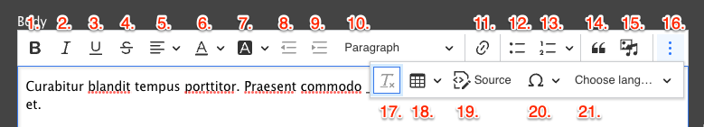
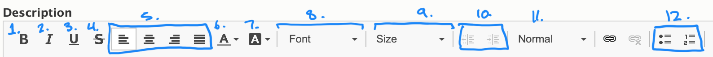

Choose any of the options for your text below by clicking on the icon or performing the keyboard shortcut indicated. To format text you’ve previously typed, highlight the text and then click on the button in the editor. Many formatting options also have [keyboard shortcuts](https://ckeditor.com/docs/ckeditor5/latest/features/keyboard-support.html).

## CKEditor 5 Toolbar

[Demo Basic Text Formatting on CKEditor 5.](https://ckeditor.com/ckeditor-5/demo/feature-rich/) or read [more detail about these features](https://ckeditor.com/docs/ckeditor5/latest/features/index.html#ckeditor-5-wysiwyg-editor-features-and-functions).

The CKEditor 5 toolbar includes the following text formatting options:

1.  **Bold**
2.  *Italics*
3.  <u>Underline</u>
4.  <strike>Strikethrough</strike>
5.  **Superscript**
6.  **Subscript**
7.  **Remove Format** - Clears all formatting. Useful when pasting content from Word or other applications.
8.  **Link** - See [Adding links](../adding-links).
9.  **Bulleted list**
    *   Lists
    *   like
    *   this.
10. **Numbered list**

    1.  Lists
    2.  like
    3.  this.
11. **Block quote**
12. **Insert media** - See [Adding media](../adding-media).
13. **Insert table** - A [feature-rich table editor](https://ckeditor.com/docs/ckeditor5/latest/features/tables/tables.html).
14. **Horizontal Line**
15. **Heading** - Set paragraphs or heading levels—headings in your content [should be ordered sequentially](https://www.a11yproject.com/posts/how-to-accessible-heading-structure/) for the best accessibility.
16. **Code Block** - For inserting multi-line code snippets. Supports syntax highlighting for various languages (Plain text, C, C#, C++, CSS, Diff, HTML, Java, JavaScript, PHP, Python, Ruby, TypeScript, XML).
17. **Source** - View or edit the source code of the content. Be aware that some HTML tags may be stripped out due to Drupal's Text Format rules. Click **About text formats** below the editor to learn more.

## CKEditor 4 toolbar

[Demo Basic Text Formatting on CKEditor 4 >](https://ckeditor.com/ckeditor-4/demo/#article)

1.  **Bold Text** - `Ctrl`+`B` (Windows) or `Command` (⌘)+`B` (Mac) or clicking/unclicking the B icon
2.  **Italics -** `Ctrl`+`I` (Windows) or `Command` (⌘)+`I` (Mac) or clicking/unclicking the I icon
3.  **Underline -** `Ctrl`+`U` (Windows) or `Command` (⌘)+`U` (Mac)or clicking/unclicking the U icon
4.  **Strikethrough -** Clicking/unclicking the S icon
5.  **Alignment controls -** Left, Center, Right, and Justify.
6.  **Font Color -** A small grid of swatches you can apply to your text. Overrides the default font-color
7.  **Text Background color** (not recommended)
8.  **Font** (should remain Cachet or Verdana to conform to YMCA brand standards)
9.  **Font Size -** A dropdown to select the size of your text. Measured in points, not pixels. Overrides the default font size for your text, including styles and format.
10. **Indent -** Add one or more indents to your copy. Also, have the option to undo the indent.
11. **Format -** A dropdown list of text formats you can apply to your content. Helps to create sections. Comes out-of-the-box with six heading formats.

    > Most Ys will not use the “Formatted” format, which styles text like HTML code.

12. **Bulleted/Numbered lists -** Click the numbered or bulleted list icon to create a list. You can create indented bullets by hitting your tab key or clicking on the indent icon
